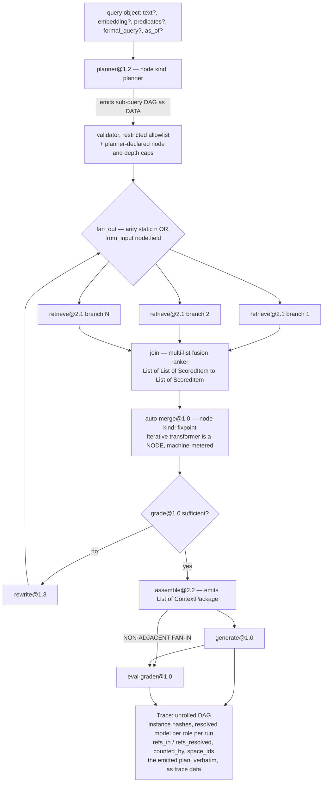

# D1 Two Kingdoms — two regimes, one boundary, and nothing crosses it but knowledge

## Position

D1 takes the two-regime split literally: the kernel and the sandbox are separate kingdoms with separate laws, and the border carries information, never material. A sandbox part gets a hard OS-level jail, a document-tier corpus feed, and answer-tier evidence forever. It never lends a component to a kernel wiring, never writes a byte the kernel will read, and never produces evidence the promotion gate will accept. When a sandbox part proves worth having, the kernel **rebuilds it** as versioned kernel components and the sandbox artifacts are discarded. What the other variants buy with adapters, partial decomposition, and borrowed artifacts, D1 declines to buy — because every one of those purchases is paid for in the same currency: a kernel trace with a hole in it. D1's bet is that the promotion path stays honest precisely because it is expensive and narrow, and that the machine's most valuable property is the one that is destroyed first by convenience — that *every kernel run is completely attributable*. The system-level consequence, stated up front rather than discovered later: in D1 promotion is triggered by **recorded demand**, not by measured superiority, because D1 declares cross-regime measured superiority to be exactly the thing it refuses to compute. [inference]

## The five axes

| Axis | D1's position | Justification |
|---|---|---|
| Kernel graph-execution style | **Full declared-graph engine** (B-style Conductor, complete) | The kernel is the only regime that gets deep evidence, so it must be able to express every shape worth measuring — loops, fan-out/join, planner-emitted subgraphs, non-adjacent fan-in. A partial executor would push shapes into the sandbox, where D1 refuses to measure them, and the whole design would starve. [inference] |
| Sandbox containment depth | **OS container / confined unit — hard isolation**, deny-by-default net/FS/store-write, wall-clock watchdog | Machine service #2 must exist anyway for per-arm kernel mutation isolation [docs: RT-selfimprove §6]. Given that it exists, the marginal cost of hosting sandbox parts inside it is a unit file per part, not a new mechanism. Soft containment would buy nothing and cost the deny-by-default guarantee. [inference] |
| Promotion mechanics | **Full re-implementation as kernel components; sandbox artifacts discarded** | Sandbox artifacts were built by an unversioned pipeline with unresolved embedder identity, unknown chunk boundaries, and undeclared edge-weight semantics. Adopting them means minting an SA-1 recipe hash over inputs that were never resolved — a false stamp. Such an artifact would be `unknown`-provenance, hence never declared-compatible [docs: RT-upgradability §5], hence unshareable, hence rebuilt on the next component bump anyway. The saving is illusory; the identity damage is permanent. [inference] |
| Instrument placement | **All six machine services are kernel services** | The kernel owns the instruments; the sandbox is a subject of measurement, never an owner of one. Eval bundle, gate, isolation domain, artifact ownership, ledger, and validator are kernel-operated; sandbox parts are *run by* them and *recorded in* them, and implement none of them. [inference] |
| Comparison depth | **Rig refuses cross-regime deep comparison; sandbox evidence is always answer-tier** | RT-modularity's structural finding against D is that a cross-regime metric is defined at the shallowest common denominator, so the promotion decision always runs on the least informative evidence the system produces [docs: RT-modularity Attack 4]. D1 does not mitigate that. It deletes it: cross-regime evidence never reaches the gate at all. [inference] |

---

## Anatomy

The fixed anatomy (BRIEF §4), specialized to D1. Two diagrams: the kernel machine, then the regime boundary.

```mermaid
flowchart TB
    APPLETS["Sourcerer applets: Wiki / Library / Graph"]
    CLI["CLI + rig + improvement loop"]

    subgraph MACHINE["DATABASISE — the machine"]
        SEAM["REST + MCP seam, modality-agnostic<br/>query contract carries as_of / time-context"]
        ISEAM["Ingest seam, source-polymorphic<br/>documents / repo / stream / vault / interaction-log / live-only / nothing"]

        SEL["Selector, per-query routing<br/>pinned by selector-policy@version<br/>candidate set filtered to regime=kernel"]

        subgraph BUDGETED["BUDGET ENCLOSURE — spend + capacity + standing-corpus, over ingest AND query"]
            subgraph INGEST["Kernel ingest lane"]
                DOCST["doc-status"] --> CHK["chunker@v, selected PER DOCUMENT<br/>flag: consumes_embedder"] --> ENR["context-enricher@v, optional"] --> EXT["extractor@v + embedder writes"]
            end

            subgraph HARN["Harness tier — OPTIONAL WRAPPER, stackable"]
                H1["crag@v / self-rag@v / drift@v"]
            end

            EXEC["KERNEL EXECUTOR<br/>executor@version, named in every trace<br/>node kinds: component / fan_out / join / planner / fixpoint"]
        end

        subgraph STORES["Stores — kernel-owned"]
            KV["KV: scopes corpus / session / run-multiwriter<br/>chunks carry PER-CHUNK provenance"]
            VEC["Vector: namespaces stamped space_id<br/>score_all, multi-vector, get_vectors"]
            GR["Graph: pointwise / bulk-export / formal-query<br/>sub-capability: validity, as_of"]
            LEX["Lexical / BM25"]
            BLOB["Blob + machine-owned sidecar manifest<br/>sub-range addressable"]
        end

        subgraph CLIENTS["API clients — role-addressable, phase-split"]
            IDX["INDEX-TIME: embed, encode-tokens, extract"]
            QRY["QUERY-TIME: keyword, query, rerank, judge, planner, drafter, verifier, classify-lite, vlm"]
        end

        subgraph SERVICES["Machine services — all kernel"]
            REG["Component registry<br/>name@version + lineage + upstream_ref + regime tag"]
            AREG["Artifact registry<br/>namespace to recipe@v + sub-recipe stamps + corpus + space_id"]
            VAL["Wiring validator + Static Mutation Validator<br/>fails at LOAD, all violations at once"]
            MIG["Reindex planner<br/>recipe vA to vB gives reuse / re-embed / re-extract / rebuild + cost"]
            EVAL["Eval bundle@version<br/>questions + gold + judge + judge-prompt + corpus hash"]
            SCORE["Scorer: judge role + deterministic checks"]
            BOARD[("Scoreboard, partitioned by<br/>corpus@v x eval@v x judge@v x artifact-set x TIER")]
            RIG["Comparison rig"]
            TRACE["Trace collector"]
            LEDG["Promotion ledger, append-only"]
            ISO["Isolation domain, confined units"]
            GC["Artifact ownership + CoW + refcount GC<br/>+ corpus manager: snapshot / freeze / evict"]
        end
    end

    APPLETS --> SEAM
    CLI --> SEAM
    SEAM --> SEL
    ISEAM --> INGEST
    SEL --> EXEC
    SEL -. "explicit part_ref only" .-> SBX["SANDBOX — see diagram 2"]
    HARN -->|"N calls, wraps"| EXEC
    EXEC -->|"returns"| HARN
    H1 -->|"stacks"| H1
    INGEST --> STORES
    EXEC --> STORES
    EXEC --> CLIENTS
    IDX -. "binds: every vector is model, dim, norm, prefix, pooling" .-> VEC
    AREG --- STORES
    AREG --> REG
    VAL --> REG
    VAL --> AREG
    MIG --> AREG
    SEL -.emit.-> TRACE
    HARN -.emit.-> TRACE
    EXEC -.emit.-> TRACE
    STORES -.emit.-> TRACE
    CLIENTS -.emit.-> TRACE
    RIG -->|"fans out N wirings"| SEL
    TRACE --> RIG
    AREG --> RIG
    EVAL --> RIG
    SCORE --> RIG
    RIG --> BOARD
    BOARD --> LEDG
    ISO --> EXEC
```

**The rule on the `IDX -. binds .-> VEC` edge:** index-time clients bind artifacts; query-time clients do not. Rerank and generator upgrades are free; extractor and embedder upgrades cost a rebuild. Embedder identity is mandatory — the machine refuses to write vectors it cannot attribute [docs: ANATOMY-REVIEW #16, from `_generate_collection_suffix()` returning `None` when `model_name` is absent, code-verified there].

Now the boundary, which is D1's whole subject:

```mermaid
flowchart LR
    subgraph KING1["KERNEL"]
        KEXEC["Declared graphs of versioned components<br/>machine-owned stores, deep traces<br/>mutation, A/B, promotion"]
        KINST["ALL SIX INSTRUMENTS LIVE HERE"]
    end

    CORP[("Corpus: documents + content hashes + doc-status<br/>machine-owned, snapshot-frozen for A/B")]

    subgraph KING2["SANDBOX — confined units, one per part"]
        S1["lightrag-upstream@2.0"]
        S2["hipporag2@1.1"]
        S3["codebase-memory-mcp@0.9"]
        S4["CAG@1.0"]
        SJAIL["JAIL POLICY per unit:<br/>PrivateNetwork, full-apivfs confinement<br/>RuntimeMaxSec, MemoryMax<br/>NO write path to kernel stores"]
    end

    CORP -->|"FEED TAP: document-tier, read-only<br/>doc_id + content_hash + bytes + doc-status"| KING2
    CORP --> KING1

    KING2 -->|"answer-tier evidence ONLY<br/>question, answer, refs, wall-clock, tokens+counted_by"| RIGB["Rig — tier-partitioned scoreboard"]
    KING1 -->|"kernel-deep evidence<br/>+ an answer-tier projection"| RIGB

    RIGB -->|"answer-tier row"| DEC["Human/agent decision:<br/>port-authorized<br/>recorded in the ledger with a reason"]
    SELD["Selector: explicit sandbox invocations counted<br/>= the promotion-demand signal"] --> DEC
    DEC -->|"KNOWLEDGE ONLY: a work order + inspired_by pointer"| BUILD["Re-implement as kernel components<br/>new name@version entries, own manifests,<br/>own tests, own identity"]
    BUILD --> KING1
    KING2 -.->|"artifacts, caches, indexes: DISCARDED on retirement<br/>never read, never promoted"| X["retired"]
```

**What crosses, exhaustively.** Kernel to sandbox: documents, doc-status, the eval bundle, a query, a budget, a jail policy. Sandbox to kernel: an answer, references it chose to emit, wall-clock, self-reported tokens with `counted_by`, and a manifest. Nothing else. No component, no artifact, no chunk, no vector, no socket, no adapter. [inference]

---

## Execution model

The kernel executor is a full declared-graph engine over JSON wiring specs (`WIRING-SPEC-DRAFT.md` §2, adopted unchanged). It is itself a versioned artifact named in every trace [amendment B-3, docs: RT-upgradability §4]. Node kinds are a tagged sum — a single-key object whose key selects the kind and whose value is validated by that kind's own schema, stated as serde external tagging / pydantic discriminated unions, never as a shallow structural union [docs: spike 004 Q10 — shallow `either`/`oneOf` dispatch silently picks the first matching branch and evaporates every per-kind check].

- **fan-out / join** are first-class node kinds. Arity may be static (from config) or runtime (`from_input`, the LangGraph `Send()`-style shape flagged as expressible in no candidate as drawn [docs: architecture-selection.md]). Runtime arity is execution-plane data; the unrolled branch set appears in the trace. Budget accounting under fan-out is multiplicative, not accumulating [docs: GAP-SWEEP §3.7.2].
- **Ephemeral subgraph.** The `planner` component is the versioned artifact; the emitted plan is trace data and never enters the wiring registry, never receives an alias, never appears in the ledger. Because a planner-emitted plan is untrusted input authored at runtime, it passes through the *same* static validator as any mutation-authored wiring, against a restricted node-kind allowlist plus the caps the planner's own manifest declares. [inference, mechanism per WIRING-SPEC-DRAFT §4]
- **Non-adjacent fan-in** is free rather than an extension: `deps` is a partial order over named nodes [docs: spike 004 Q10], so `eval-grader` naming both `assemble` and `generate` is ordinary wiring. This is the shape the inline-eval family needs — pre-assembly evidence *and* the final answer [docs: GAP-SWEEP §3.8.3].
- **Iterative transformers are fixpoint nodes.** Auto-merge performs store I/O and loops internally in surveyed code [code-verified, RT-modularity Attack 6 stress 3], which violates goal 10 as written. D1 hosts it as a `fixpoint` node kind with a machine-owned iteration budget, so the loop belongs to the executor rather than to the component.
- **Partial results are first-class.** A budget-halted or degradation-path run is traced, scored, and tier-labeled — never discarded. Manifests declare degradation paths as well as requirements (the logprobs-to-prompt-mediated fallback is a declared degradation, not an error) [docs: SYNTHESIS §3].

---

## The sandbox boundary

**What is enforced, and by what mechanism.**

| Enforced property | Mechanism | Failure mode it removes |
|---|---|---|
| No network egress unless declared | `PrivateNetwork` on the confined unit; declared egress becomes an explicit allowlist | Prompt/corpus exfiltration — mutation failure class 3 [docs: RT-selfimprove §3] |
| No filesystem reach outside its own state dir | `confinement.enable`, `mode = "full-apivfs"` | Cross-part contamination; reading another part's index |
| **No write path to kernel stores at all** | The part is not given store credentials, sockets, or mounts; kernel stores are not in its namespace | Shared-artifact corruption — the largest uncovered blast radius [docs: RT-selfimprove §3 row 4]. In D1 the cross-regime surface for it is **zero**, not "scoped" |
| Bounded wall-clock and memory | `RuntimeMaxSec`, `MemoryMax` | Tight-CPU-loop failure class 2, which budgets do not cover |
| Corpus feed is document-tier | The feed tap serves `(corpus_id, doc_id, content_hash, bytes, doc-status)`; chunk-tier is refused | See below — the chunker hazard |
| Manifest is a precondition | Manifest checked against jail policy at admission; policy must be at least as strict as the manifest; undeclared is denied, not warned | Goal 3 as an enforced boundary rather than documentation |

These are behavioral requirements. `systemd` confinement is named as the substrate implementation only [docs: spike 004 — machine service #2 is specified behaviorally; the Nix build sandbox is build-time and is not the runtime isolation domain]. Nothing in the model depends on it.

**The chunker hazard, and D1's answer.** Chunking strategy is selected per document, and strategy `V` consumes an `EmbeddingFunc`, so chunk *boundaries* are a function of the embedding model [code-verified, ANATOMY-REVIEW F2/F3]. The claim "shared KV is paradigm-neutral" is therefore false under `V`, and the brief notes this lands hardest on D's cross-regime shared corpus feed. D1's answer is the strict one: **the feed is demoted from chunk-tier to document-tier at the boundary.** A sandbox part receives documents and chunks them however it likes, inside its jail, into its own storage. Chunk-tier feed exists only as a declared, optional upgrade for a sandbox part that accepts a *specific* chunker stamp, and is refused outright for any recipe whose chunker declares `consumes_embedder: true`.

The price is C's price: every sandbox part re-chunks and re-embeds, N× token cost, paid per part. D1 accepts it, because that is precisely the cost the two-regime split exists to confine — migration and duplication debt confined to the regime that is allowed to be thrown away [docs: RT-upgradability §2]. The purchase is that no sandbox artifact can ever be mistaken for a kernel-shareable one, at any point, by anybody.

**Fairness of comparison under a document-tier feed.** The unit of an answer-tier comparison is `(corpus_id@content_hash, eval_bundle@version, question)`. Chunking is part of what the part *is*, so differing chunkers do not invalidate an answer-tier comparison — they would invalidate a stage-tier one, which D1 refuses anyway. D1's chunk-tier refusal and its comparison-tier refusal are the same decision seen twice. [inference]

**`as_of` at the boundary.** The query contract carries `as_of`. A sandbox part that does not declare the `temporal` capability is refused an `as_of`-bearing query at the feed tap — fail closed, rather than silently answering as-of-now. [inference]

---

## Promotion

**The mechanic.** There are exactly three ways a sandbox part's existence changes the kernel, and all three are records, not transfers:

1. **`port-authorized`** — a ledger record: `{sandbox_part_id, evidence_pointer (answer-tier rows), demand_metric, reason, authorizer, date}`. It authorizes work. It is not a promotion and does not pass through the promotion gate.
2. **Re-implementation** — new kernel component entries, each with its own `name@version`, `config_hash` (over author-supplied JSON, RFC 8785 canonicalized, environment hash included), manifest, socket types, tests, and `upstream_ref` where the idea came from readable source. Each new entry carries `inspired_by: <sandbox_part_id>` plus the ledger record id. This is the only trace of the crossing, and it is a citation, not a dependency.
3. **Normal kernel promotion** — the new wiring competes against the incumbent kernel wiring through the ordinary mutate → A/B → gate → ledger → alias-repoint cycle (S3 below), on kernel-deep evidence.

**What gates it.** Nothing gates step 1 except a recorded human or agent judgment; the machine explicitly declines to support that decision with a quality claim, and says so. Step 3 is gated by the full promotion gate on kernel-deep evidence only. The consequence is stated bluntly: **in D1, a sandbox result is a reason to start work and never a reason to ship it.**

**What is discarded.** On retirement, a sandbox part's index, vectors, KV, caches, and blobs are deleted; they are never read by the kernel and never enter the artifact registry as shareable artifacts (they appear there only as opaque disk-accounting entries with a retirement policy). What is retained: the manifest, the `upstream_ref`, the answer-tier scoreboard rows (immutable, tier-labeled, archived under their partition key), and the ledger records.

**Porting does not retire the part.** A ported part is *reclassified*, and D1 recognizes four sandbox populations, assigned at admission and revisable only by a ledger record:

| Population | Definition | Exit |
|---|---|---|
| **Transient** | Under trial | Ported, or deleted |
| **Permanent resident** | Structurally unportable — black boxes, self-contained storage, `model-weight-access`-adjacent shapes | Never ports; that is correct behavior, not failure [docs: RT-selfimprove §5.1] |
| **Comparator** | An upstream tracker kept alive after its port, e.g. `lightrag-upstream@latest` | Retired when the upstream project dies |
| **Drifter** | Valuable, portable, unported | This is the rot. See below |

The comparator population is D1's answer to the "no re-promotion path" defect [docs: RT-upgradability §1]: re-porting is just another port, and the standing sandbox@latest-vs-kernel@ours rig job makes it repeatable rather than a one-time ritual.

**Two governance mechanisms, adopted as design, not discipline:**

- **D-1 (safety):** sandbox parts are excluded from the default selector candidate set. Reachable by the rig and by an explicit `part_ref` on a request; never routed to by production. One condition in the selector policy [docs: RT-upgradability §4].
- **D-2 (pressure):** sandbox parts carry a TTL (~90 days); at expiry they are disabled unless ported or explicitly renewed **with a recorded reason**. The accumulating record is the whole mechanism.

**And the honest answer on rot.** Nothing in D1 mechanically forces a port. D-1 makes rot *harmless* — a sandbox part cannot become load-bearing, so "stays forever" is untidy rather than dangerous. D-2 makes rot *visible* — a drifter is a part with a growing stack of renewal reasons. Neither makes rot *not happen*. The one mechanical signal D1 does provide is a demand counter, not a quality measurement: because sandbox parts are unreachable by default, every use is an explicit request, and **explicit sandbox invocations per part per week is the promotion-demand metric**. It is the only honest cross-regime signal in a design that refuses cross-regime quality claims, and it is exactly the number promotion economics wants — port the top 2–3 by production traffic, leave the tail permanently [docs: RT-selfimprove §5.2]. If that counter is high and the kernel is empty, D1 has been falsified by observation (see falsifiers). D1 declines to add a hard sandbox population cap; the third lever should stay unbuilt until the first two are measured insufficient [docs: RT-upgradability §4].

---

## Instruments

All six are kernel services. The sandbox implements none of them and is a subject of all of them.

| # | Service | Owner | What it costs D1 |
|---|---|---|---|
| 0 | **Eval bundle@version** — questions + gold + judge + judge-prompt + corpus hash; dev/holdout split; sealed holdout budgeted as scarce | Kernel artifact | Sandbox runs consume it read-only through the feed tap. The bundle must be answerable by *whole parts*, not only by kernel wirings, so gold-passage-level targets are kernel-only and answer-level targets are shared. Two target families in one bundle |
| 1 | **Promotion Gate** — A/A null, paired significance, minimum-effect floor, confirmation rule, epoch FDR, regression suite as hard gates never averaged | Kernel | Gains one D1-specific refusal: any evidence whose `tier != kernel-deep` is rejected as gate input |
| 2 | **Isolation Domain + manifest enforcement** | Kernel-operated; hosts sandbox residents permanently and kernel arms per run | Built once, serves both regimes. D1's cheapest structural win |
| 3 | **Artifact ownership + CoW + refcounted GC** — writes scoped to `(recipe@version, namespace)`; cache keys include component version | Kernel | Sandbox storage is tracked for disk accounting and deleted on retirement; it is never refcounted against kernel wirings because nothing kernel-side can reference it |
| 4 | **Promotion ledger** — append-only decisions, distinct from the lineage tree | Kernel | Gains two D1-specific record kinds: `port-authorized` and `sandbox-classified` (population assignment, TTL renewal with reason) |
| 5 | **Static Mutation Validator** — type-check wirings and caps before execution | Kernel | Also validates planner-emitted plans. Sandbox parts have no wirings to validate; the validator's sandbox-facing job is manifest-vs-jail-policy satisfiability, deny-by-default |

Owner assignments, stated because the brief asks: the eval bundle is a kernel artifact under the artifact registry's versioning rules; the gate is a kernel service with one implementation parameterized by the verb ladder (`check` / `preview` / `run` / `promote-next` / `promote-now`); the ledger is kernel-owned and append-only, with the active-wiring pointer as a derivable projection — if pointer and ledger disagree, the ledger wins; the validator is kernel-owned and runs at load, never per query.

Sequencing is unchanged and not re-litigated: eval bundle + promotion gate → isolation domain → architecture. D1 notes only that its own axis choices make the second step do double duty, which shortens the path to the third. [docs: RT-selfimprove §7]

---

## Comparison depth

Two tiers, one field, and one rule.

**`tier: kernel-deep`** — per-node evidence: instance hashes, resolved model per role per run, `refs_in` / `refs_resolved`, `counted_by` on every token number, `space_id` on every vector touch, the unrolled trace DAG, and any emitted plan verbatim.

**`tier: answer`** — question, answer text, references the part chose to emit, wall-clock, and tokens either self-reported with `counted_by: part-declared` or machine-recounted with `counted_by: <canonical tokenizer id>` when raw prompt text was retained.

**The rule.** Every scoreboard row carries a tier and a partition key `(corpus@v, eval@v, judge@v, artifact-set hash, tier)`. Every scoreboard query names a tier. A query that would join across tiers returns a **refusal with a reason string**, not a coerced number. Kernel parts emit both tiers — the answer-tier row is a projection of the deep trace — so cross-regime comparison *at answer tier* is fully legal and is the intended cross-regime instrument. What is refused is (a) any stage-level cross-regime claim, and (b) any promotion decision taking answer-tier evidence as gate input.

A corollary worth stating because it retires an earlier amendment: C-1 said the broker must refuse cross-engine comparison when embedder identities differ [docs: RT-upgradability §2]. Under D1's tiering that refusal is subsumed and partly wrong — at answer tier over the same documents and eval bundle, the embedder *is part of the engine*, and comparing two whole engines with different embedders is exactly the comparison you want. D1 keeps embedder identity as a required manifest field (for reproducibility and for the reindex planner's cost estimate) and drops the refusal, because the only comparison it protected was the stage-tier one D1 already refuses. [inference]

Mixed-tier runs are not merely unhelpful, they are **forbidden**: a wiring's evidence tier is the minimum over its nodes, and a kernel wiring containing a sandbox node would be answer-tier overall while being production-selectable — which reintroduces exactly the load-bearing-sandbox-part failure D-1 exists to prevent. D1 therefore refuses kernel wirings containing sandbox nodes at validation time.

---

## Scenario S1 — Embedder swap

Ops replaces the embedder on both index and query sides.

**What identity says.** `EmbeddingSpace` is a first-class identity hashed from `(model_id, revision, dim, metric, normalization, query_prefix, doc_prefix, pooling, namespace_text_convention)`; vector namespaces are stamped with `space_id` at creation and are immutable in space [docs: RT-modularity Attack 2 fix]. A new embedder therefore *mints a new namespace*, never mutates one — which is upstream's own answer, physical separation by collection suffix [code-verified, ANATOMY-REVIEW F1].

**What invalidates, via SA-2 sub-recipe stamps.** KV←chunker, graph←extraction, vector-namespace←embedding. The reindex planner walks the stamp graph, not a flat artifact list:

| Artifact class | Verdict | Condition |
|---|---|---|
| KV chunks + per-chunk provenance | **reuse** | unless the document's chunker declares `consumes_embedder: true` (strategy `V`), in which case **rebuild** [code-verified, F3] |
| Graph | **reuse** | unless KV rebuilt above, in which case **re-extract** — the expensive side, ~1,786 entangled lines and all the tokens [code-verified, spike 001] |
| Lexical index | **reuse** | same condition as KV |
| Every vector namespace bound to `space_A` | **re-embed** into a fresh `space_B` namespace | always |

The transitive rule is the part worth freezing into the contract: invalidation propagates along sub-recipe stamps, so a `V`-chunked corpus turns a cheap re-embed into a full rebuild, and the planner's cost estimate says so *before* anyone starts.

**Query side.** Index-time clients bind artifacts, query-time clients do not — but the embedder is both. Every vector-touching component declares `reads_space` / `writes_space`, and the wiring validator typechecks that a seed selector reading namespace N has a query encoder whose `space_id == N.space_id`. So a query-side-only embedder swap is **refused at load**, not silently wrong. That single check is the difference between this scenario and the documented silent-corruption path where a same-dimension swap fires no assert and is wrong forever [code-verified, RT-upgradability §0].

**In-flight A/B arms straddling the migration.** They cannot straddle. An arm's instance identity closes over `resolved_dependency_ids`, which include the vector namespace's artifact id, resolved and refcount-pinned at launch. Arms launched before the switch finish against `space_A`; arms launched after resolve `space_B`. The gate then applies an automatic refusal — arms whose resolved artifact ids differ on any namespace are not comparable — so this is a mechanical rejection rather than a judgment call. The dual-artifact/shadow window is just the refcount: `space_A` is GC-eligible when no pinned wiring and no retained scoreboard entry references it.

**How the rig avoids misattribution.** Two mechanisms. First, the scoreboard's partition key includes the artifact-set hash, so pre- and post-migration series are different series and cannot be plotted as one. Second — the load-bearing one — **an artifact-set change invalidates the A/A null**. Champion-vs-itself must be re-run on `space_B` before any `space_B` arm is judged. Without it, the null distribution belongs to a different artifact set and every measured delta silently includes the migration's effect, which is exactly how a regression gets attributed to the component under test rather than to the invalidated artifact [docs: ANATOMY-REVIEW #17].

**The trace records:** the resolved embedder model per role per run (never the role name — role→binding is hot-updatable at runtime [code-verified, F5]), the `space_id` of every namespace touched, the instance hashes, and `refs_in`/`refs_resolved`.

**Sandbox:** nothing happens. Sandbox parts embed inside their jails with their own embedders; a kernel embedder swap does not touch them and cannot invalidate them. Their answer-tier rows stay comparable to themselves. The cross-regime answer-tier rows, however, have a changed kernel side, so those rows are archived under the old artifact-set key and the comparison is re-run if anyone wants it — one rig run, zero re-indexing, because the sandbox side did not move. This asymmetry is D1 working as designed: the expensive migration lives entirely in the regime that owns the instruments, and the disposable regime is undisturbed.

---

## Scenario S2 — LightRAG ships v2 upstream

**How you know which components have deltas.** Every kernel component registry entry carries `upstream_ref` = `(repo, tag/commit, file, symbol)`. A diff of `v1.5.4..v2.0` restricted to the union of those file/symbol paths yields the affected set directly: *"these 4 of 23 kernel components have upstream deltas, at these symbols."* **The answer is a diff-able list, not a blind decision** — which is the entire point of the field, and it also gives the outstanding `upstream-venv` caveat (`api_version` 0313 vs the fork's 0312) somewhere to be pinned rather than remembered [docs: ANATOMY-REVIEW #18].

**What a re-port costs.** Priced by which side the delta falls on, using code-verified line counts: a query-side stage is ~160 lines within a ~794-line, already-componentized, plain-data-boundary path — cheap, days. An index-side delta lands in ~1,786 lines welded to the entity/relation ontology, plus 10–50 M tokens to re-index — weeks [code-verified, spike 001]. A storage-contract delta is worse in kind: `base.py` declares 43 abstract methods across five storage base classes, and the Databasise plugin implements 20 of them; upstream's own migration mechanism is version-free heuristic sniffing with no schema version field anywhere [code-verified, RT-upgradability §1]. D1's kernel does not inherit that — it owns its stores and takes `base.py` as a starting point to subtract from, not a contract to adopt.

**What the sandbox absorbs.** The whole release, for the price of a unit file, a manifest, a document-tier feed, and one full in-jail index (optionally on a 500-chunk sub-corpus for ~5% of the token bill [docs: RT-selfimprove §5]). `lightrag-upstream@2.0` is admitted as a **comparator**, and the standing rig job — sandbox@latest vs kernel@ours, same documents, same eval bundle, **answer tier**, on every upstream release — tells you whether v2 is worth adopting instead of guessing from a changelog. This is the one genuine, non-obvious upgradability asset D wins over every other candidate [docs: RT-upgradability §1], and D1 makes it a scheduled job rather than an intention.

**What the kernel must re-implement: everything it wants.** There is no partial adoption. If the answer-tier delta says v2 is better and the diff says the change is in the extraction prompt, the kernel work is a new `extractor@2.1` whose prompt is authored as a kernel component — with its own `prompt_hash` folded into the recipe identity per SA-1, its own tests, and `upstream_ref` recording where the text came from. Copying upstream *source text* is legal and recorded; importing the sandbox part's runtime or artifacts is not. Then the change is A/B'd kernel-deep, because that is the only evidence the gate accepts.

**The honest cost in this scenario.** The answer-tier delta tells you *that* v2 is better and never *why*. If v2 wins because of a retrieval bugfix and you re-implement the prompt, you get nothing and pay for the finding. D1 has no cheap screen for this: the only way to learn which change mattered is to make each candidate change a kernel A/B, which is days on the query side and weeks-plus-tokens on the index side. The mitigation available *within* D1's rules is not a boundary exception, it is ordinary kernel practice — re-implement in the smallest increments the kernel's decomposition allows and A/B each one. That works well query-side and badly index-side, which is precisely where the cost is largest.

---

## Scenario S3 — One full mutate → A/B → promote cycle

Every service touched, in order.

1. **Mutation operator** (a kernel component, versioned, its hit-rate tracked per mutation class in the ledger) emits an **RFC 7386 merge-patch** against the incumbent wiring. JSON only, never code. A differing component-kind tag replaces the whole `kind` subtree rather than merging into it. Subtractive operations are fail-closed: a mistyped key errors, never silently no-ops [docs: spike 004 Q10 — a one-character typo produced an arm reporting "reranker dropped" that shipped with the reranker still in it].
2. **Static Mutation Validator (service 5)** applies the patch and validates the resulting wiring **and the base independently** — an arm's override is filtered before type checking and would otherwise mask base type errors. It returns **all violations at once with JSON-Pointer paths**; cycles are reported as data (`{cycle: [node names]}`), never thrown, because cyclic wirings are legal. It checks: component resolution; socket types across every `deps` edge; declared capabilities, deny-by-default; caps (max nodes, loop bound, fan-out arity, config domains); `provides` satisfied; `reads_space`/`writes_space` against namespace `space_id`; `requires_block_kinds` against what the assembler emits; `requires_edge_weight_semantics` against what the recipe wrote; `presumes_graph`; and that an assembler carrying a token budget is wired to a generator whose tokenizer is resolvable.
3. **Identity resolution.** `config_hash` over the author-supplied input JSON, RFC 8785 canonicalized, including the environment hash; instance identity closes over `(name@version, config_hash, resolved_dependency_ids)`; the wiring is itself content-addressed. Resolution emits a **lock**: the spec pins contract-version ranges, the lock records resolved behavior versions, resolved artifact ids, and resolved model per role [amendment R7-b].
4. **Isolation domain (service 2).** Each arm runs as a confined unit: deny-by-default net/FS/store-write, `RuntimeMaxSec` watchdog, per-arm process. **Artifact ownership (service 3)** scopes writes to `(recipe@version, namespace)` with copy-on-write for experimental arms, and cache keys include the component version — cache poisoning is the insidious failure and the cheapest to prevent.
5. **Execution.** The kernel executor runs both arms against `eval-bundle@v` dev split under the budget enclosure, which covers ingest as well as query, separates capacity from spend, and accounts multiplicatively under fan-out. Halted and degraded runs are traced and scored.
6. **Trace collection.** Unrolled DAG per run: instance hashes, executor version, resolved model per role, `refs_in`/`refs_resolved`, `counted_by`, `space_id`s, emitted plans as data.
7. **Rig.** Fans out both wirings at the selector, reads traces + artifact registry, consumes the eval bundle, invokes the scorer, writes scoreboard rows tagged `tier: kernel-deep` under `(corpus@v, eval@v, judge@v, artifact-set, tier)`.
8. **Promotion gate (service 1).** Sees: two arms' per-question scores, the stored A/A null for *this* artifact set, the regression suite results, and the run metadata. Applies paired significance (exact McNemar for binary, paired bootstrap for continuous), a minimum-effect floor with the MDE stated, the confirmation rule (win twice on disjoint subsets), and epoch-level FDR. Regression checks are hard gates, never averaged into the score.

   **What the gate refuses, explicitly:** evidence whose `tier != kernel-deep`; arms whose resolved artifact ids differ; arms scored under different `(eval@v, judge@v, corpus@v)`; any run where `refs_resolved < refs_in`; token comparisons with differing `counted_by` unless recounted centrally; an arm judged against a stale A/A null for its artifact set; and any promote request carrying sandbox-derived evidence — that request is downgraded to a `port-authorized` record, which is a work authorization and not a promotion.
9. **Ledger (service 4).** One append-only record: mutation id, class, parent, arms, effect size, gate decision, evidence pointer, proposer id. **Running an arm does not append** — evaluation is not a decision.
10. **Promotion.** An atomic alias repoint plus a generation record: `rename(2)`-atomic, ~1 ms, multiple artifacts switched in one swap, never a build [docs: spike 004]. The active-wiring pointer is a projection derivable from the ledger; on disagreement the ledger wins.
11. **Loser handling.** A tombstone of ~200 bytes (mutation id, parent, effect size, decision, evidence pointer); code and experimental artifacts are GC'd by refcount. The tombstone exists mainly to stop a stateless proposer re-proposing the same losing mutation every epoch [docs: RT-selfimprove §1.3].

Sandbox involvement in this scenario: **none.** That is the point of the walk.

---

## Advantages

1. **Every kernel trace is complete.** No kernel wiring contains a node whose spend, refs, models, or score semantics are unattributable, because no kernel wiring may contain a sandbox node. Goal 9 holds without exception inside the kernel, which is what makes goal 7's promise — a quality regression is attributable to a version diff — true in substance rather than syntactically [contra RT-modularity Attack 1a, where the promise is "satisfied syntactically and violated in substance"].
2. **The documented structural flaw of candidate D is deleted rather than mitigated.** The red team's finding is that the cross-regime metric collapses to the shallowest denominator, so the promotion decision always runs on the weakest evidence the machine produces [docs: RT-modularity Attack 4]. In D1 cross-regime evidence never reaches the gate; the gate sees one evidence type.
3. **Zero cross-regime artifact-corruption surface.** Mutation failure class 4 — the largest uncovered blast radius — has no cross-boundary path at all: no store credentials, no chunk-tier feed, no shared namespaces. A reasonable alternative that lets a sandbox part write chunks into the shared KV has to scope, audit, and CoW that path forever.
4. **One isolation mechanism, two jobs.** Service 2 is mandatory for per-arm kernel isolation regardless of variant; D1 gets hard sandbox containment as a unit file on top of it. Variants with softer sandbox containment do not save the mechanism, only the strictness.
5. **No third category.** The registry contains kernel components/wirings and sandbox parts, and nothing else. Variants permitting adapters or partial decomposition create half-ported parts that inherit the kernel's bookkeeping and the sandbox's opacity simultaneously — the worst cell in the matrix, and the one the red team predicts B slides into by accident [docs: RT-upgradability §4].
6. **Upstream tracking is permanent and idempotent.** The comparator population plus a standing rig job answers "is upstream v2 worth adopting" by measurement rather than changelog, on every release, forever — repairing the one-way-promotion defect the red team named [docs: RT-upgradability §1].
7. **Cheap disqualification survives intact.** The sandbox's genuine economic value is disqualifying a recipe *before* paying the index bill [docs: RT-selfimprove §5], and that value is answer-tier by nature. D1 gives up nothing it was actually buying.
8. **The promotion decision is recorded as a judgment, not disguised as a measurement.** A `port-authorized` record with a reason is honest about what it is. A gate output computed from shallowest-denominator evidence is not.

---

## Disadvantages

1. **Re-implementation is the most expensive promotion mechanism on the table, and for one whole class of parts the sandbox is pure waste.** For a new query wiring over an existing recipe — the PathRAG class — sandbox and kernel-direct cost the same 1–3 days, and going through the sandbox adds a migration you then pay on top [docs: RT-selfimprove §5]. D1 must therefore admit query-wiring-class parts **directly to the kernel** and reserve the sandbox for recipe-class trials, black boxes, and upstream comparators. Any admission policy that routes everything through the sandbox first makes D1 strictly worse than kernel-direct for that class.
2. **Nothing mechanically prevents "everything stays in the sandbox forever."** Conceded plainly. D-1 makes rot harmless, D-2 makes it visible, the invocation counter makes demand legible — none of them makes a port happen. D1's residual defence is that a rotted D1 is a *safe* rotted system (production never touches a sandbox part) whereas a rotted variant with adapters is an unsafe one (production quietly depends on unattributable nodes). That is a real difference and it is not a solution.
3. **Refusing cross-regime deep comparison forecloses a class of cheap experiments.** Named precisely in the next section.
4. **A kernel harness cannot wrap a sandbox part.** "Does our corrective harness improve HippoRAG 2?" is unanswerable without first re-implementing HippoRAG 2. This is a genuinely attractive cheap experiment that D1 refuses, and it is the cost that most tempts a variant to soften the boundary.
5. **The sandbox pays C's costs in full, and slightly more.** Document-tier feed means every sandbox part re-chunks *and* re-embeds: N dependency trees, N indexes, N× tokens, and engines that eventually stop installing [docs: RT-upgradability §4]. D1's answer is that this debt is confined and disposable, which is true and is still a bill.
6. **Two ingest lanes, two evidence tiers, two retention policies, two admission paths.** Each is small; together they are the two-regime maintenance cost the brief names as risk (a), and D1 pays it at full price by choosing the hard version of every axis.
7. **The port's first iterations will look like kernel regressions when they are decoupling bugs.** Cutting a monolith's implicit prompt-format agreement into assembler + generator loses the agreement that made the original work [docs: RT-modularity Attack 3, D-specific]. Because D1 discards the sandbox artifacts, there is no side-by-side intermediate state to debug against — only the answer-tier rows and the source. This will discredit early ports, and D1 has no cheaper answer than "expect it, and record it in the ledger."

### What decisions become unmakeable, and is that acceptable

Concretely unmakeable in D1:

- *"Which stage of this sandbox engine is the valuable one?"* — no stage-level cross-regime evidence exists, so the answer arrives only after the whole part is re-implemented and its stages are mutated inside the kernel. Ports are effectively all-or-nothing, and the screening you want most is the screening you cannot have.
- *"Would engine E's reranker help our kernel wirings?"* — must be built as a kernel component and A/B'd. No shortcut.
- *"Is that engine's seeding better than our expander?"* — answer-tier only; the delta is attributable to the whole part, never to seeding.
- *"Does our harness improve that engine?"* — unexpressible (disadvantage 4).
- *"Did upstream v2 win because of the prompt or the retrieval fix?"* — unanswerable before paying for both experiments (S2).

Acceptable? **Mostly yes, with one exception that genuinely hurts.** The yes: every one of these decisions, in a variant that permitted them, would be made on evidence the red team already characterized as the least informative the system produces. D1 does not lose a working decision procedure; it stops operating a broken one and forces the cost into the open where it can be budgeted. The exception is the first bullet. Pre-port stage screening is the one place where shallow evidence might genuinely have predictive value — not as a promotion input, but as a work-ordering heuristic — and D1 forbids even that. If that heuristic turns out to work, D1 has thrown away a cheap instrument for a purity it did not need, and a variant that permits *labeled, non-gating* deep comparison beats it. That is the sharpest live threat to this variant and it is testable (see falsifiers).

---

## Disqualifier check

| DQ | Verdict | Mechanism |
|---|---|---|
| **DQ-1 — Executor primitives** | **Passes** | `fan_out` / `join` are first-class node kinds with static or `from_input` runtime arity; `planner` emits a runtime graph while the planner component is the versioned artifact and the emitted plan is recorded verbatim as trace data with a separate lifecycle from versioned wirings; non-adjacent fan-in is the default because `deps` is a partial order over named nodes, so an eval node naming both `assemble` and `generate` is ordinary wiring |
| **DQ-2 — Two-plane separation** | **Passes** | Artifact plane: component versions, recipes, index artifacts, wiring specs, traces, lineage — content-addressed, DAG. Execution plane: loops, branches, fan-out/join, planner-emitted subgraphs — kernel-executor-owned. Completed runs are unrolled DAGs. Emitted plans never enter the registry, never get an alias, never appear in the ledger. Components receive resolved inputs from the executor and cannot address the registry at runtime; the active-wiring alias is resolved at load, never per node. Cyclic wirings are legal artifact-plane data whose *content* describes cycles |
| **DQ-3 — Second identity vocabulary** | **Passes** | Identity is `(name@version, config_hash, resolved_dependency_ids)` with `config_hash` over author-supplied JSON. Store paths, filesystem locations, import paths, and systemd unit names are deployment labels only, never identity. Sandbox part identity is `(part_name@version, manifest_hash, resolved-dependency-set digest)` — a content digest of the declared closure, not a path |
| **DQ-4 — Environment-unpinned identity** | **Passes** | `config_hash` includes a build/runtime environment hash for kernel components; a sandbox part's identity includes its full resolved dependency-set digest, which is the same requirement expressed for an opaque engine |
| **DQ-5 — Wirings with evaluation semantics** | **Passes** | Wirings are JSON with no evaluation semantics. The mutation operator emits JSON; the planner emits JSON plans validated by the same validator; no format the validator must sandbox to read exists anywhere in the design. If a module-system validator is chosen at build time, JSON enters only as wrapped data, never as the tool's own keywords |

---

## Rubric scoring

Ten goals, scored honestly. D1 deliberately fails two of them system-wide, and the failures are the design.

| # | Goal | Kernel | System-wide | Note |
|---|---|---|---|---|
| 1 | Single responsibility | **Strong** | **Partial** | A sandbox part is a whole engine by definition. D1 does not pretend otherwise and does not let a whole engine into the kernel |
| 2 | Explicit contract | **Strong** | **Partial** | Kernel boundaries carry `ScoredItem` + `Score{value, semantics, space_id}` + `ContextPackage`. The sandbox boundary is the universal core plus a manifest — plain data, but coarse |
| 3 | Capability manifest | **Strong** | **Strong** | Enforced in both regimes: validator for kernel wirings, jail-policy satisfiability for sandbox parts. Deny-by-default in both. D1's best system-wide score |
| 4 | Swappable | **Strong** | **Weak** | A sandbox part is swappable only for another whole part. Deliberate |
| 5 | Composable | **Strong** | **Weak** | Kernel wirings compose and stack harnesses freely; sandbox parts compose with nothing, and no harness may wrap one. This is D1's most contested cost |
| 6 | Artifact-shareable | **Strong** within a recipe family | **Refused across regimes** | The honest restatement stands: paradigm-shaped artifact sharing is a within-family property, evidenced by exactly one code-verified cross-modality instance, a fork [code-verified, RT-modularity §0]. D1 makes the refusal explicit rather than aspirational |
| 7 | Version-controlled | **Strong** | **Partial** | Kernel: full. Sandbox: version identity is the resolved dependency-set digest — real, but coarse, and internal components are unversioned because there are none |
| 8 | Mutable | **Strong** | **Partial** | Improvement loop is kernel-only by design, which is also what bounds registry growth and blast radius [docs: RT-selfimprove §1.5] |
| 9 | Observable | **Strong** | **Two-tier by design** | Complete inside the kernel; answer-tier in the sandbox, labeled, never silently mixed |
| 10 | Budget-obedient | **Strong** | **Strong** | Budget encloses ingest and query; iterative transformers are fixpoint *nodes* so the machine owns the loop; sandbox parts are bounded by `RuntimeMaxSec` / `MemoryMax` even where their internal loops are invisible |

Two goals D1 gives up system-wide (4, 5) and one it refuses outright across the boundary (6). No variant scores all ten; D1's pattern of loss is concentrated entirely on the sandbox side, which is the intended shape.

---

## Machine services

| # | Where it lives | What it costs D1 specifically |
|---|---|---|
| 0 | Kernel artifact, versioned like any other; consumed read-only by sandbox runs through the feed tap | Must carry two target families — gold-passage targets usable only kernel-side, answer-level targets usable in both. A bundle designed only for stage-level scoring cannot evaluate the sandbox at all |
| 1 | Kernel service, one implementation parameterized by the verb ladder | One extra refusal (`tier != kernel-deep`) and one extra invalidation rule (A/A null is per artifact set). Both cheap; the second is load-bearing for S1 |
| 2 | Kernel-operated; permanent residency for sandbox parts, per-run for kernel arms | Cheapest structural win in the variant — one mechanism, two jobs. The cost is that sandbox parts must be packaged as confined units, which is real per-part work and is where "the sandbox is cheap to admit to" is least true in D1 |
| 3 | Kernel | Sandbox storage sits outside the refcount graph entirely (nothing kernel-side can reference it), so its GC policy is retirement-driven rather than reachability-driven — a second, simpler policy to maintain |
| 4 | Kernel | Two extra record kinds, `port-authorized` and `sandbox-classified`. The ledger becomes the only durable record of every crossing, which is exactly what D1 wants of it |
| 5 | Kernel | Also validates planner-emitted plans against a restricted allowlist. Sandbox-facing job is manifest-vs-policy satisfiability only |

---

## Contract clauses

1. **Declarations are machine-enforced preconditions.** The wiring validator runs at load and fails closed, returning all violations at once with JSON-Pointer paths; the manifest checker does the same at sandbox admission against the jail policy. Undeclared is denied, never warned.
2. **Identity closes over the closure.** `(name@version, config_hash, resolved_dependency_ids)` with the environment hash inside `config_hash`; traces, lineage, and A/B rows record the *instance* hash, never the bare name. This closes the unversioned-config back door through the immutability rule and makes "shared component" honest — sharing a name while injecting a different encoder is not sharing [docs: RT-modularity Attack 5].
3. **Machine-minted refs with provenance.** `ChunkRef = (corpus_id, recipe@version, ordinal, content_hash)`; positional/dense indices are permitted only as declared part-local projections with an auditable bijection — which HippoRAG's own `node_name_to_vertex_idx` already is [code-verified]; `deref` raises on unknown; an assembler may not emit unresolved refs; every run records `refs_in`/`refs_resolved` and the gate fails any run where they differ. This is the invariant that converts a confident sourceless answer from silent to loud. Sandbox parts mint their own refs inside their jails and the kernel never dereferences them; sandbox references are answer-tier payload, not machine refs.
4. **Interpretation travels with the value.** `ScoredItem{ref, kind, score, provenance, payload}`; `Score{value, semantics, space_id}`; vector namespaces immutably stamped with an `EmbeddingSpace` id; graph edges declare weight semantics and whole-graph algorithms declare which they require — the clause that stops PPR running over LLM-confidence weights [code-verified basis, RT-modularity Attack 4]; generic transformers declare `accepts/emits kinds`, `accepts/emits semantics`, `effects[]`, `iterative`, `presumes_graph`.
5. **Structured prompt boundary.** Assemblers emit `List[ContextPackage]` of typed blocks with declared ordering (`order_policy`, because PathRAG's ascending order is load-bearing [code-verified mechanics]); rendering happens once in a machine-owned renderer pinned by the wiring, so harnesses splice blocks and never text; generators declare `requires_block_kinds` and may pin client capabilities; token counting is a machine service using the *consuming* model's tokenizer, stamped `counted_by`. Cross-regime token comparison is legal only after central re-count, which is why raw prompt text retention is a contract requirement and not an option.

---

## What would falsify this variant

Concrete and observable. Any one of these, if true, means D1 is the wrong variant.

1. **Shallow evidence predicts the winning port.** Over ≥5 completed ports, record whether the answer-tier and token-tier cross-regime evidence available *before* the port predicted which kernel component change actually won its A/B afterwards. If it predicts well, D1's refusal discarded a working work-ordering instrument, and a variant permitting labeled non-gating deep comparison wins. **This is the sharpest test and it is cheap — the data accrues from work D1 does anyway.**
2. **The kernel stays empty while demand is high.** After ~12 months: kernel population ≤1–2 and sandbox ≥8, with explicit-invocation demand concentrated on sandbox parts. That is re-implementation-only promotion priced above the actual labor budget, and no amount of safety argument rescues it.
3. **Port-to-parity iterations do not fall across ports.** Track how many debug iterations each port needs before it matches the sandbox original's answer-tier quality. A flat curve means the decoupling bugs are not a learnable class, and discarding the sandbox artifacts destroyed a differential-debugging asset that a variant retaining them would have.
4. **The document-tier feed's token bill dominates.** If sandbox re-chunk + re-embed cost consumes a majority of the experiment budget, chunk-tier feeding has to return, and D1's cleanest boundary claim weakens to a policy with exceptions.
5. **Harness-over-sandbox is where the cheap learning lives.** If, in practice, most valuable findings come from wrapping externally-hosted engines in house harnesses, D1 has forbidden the highest-yield experiment in the system.
6. **Sandbox parts turn out to be uniformly cheap to decompose.** If the observed port cost for recipe-class parts is days rather than weeks, the whole justification for a separate regime shrinks and plain B-with-an-isolation-domain is the better design. (Conversely, the existing code-verified 794-vs-1,786-line asymmetry is why D1 currently believes otherwise.)

---

## Contract skeleton implied

The boundaries D1 would freeze into the fitting contract (feeds SPIKE-PLAN step 8):

- **`regime: kernel | sandbox`** — a required, immutable field on every registry entry. A part never changes regime; a kernel component that re-implements a sandbox part is a new entry carrying `inspired_by: <sandbox_part_id>` and the `port-authorized` ledger record id. This one field is D1's whole thesis in the contract.
- **`tier: kernel-deep | answer`** — required on every trace header and every scoreboard row, with the partition key `(corpus@v, eval@v, judge@v, artifact_set_hash, tier)`. Cross-tier joins return a typed refusal, never a coerced number. A wiring's tier is the minimum over its nodes, and a kernel wiring containing a sandbox node fails validation.
- **`feed_tier: document | chunk(chunker_stamp)`** — with `chunk` refused whenever `chunker.consumes_embedder == true`. Default at the regime boundary is `document`.
- **Universal part core** — `ingest(source: documents | repo | stream | vault | interaction-log | live-only | nothing)` plus at least one of `retrieve | answer`, plus a manifest of declared capabilities, required machine primitives, and **declared degradation paths**.
- **Jail policy schema** — net / FS / store-write denials, `RuntimeMaxSec`, `MemoryMax`, declared egress allowlist; must be at least as strict as the manifest; specified behaviorally, with systemd confinement named only as substrate implementation.
- **Wiring JSON schema** — `nodes` (id → instance), `deps` (partial order), `recipe` (sub-recipe stamp sources), `harnesses` (ordered), `provides`; node kinds as a tagged sum: `component | fan_out | join | planner | fixpoint`.
- **Identity** — `config_hash` = SHA-256 over author-supplied JSON, RFC 8785 canonicalized, environment hash included, no integers outside int64, `1 ≡ 1.0`; instance = `(name@version, config_hash, resolved_dependency_ids)`; artifacts addressed by NAR-style hash over the artifact tree; spec pins contract-version ranges and a per-run lock records resolved behavior versions, artifact ids, and resolved model per role.
- **The five clause types** — `ComponentInstance`, `ChunkRef`, `ScoredItem`/`Score`/`EmbeddingSpace`, `ContextPackage` blocks + `counted_by`, plus `reads_space`/`writes_space`, `requires_block_kinds`, `requires_edge_weight_semantics`, `presumes_graph`, `effects[]`, `iterative`, `order_stable`, `hierarchy_aware`, `checkpoint`.
- **Gate input schema and its refusal list** — the seven refusals enumerated in S3 step 8, as contract, not policy.
- **Ledger record schema** — the mutation record, plus `port-authorized` and `sandbox-classified` (population assignment, TTL renewal with reason). The active-wiring pointer is a projection; the ledger wins on disagreement.
- **Selector contract** — per-query routing pinned by `selector-policy@version` (itself a versioned artifact routed through branch → A/B → promote), candidate set filtered to `regime == kernel`, with a per-request `part_ref` override that is counted and recorded as the promotion-demand signal.
- **Registry fields** — `upstream_ref (repo, tag/commit, file, symbol)` on every ported component; `inspired_by` on every re-implementation; blob artifacts carry a machine-owned sidecar provenance manifest; retention tiers `runnable | readable | tombstoned` with a scheduled reconstructability test.
- **Declared not hosted** — `model-weight-access` (DSI, ROME/MEMIT, RAFT, RL retrieval): a chosen non-goal, named in the contract rather than left as a gap.

---
*D1 draft, spike 003. Uncommitted. Positions per BRIEF §"YOUR VARIANT"; settled set incorporated per §2, never re-litigated.*
