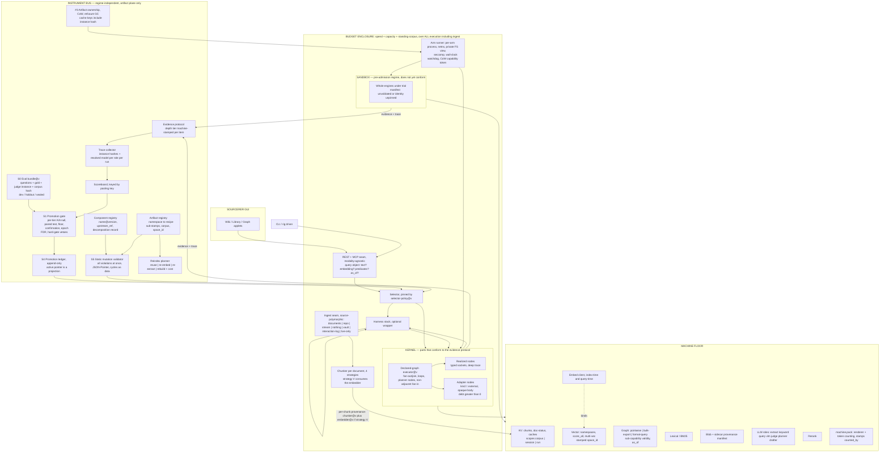
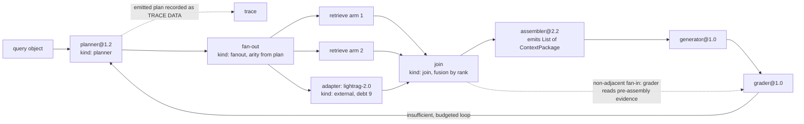

# D2 Instrument Bus — the measurement apparatus is the primary structure; the regimes are its clients

## Position

Candidate D is drawn as two regimes with a promotion path between them, and every property of the system is then derived from which regime a part sits in: how deeply it is compared, how strongly it is contained, whether it can be mutated. D2 asserts that this derivation is backwards. The regime split is a *deployment* fact — how much of a part we have taken apart — and deriving measurement, containment, and improvement rights from it couples three unrelated questions to one crude flag. What actually determines whether this system can improve itself is the instrument: the eval bundle, the promotion gate, the ledger, the validator, and the evidence protocol that feeds them. So D2 lifts those out of both regimes into a third block that neither owns, gives both regimes exactly one way to report into it, and lets every property that canonical D derives from regime membership be derived instead from a *measured* quantity carried on the data. Two consequences follow and they are the whole variant. First, promotion stops being a cliff: a part enters the kernel as an adapter — a legal kernel node of a declared external kind — runs the day it arrives, and is decomposed stage by stage afterwards, with the outstanding **decomposition debt** a computed registry field rather than an unspoken intention. Second, comparison depth stops being a regime property: an **evidence-depth tier** is machine-stamped onto every evidence item, so a black box that agrees to emit machine-resolvable refs yields retrieval-grade evidence without being taken apart at all, and the gate reasons about mixed-depth evidence explicitly instead of the rig refusing to mix it. The regime boundary that remains is not decomposition but **protocol conformance**: the sandbox holds parts that do not yet report into the bus; the kernel holds everything that does, at whatever depth it can.

## The five axes

| Axis | D2's position | Justification |
|---|---|---|
| **Kernel graph-execution style** | Full declared-graph engine (B-style) | The executor must host fan-out/join, planner-emitted ephemeral subgraphs, and non-adjacent fan-in as first-class primitives (DQ-1); nothing weaker survives the gap sweep's §3.8, and the declared graph is also the object the mutation operator patches. Adapters are nodes *in* that graph, not an escape from it. |
| **Sandbox containment depth** | Process isolation, applied by the arm runner to **both** regimes | A regime-specific isolation depth contradicts the instrument-block position, so D2 reads this axis as "the containment envelope is process-level" and makes it a bus-adjacent service rather than a sandbox property. The consequence is that a mutated *kernel* component never runs in-process beside its champion — the named hole in B [docs-verified, RT-selfimprove §3.1]. See §Disadvantages for where process-level stops. |
| **Promotion mechanics** | Adapter-first, then decompose incrementally; the registry tracks **decomposition debt** as a first-class computed quantity | Canonical D's promotion is a weeks-long refactor gated on a decision nobody wants to make, which is why its named rot mode is "everything stays in the sandbox forever" [docs-verified, CANDIDATES §D]. Making entry cheap and *partial* converts an unanswerable yes/no ("do we port?") into a number that trends ("how much is still opaque?"). |
| **Instrument placement** | Regime-independent third block; both regimes are clients | Sequencing is already settled as eval bundle + gate → isolation domain → architecture [docs-verified, MANIFEST]. D2 is the variant whose *shape* is that sequence: the instrument block is buildable and testable before either regime exists, which is only true if it depends on neither. |
| **Comparison depth** | `depth` tier is a first-class field on every evidence item, machine-stamped | Depth is a property of what was actually observed on a given run, not of where the part lives. Binding it to regime throws away the most valuable measurement in the system — gold-passage recall from an opaque part that can name its refs [inference from RT-selfimprove §2.6]. |

**Named adjustment.** The containment axis as assigned reads as a sandbox property. Under D2 the sandbox is not a security boundary and not the destination for untrusted code, so a containment depth attached to it would be attached to the wrong object. D2 keeps the assigned *depth* (process-level) and moves its *owner* to the arm runner. Nothing else in the assigned position was changed.

---

## Anatomy

The fixed anatomy (BRIEF §4), specialized to D2. Three blocks over one machine floor.



Four things the drawing is making claims about, each of which is an edit from the reviewed anatomy:

- **Ingest is a lane, not a mixin.** Upstream welds it onto the modality object as `_PipelineMixin` reading `self.full_docs` / `self.doc_status` / `self.tokenizer` [code-verified, via ANATOMY-REVIEW F6], and cutting it off is the single largest port cost. In D2 it is the *first* thing an adapter is relieved of: an adapter that declares `storage: machine` uses the machine ingest lane on admission, before any decomposition, because ingest is where the shared corpus lives and a part that does not share the corpus cannot be compared at all.
- **The shared corpus feed carries a hazard flag.** Chunker strategy `V` consumes an `EmbeddingFunc`, so chunk *boundaries* are a function of the embedding model [code-verified, via ANATOMY-REVIEW F3]. The claim "chunks are paradigm-neutral" is therefore false under `V`. D2's rule: chunkers declare `embedder_coupled: bool`; an embedder-coupled chunker's KV output is stamped with the embedding sub-recipe and is **not** admitted to the shared lane — it is recipe-bound like a graph. This lands hardest on D-family designs because the cross-regime feed is the thing both regimes are supposed to hold in common [docs-verified, ANATOMY-REVIEW §Effect on candidates].
- **`EMB -.binds.-> VEC`, and the asymmetry is a rule the validator enforces.** Index-time clients bind artifacts; query-time clients do not. Rerank and generator upgrades are free; extractor and embedder upgrades cost a rebuild. Embedder identity is mandatory — the machine refuses to write vectors it cannot attribute, which is the cheapest possible fix for the `_generate_collection_suffix()` hole where a missing `model_name` collides two models at the same dimension in one collection [code-verified, via ANATOMY-REVIEW F1].
- **The bus is drawn entirely inside the artifact plane and touches execution at exactly two points**, both at load time: `VAL → SEL` (a wiring is admitted or refused before it runs) and `LEDG → SEL` (the active pointer is a ledger projection, read at load). Nothing in the bus is read during a run. See DQ-2.

---

## Execution model

The kernel is a full declared-graph engine over a JSON wiring. Node kinds are a tagged sum — a single-key object whose key selects the kind and whose value is validated by that kind's own schema [docs-verified, WIRING-SPEC-DRAFT §2]. `deps` is a partial order over named node ids, never a total order by priority.



The three disqualifier primitives, explicitly:

- **fan-out / join** are node kinds, not a wiring convention. Arity may be static (declared in the wiring) or runtime (supplied by an upstream planner node). Runtime arity is the case no candidate expressed as drawn [docs-verified, architecture-selection.md]; D2 gives it a home by declaring that a `fanout` node's arity is an input socket like any other, so a `planner` node's output can drive it. Budget accounting under fan-out is multiplicative, not accumulative [docs-verified, GAP-SWEEP §3.7].
- **Ephemeral subgraph.** A `planner` node emits a runtime graph. The *planner* is the versioned artifact; the *emitted plan* is recorded as trace data and never enters the registry. Versioned wirings and ephemeral plans have separate lifecycles. A run remains reconstructable because the trace holds the plan verbatim alongside the planner's instance hash.
- **Non-adjacent fan-in.** Because `deps` is a partial order over named nodes, any node may name any node that precedes it in the topological order, not only its immediate predecessor. The eval-in-the-loop case — a grader needing pre-assembly evidence *and* the final answer — is a two-entry `deps` list, not a new primitive.

**Adapters constrain expressiveness, not the executor.** An adapter node is a black box to the executor: you cannot fan out from inside it, you cannot read a sibling's output from its middle, and a loop inside it is invisible. This is a real cost of adapter-first promotion and it is proportional to debt — every stage realized out of an adapter is a stage that becomes a fan-out point, an intervention point, and a trace boundary. Expressiveness is one of the three things decomposition buys.

**Containment is a property of the arm runner, not of the regime and not of production serving.** The promoted active wiring serves production in-process. Every *arm* — kernel or sandbox, adapter or realized — runs under the runner's envelope. Arm-start cost (process spawn plus interpreter warm-up) is paid once per arm per eval-bundle run, amortized across the bundle's questions, so it is negligible against the per-question token bill [inference].

---

## The sandbox boundary

**What the boundary is.** Not decomposition. Not opacity. **Protocol conformance.** A part is in the kernel when all five hold:

1. Its manifest validates against the capability vocabulary, and every capability it exercises is declared (deny-by-default; undeclared is denied, never warned).
2. Its instance identity is computable: `(name@version, config_hash, resolved_dependency_ids)` with `config_hash` over the author-supplied input JSON canonicalized by RFC 8785, including the build/runtime environment hash. For an adapter this hash covers the *whole external closure* — that is what makes an opaque part's identity honest.
3. It declares its storage mode: `machine` (uses machine stores under a scoped write capability) or `self-contained` (writes only inside its own blob, with a machine-owned sidecar provenance manifest beside it).
4. It emits evidence conforming to the protocol at depth ≥ T0, with instance hashes and the resolved model per role per run. Role→binding is hot-updatable at runtime [code-verified, via ANATOMY-REVIEW F5], so the *role name* in a trace is worthless; the resolved model id is the field that matters.
5. It accepts the arm-runner envelope: it can be started as a fresh process, denied network and filesystem by default, and killed on a wall clock.

**What is enforced, by what mechanism.**

| Enforced | Mechanism | Where it lives |
|---|---|---|
| Capability declarations | Static mutation validator, fails closed at load with all violations at once | Bus (#5) |
| Network / filesystem denial | Per-arm process in its own mount and network namespace; substrate implementation is systemd unit confinement (`confinement.enable`, `mode = "full-apivfs"`) plus `PrivateNetwork`, since unit confinement is filesystem-level only [docs-verified, NIX-LEVERAGE] | Arm runner |
| Wall clock | `RuntimeMaxSec` or supervisor equivalent | Arm runner |
| Store-write scope | Capability token scoped to `(recipe@version, namespace)`, CoW overlay per arm; **not a process property** | Bus (#3) |
| Spend and capacity | Budget enclosure over the whole execution including ingest | Floor |
| Evidence honesty | Depth is machine-stamped from what arrived, never self-declared | Bus |

**What crosses the boundary.** Corpus chunks and their per-chunk provenance, in one direction (the machine feeds both regimes). Evidence items and traces, in the other (both regimes report into the bus). Nothing else. A sandbox part never reads the ledger, never reads the artifact registry, and never writes a machine store.

**What the sandbox is still for.** Cheap disqualification before paying the index bill. A new index recipe can be trialed on a 500-chunk sub-corpus for roughly 5% of the token bill, against ~15 M extraction tokens for a full recipe version — one index-recipe mutation is about seven days of query-side experimentation [inference, RT-selfimprove §5 and §2.7]. That is the sandbox's permanent job in D2, and it is a smaller job than canonical D gives it, because hosting is no longer the sandbox's monopoly.

---

## Promotion

Promotion is a gradient with a threshold at the front of it.

**Step 0 — Admission (the only discrete event).** A sandbox part becomes an adapter node when the five conformance conditions hold. Cost: 1–3 days for an adapter, the same order as building the sandbox wrapper in the first place [inference, RT-selfimprove §5 table]. The adapter enters the registry with a **decomposition record**:

```json
"decomposition": {
  "declared_stages": ["chunk","extract","seed","expand","rank","assemble","generate"],
  "realized_nodes": [],
  "debt": 7,
  "upstream_ref": {"repo":"...","tag":"v1.5.4","symbols":[...]}
}
```

`declared_stages` comes from the part's own manifest — what it claims to do internally, in the machine's primitive vocabulary. `realized_nodes` is computed by the registry from the wiring: nodes that exist as kernel nodes with typed sockets. **Debt is computed, never declared**, which is what stops it from being a comment.

**Step 1..N — Decomposition increments.** One stage is cut out of the adapter and becomes a realized node; the adapter's manifest shrinks by that stage; debt decrements. Each increment is an ordinary wiring change validated and A/B'd like any other, with the incumbent being the adapter-with-the-stage-inside. The acceptance test for a lossless increment is the parity test the project already has a precedent for: same wiring, same corpus, pre- and post-decomposition, outputs identical or differing only where the increment declares [docs-verified, RT-upgradability §5 and the `run_substrate_parity.py` precedent].

**What evidence gates each increment.** The same gate as any other promotion, at the tier the increment's claim requires (see §Comparison depth). A decomposition increment's claim is normally "this is behavior-preserving", which is a *parity* claim evaluated as a hard gate, not a significance test — outputs match or they do not.

**What is discarded.** Losers are tombstoned: identity, parent, mutation class, effect size, decision, evidence pointer — roughly 200 bytes — while code and artifacts become GC-eligible under reference counting. Tombstones exist as much to stop a stateless proposer re-proposing the same losing mutation every epoch as to keep the tree readable [inference, RT-selfimprove §1.3].

### What actually forces debt down

Three forcing functions, ranked by how much of a mechanism each really is. The brief demands an honest answer here, so:

1. **Mutation surface equals realized nodes. This is a mechanism, not discipline.** You cannot mutate what is not a node. An adapter with debt 7 and zero realized nodes has exactly one mutable surface — its own config — and the static validator can check almost nothing inside it. The reason anyone decomposes a stage is that they want to A/B that stage; decomposition is the price of admission to the improvement loop for that stage, and no amount of goodwill substitutes. This is enforced by the wiring format itself.
2. **Debt is priced in evidence depth, and depth sets the promotion floor.** An adapter emits no T2/T3 items for stages it has not realized, so claims about those stages are refused for insufficient depth, and claims it *can* make are tested against a wider null with a higher minimum-effect floor (§Comparison depth, Rule 2). The floor is not a policy number someone can argue down — it is the A/A 95th percentile measured at that tier. This is a real cost imposed automatically, but it is a *tax*, not a *bar*: a part that never decomposes simply pays it forever.
3. **Debt is reported and renewal is recorded.** Debt is written into every ledger record at decision time, so its trend per part is a query, not an audit. Two governance rules ride on it, generalizing the two amendments canonical D needs to stay above C [docs-verified, RT-upgradability §4]: parts with debt above a threshold are **excluded from the default selector** (runnable by the rig and by explicit request, never routed to by production), and an adapter whose debt has not moved in ~90 days requires a **recorded renewal reason** to stay selectable at all.

**The concession.** Only (1) is a mechanism. (2) is pricing and (3) is discipline with a paper trail. An adapter that never decomposes is a permanent opaque node sitting in the kernel, and D2 does not prevent that — it makes it visible, expensive, and non-load-bearing in production. The residual hole is specific and worth naming precisely: an **index-side** adapter with `storage: machine` legitimately needs a store-write capability, and inside its declared `(recipe@version, namespace)` scope the machine cannot audit what it writes beyond the namespace boundary and the sidecar provenance stamp. Shared-artifact corruption is the largest uncovered blast radius in the whole design [docs-verified, RT-selfimprove §3], and D2 narrows it to exactly this case rather than eliminating it. For a self-contained adapter the hole does not exist, because it has no machine-store write capability at all.

---

## Instruments

All six machine services live in or beside the bus. None of them is a kernel service.

| # | Service | Home | Notes for D2 |
|---|---|---|---|
| 0 | **Eval bundle@version** | Bus, owned by the bus | Questions + gold passages + judge instance + judge prompt hash + corpus snapshot hash; dev / holdout / sealed holdout. The judge is an LLM client role and therefore version-coupled like any other; a judge that drifts mid-A/B *is* the measured improvement. |
| 1 | **Promotion gate** | Bus | One implementation serves every verb in the ladder (`check` / `preview` / `run` / `promote-next` / `promote-now`); the verb is a parameter. Per-tier A/A nulls, paired significance, minimum-effect floor, confirmation on disjoint subsets, epoch FDR, regression suite as vetoes never averaged. |
| 2 | **Isolation domain + manifest enforcement** | Arm runner — bus-adjacent, applied uniformly to both regimes | The only service D2 places outside the bus proper, because it acts on the execution plane. It reports into the bus (kill reason, watchdog trip, denied syscall) and never reads from it during a run. |
| 3 | **Artifact ownership + CoW + refcount GC** | Bus | Mints the per-arm write capability the runner attaches. Cache keys include the component **instance** hash — cache poisoning is the insidious failure and the cheapest to prevent. |
| 4 | **Promotion ledger** | Bus | Append-only decisions, distinct from the lineage tree. Running an arm SHALL NOT append. The active-wiring pointer is a projection derived from the ledger; on disagreement the ledger wins. Records tier-of-decision and per-node debt. |
| 5 | **Static mutation validator** | Bus | Runs before execution on every wiring including one a mutation operator emitted seconds ago. All violations at once with JSON-Pointer paths; cycles reported as data; subtractive operations fail closed. |

Two registries, split because their lifecycles are different: the **component registry** (identities, lineage, `upstream_ref`, decomposition record — bytes, never deleted) and the **artifact registry** (namespace → sub-recipe stamps, corpus id, `space_id`, time — gigabytes, deletion required). The **reindex planner** reads the artifact registry and classifies `recipe@vA → recipe@vB` as `{reuse | re-embed | re-extract | rebuild}` with a cost estimate.

**Who owns what.** The bus owns all of it. Neither regime owns any instrument, and this is the load-bearing structural claim of the variant: a kernel that owns the gate is a kernel that grades its own homework, and the specific way that goes wrong in canonical D is that cross-regime comparison collapses to the shallowest common denominator, so **the promotion decision is always made on the least informative evidence the system produces** [docs-verified, RT-modularity Attack 4]. D2's answer is not to make the sandbox deeper; it is to stop letting the regime decide the depth.

---

## Comparison depth

### The tier ladder

Four tiers, on the item, not the run. One run routinely emits several.

| Tier | Name | What it contains | What it enables | Available from |
|---|---|---|---|---|
| **T0** | `answer` | Final answer, token count re-counted centrally with `counted_by`, latency, degraded/partial flags | Whole-part comparison | Anything, including a total black box |
| **T1** | `evidence` | The pre-generation evidence set as `ScoredItem[]` — `{ref, kind, Score{value, semantics, space_id}, provenance}` — with every ref machine-resolvable | Gold-passage recall@k, nDCG. **No judge, no generator noise.** | Any part that declares `emits-machine-refs`, decomposed or not |
| **T2** | `stage` | Per-node input/output values at declared kernel node boundaries, each with the producing instance hash | Attribution: which node's output changed | Realized nodes only |
| **T3** | `node` | T2 plus per-node spend, per-node `refs_in`/`refs_resolved`, and the ability to hold every other node fixed while varying one | Intervention: a causal claim about one node | Realized nodes with declared determinism |

The T2/T3 line is observation versus intervention, and it is the line that matters to the gate: T2 tells you *what* differed, T3 lets you claim *why*.

**T1 is the crux of the variant.** Retrieval-side mutations are five of the seven primitive component types, and measuring retrieval instead of answers removes generator nondeterminism and judge self-disagreement — the two noise sources that dominate at n=40, where judge-only measurement error is roughly ±4.7 pp at one standard error [inference, RT-selfimprove §2.3 and §2.6]. Canonical D makes T1 unavailable from the sandbox by fiat, because "sandbox parts compare at answer level only" is a regime rule. D2 makes T1 a *capability* — an engine that can name the chunks it retrieved in the machine's ref vocabulary gives you the highest-value, lowest-noise measurement in the system while remaining entirely opaque. That is the single largest thing this variant buys.

### The gate's rule for mixed depth

The obvious objection is that putting a depth field on the evidence lets the gate consume mixed-quality evidence — which is precisely the failure the tier was invented to prevent. Five rules, and they are the contract:

**Rule 1 — Comparison is always within one tier.** Mixed-depth evidence *sets* are normal; mixed-depth *comparisons* do not exist. For a given claim the gate computes the greatest common depth across both arms, projects both down to it, and runs one paired test there. It may additionally run tests at every lower tier. It never computes a statistic where one arm contributes T2 items and the other contributes T0 items.

**Rule 2 — Each tier carries its own A/A null and its own minimum-effect floor.** Calibrated per `(eval_bundle@v, tier, metric)` by running the champion against itself. The floor is the A/A 95th percentile at that tier, not a policy constant. This is how the gate reasons about depth *explicitly*: a +3 pp T0 answer-judge win is inside the null; a +3 pp T1 recall win may be well outside it. Without per-tier calibration the ladder is decoration.

**Rule 3 — The claim class must be supported by the tier, and a shortfall is a refusal, not a null.**

| Promotion claim | Minimum tier |
|---|---|
| "This part is better overall; make it selectable" | T0 |
| "This retrieval-side change is better" | T1 — T0 alone is **refused**, because generator and judge noise swamp the effect |
| "This node caused the change" | T2 |
| "Promote this node's mutation, holding the rest fixed" | T3 |

The verdict for a shortfall is `insufficient-depth`, never `inconclusive`. The distinction is operational: `inconclusive` tells you the change did not help; `insufficient-depth` names the instrument you are missing and points at the decomposition increment that would supply it.

**Rule 4 — Cross-tier evidence may veto, never support.** Hard-gate regressions — citation validity, refuse-when-no-evidence, latency and token ceilings, output-schema conformance, and `refs_resolved < refs_in` — are evaluated wherever they are observable and are always vetoes. A T0-observable regression kills a promotion justified at T3. This is the only legal asymmetric use of mixed depth and it is safe because vetoes are conservative in the direction that matters.

**Rule 5 — Depth is machine-stamped, never self-declared.** The bus sets `depth` from what actually arrived: refs that resolve, node boundaries carrying instance hashes, an intervention actually performed. A part whose manifest claims `emits-machine-refs` but emits refs that do not resolve has its items downgraded to T0 *and* trips the `refs_in > refs_resolved` hard gate. Without Rule 5 the tier is a self-report and the first thing an optimizing proposer learns is to inflate it.

**The pooling key.** Two evidence items may be pooled or compared only when identical on `(eval_bundle@v, corpus@v, judge_instance, space_id, tier, counted_by)`. One line, and it subsumes the judge-drift failure, the corpus-drift failure, the same-dimension embedder swap, the N-tokenizers measurement failure, and the mixed-depth failure. It is the most load-bearing clause D2 contributes.

---

## Scenario S1 — Embedder swap

A query-side and index-side embedder change, `bge-m3` → a different model at the same dimension. The same-dimension case is the dangerous one; a dimension change crashes loudly at load on the vendored `nano_vectordb` dimension assert [code-verified, via RT-upgradability §0].

**What invalidates.** SA-2 sub-recipe stamps decide it, per artifact class:

| Artifact | Stamp | Verdict |
|---|---|---|
| KV chunks | chunker sub-stamp | **Reuse** — unless the corpus contains chunks from strategy `V`, whose chunker sub-stamp includes the embedder [code-verified, via ANATOMY-REVIEW F3]. Those chunks rebuild, and per-chunk provenance is what makes this decidable at chunk granularity rather than corpus granularity. |
| Graph | extraction sub-stamp | **Reuse.** The extractor did not move. This is SA-2's entire payoff: without split stamps, an embedder change invalidates the graph, which is logically false but is what a single coarse stamp asserts — and extraction is the expensive side, roughly 15 M tokens per recipe version [inference, RT-selfimprove §2.7]. |
| Vector namespaces | embedding sub-stamp / `space_id` | **Re-embed** into a new namespace. Never a migration. Upstream's own answer is physical separation by collection suffix, and that is the right answer [code-verified, via ANATOMY-REVIEW F1]. |
| Lexical index | none | Reuse. |

The reindex planner returns `{KV: reuse (except V-chunks: rebuild), graph: reuse, vectors: re-embed, cost: ~N_chunks × embed_cost}` before anything runs.

**What the trace records.** The resolved embedder model id per role per run — not "the embed role" — plus the `space_id` of every namespace touched, `refs_in`/`refs_resolved`, and the instance hashes of every node. `space_id` is hashed from `(model_id, revision, dim, metric, normalization, query_prefix, doc_prefix, pooling, namespace_text_convention)`, so the two 1024-d encoders that look identical to a dimension check are different identities here.

**In-flight arms straddling the migration.** Three mechanisms, in order:

1. **Refusal at load.** Any wiring whose query-side encoder's `space_id` ≠ the namespace's `space_id` fails static validation. This is a socket typecheck, not a runtime guard, so the classic failure — query embedded by model B against vectors from model A, returning plausible ranked wrong results with no exception [code-verified failure path, via RT-upgradability §2] — never reaches execution. Both sides must move together or neither moves.
2. **Sealing, not killing.** An arm already running when the migration lands has its evidence set closed at the boundary and marked `frozen_at_migration`. Because the pooling key includes `space_id` and `corpus@v`, its pre-migration evidence can never be silently pooled with post-migration evidence — the refusal is mechanical, not a reviewer's judgment. If the sealed evidence already satisfies the confirmation rule the gate may decide on it; otherwise the verdict is `straddle` and the arm re-runs against the new baseline. Either way the ledger records the straddle.
3. **Re-baselining by A/A.** After any artifact-plane migration the gate's per-tier nulls are stale, because the null distribution is a property of the corpus and the artifacts as much as of the metric. A champion-versus-itself run on the new artifacts re-establishes the floor for every tier before any challenger is judged. This is cheap — it reuses the new index — and it is the single best defence available [inference, RT-selfimprove §2.5].

**How misattribution is avoided.** The staleness view is derived from artifact registry × currently-pinned instances: "namespaces built by embedder X are unreadable by wirings pinned to embedder Y." Combined with mechanism (1), a regression cannot be attributed to a component under test when the real cause is an invalidated artifact, because the invalid pairing is unrunnable. This matters more than it sounds: an artifact-caused regression misattributed to a component version *corrupts* the improvement loop rather than merely slowing it, and the false fact is permanent — the machine will avoid that component forever [inference, ANATOMY-REVIEW §17].

**What D2 does that canonical D does not.** The `space_id` and pooling rules are bus properties, so they apply to sandbox parts identically. A sandbox engine that re-embeds on its own schedule reports `space_id: opaque`, and opaque-space evidence is never pooled with machine-space evidence — the fleet-is-mixed failure becomes an explicit refusal rather than a published wrong number [inference, generalizing RT-upgradability's C-1].

**Cost.** Two full vector namespaces coexist through the shadow window, reference-counted and not evictable while any arm pins either. A/B-ing two embedders means two full copies; three means six [docs-verified, ANATOMY-REVIEW §17].

---

## Scenario S2 — LightRAG ships v2 upstream

**How you know, and whether it is a diff-able list.** It is a list. Every component registry entry carries `upstream_ref` = (repo, tag/commit, file/symbol), and for realized nodes cut out of an adapter, the decomposition record carries `upstream_ref` **per realized node**. A scheduled job diffs the new upstream tag against the recorded refs and emits "these K of N components have upstream deltas", per symbol. This is the difference between a re-port decision made blind and one made from a list, and it costs one field [docs-verified, ANATOMY-REVIEW §18].

**Which components have deltas, concretely.** For the LightRAG lineage: the four shipped chunkers under two coexisting contracts (upstream maintains both deliberately, which is itself the contract-version-versus-behavior-version discipline in practice) [code-verified, via ANATOMY-REVIEW F2]; the extraction prompt and its parser; the four query-path stages; the storage base contracts — `base.py` is 1,068 lines with 43 abstract methods, of which the Cozo graph plugin implements 20 [code-verified, via RT-upgradability §1]; and `storage_migrations.py`, whose migration model is version-free heuristic sniffing on emptiness, unusable as a foundation for a machine holding N artifact sets from M recipe versions [code-verified, via RT-upgradability §1].

**What the sandbox absorbs.** `lightrag@2.0` runs in the sandbox the day it ships — unmodified, own dependency tree, own storage — and produces T0 evidence against the same eval bundle. That answers "is v2 better at all" without a port. If it declares machine-resolvable refs it produces T1 as well, which answers "is v2's *retrieval* better", which is the question that actually predicts whether porting is worth it.

**What the kernel must re-implement, and how D2 changes the answer.** Canonical D's promotion path is one-way, so once LightRAG is ported, upstream v2's better extraction prompt is something you can observe is better and have no ritual to absorb; the sandbox copy and the kernel copy drift and nobody owns reconciliation [docs-verified, RT-upgradability §1]. In D2 the re-port is not a special event, because promotion was never a single event:

1. `lightrag-adapter@2.0` is admitted as a **new adapter node version** with debt reset to full. It is an ordinary registry entry, not a migration project.
2. The kernel's already-realized nodes stay pinned. Suppose 5 of 9 stages were realized from v1.5.4.
3. For each realized stage, the v2 delta list says whether that stage's upstream symbol moved. Where it did, the comparison is a **T3 intervention**: hold the wiring fixed, swap that one node for a v2-derived implementation, paired test at the node boundary. Where it did not, there is nothing to do.
4. For the 4 unrealized stages, evidence is T0/T1 only — adapter-v2 versus adapter-v1.5.4 as wholes. If v2 wins there and you want to know *which* stage did it, the gate says `insufficient-depth` and names the decomposition increment that would answer it. That is the moment decomposition pays for itself, and it is the moment the debt trend actually moves.

So the re-port becomes stage-by-stage and evidence-backed rather than a single blind decision, and the "no re-promotion path" defect is structurally absent — re-promotion is just more increments on the same gradient.

**What it costs.** The adapter and the realized nodes of the same lineage coexist and drift, so the reconciliation problem canonical D has *between regimes*, D2 has *inside the kernel*. Per-node `upstream_ref` gives the drift an owner per node instead of one owner for the whole part, which makes it tractable, not free. And the query side is the cheap side — roughly 794 lines across 5 stages with plain-data boundaries — while the index side is roughly 1,786 lines welded to LightRAG's entity/relation ontology [code-verified, via RT-selfimprove §5]. Expect the index-side stages to be the ones that sit at debt indefinitely.

**One trap D2 inherits and must name.** Decomposition is exactly where a monolith's implicit prompt-format agreement gets cut into assembler + generator, and the port loses it. Expect the first several increments to look like regressions when they are format-decoupling bugs [docs-verified, RT-modularity Attack 3]. The structured prompt boundary is the defence — assemblers emit typed `ContextPackage` blocks, rendering happens once in a machine-owned renderer, generators declare `requires_block_kinds`, and the validator refuses the wiring at load when the assembler cannot emit a required kind. The parity hard gate on each increment catches the rest.

---

## Scenario S3 — One full mutate → A/B → promote cycle

A config-class mutation on a realized ranker node: `top_k 40 → 60`. Every service touched, in order.

| # | Service | What happens |
|---|---|---|
| 1 | **Mutation operator** (versioned artifact; hit-rate tracked per class in the ledger) | Emits an RFC 7386 merge-patch against incumbent wiring `W@n`. JSON only. It never emits code and never emits anything the validator would evaluate. |
| 2 | **#5 Static mutation validator** (bus) | Applies the patch; canonicalizes by RFC 8785; computes `config_hash` including the environment hash; validates the **arm and the base independently** (an arm's override is filtered before type checking and can otherwise mask base errors); typechecks every `deps` edge including `space_id` match, `requires_block_kinds`, `requires_edge_weight_semantics`, `accepts_score_semantics`, and `effects[]` against declared capabilities; checks caps (max nodes, loop budget, config domain — `top_k ≤ 200`); reports **all** violations at once with JSON-Pointer paths; reports cycles as data. Fails closed. |
| 3 | **#3 Artifact ownership** (bus) | Mints a per-arm capability token: write scope `(recipe@version, namespace)`, CoW overlay. Cache keys for this arm include the mutated instance hash, so the arm cannot poison the champion's cache. |
| 4 | **Arm runner** (#2) | Two arms, two fresh processes, each in its own mount and network namespace, deny-by-default, seccomp-filtered, wall-clock capped. Arms are interleaved rather than run concurrently, so a shared rate-limited client cannot distort either arm's latency. |
| 5 | **Budget enforcer** (floor) | Encloses both arms including any ingest: spend (steps/tokens/time), capacity (the consuming model's context window), multiplicative under fan-out. A budget halt produces a **partial** result that is traced and scored, never discarded. |
| 6 | **Kernel executor** | Runs each arm over the dev split. Emits node-level records with instance hashes and the resolved model per role. |
| 7 | **Evidence protocol** (bus) | Mints evidence items. Depth machine-stamped: T3 for the mutated node and its neighbours (intervention performed, everything else held fixed), T2 for other realized nodes, T1 for the evidence set, T0 for the answer. Tokens re-counted centrally with the consuming model's tokenizer, stamped `counted_by`, so the two arms' token numbers are the same unit. |
| 8 | **#0 Eval bundle@v** (bus) | Dev split only. Sealed holdout untouched — it is a scarce resource, touched at most once per ~20 dev experiments. |
| 9 | **Scoreboard** (bus) | Accumulates under the pooling key. **The run does not append to the ledger.** Evaluation is not a decision. |
| 10 | **#1 Promotion gate** (bus) | Below. |
| 11 | **#4 Promotion ledger** (bus) | On promote: append mutation id, class, parent, arm ids, **tier of decision**, effect size, verdict, evidence pointer, proposer id, and per-node debt of the promoted wiring. Append-only. |
| 12 | **Alias repoint** | Atomic `rename(2)` over the pointer, measured at ~1.4 ms on host `legion`, switching a whole artifact set at once [code-verified, spike 004]. Never a build. The active pointer is a projection: if it and the ledger disagree, the ledger wins. |
| 13 | **GC / tombstone** | Loser tombstoned to ~200 bytes; its CoW overlay becomes GC-eligible once unreferenced by any scoreboard entry someone still wants reproducible. |

**What the gate sees.** For each arm: paired per-question items at each tier, each carrying instance hashes, `counted_by`, `space_id`, `refs_in`/`refs_resolved`, `degraded`/`partial` flags, and the arm's decomposition debt. Plus the stored A/A null for `(bundle@v, tier, metric)`, the epoch's α budget, and the hard-gate regression results.

**What the gate does.** Claim class is "promote this node's mutation holding the rest fixed" → minimum tier T3 → T3 is available → project both arms to T3 → paired test (exact McNemar for binary, paired bootstrap for continuous) → compare effect against the T3 floor (A/A 95th percentile) → if it clears, require confirmation on a disjoint question subset → apply epoch FDR → check every hard gate as a veto.

**What the gate refuses, by name.**

- `insufficient-depth` — the claim needs a tier the evidence does not have. A retrieval-side claim backed only by T0 is refused here, not tested and reported inconclusive.
- Any comparison whose arms differ on the pooling key `(eval_bundle@v, corpus@v, judge_instance, space_id, tier, counted_by)`.
- Any arm where `refs_resolved < refs_in` — the confident sourceless answer is the worst failure the system can produce and this converts it from silent to loud.
- Any arm whose depth was downgraded by Rule 5 (claimed refs did not resolve), which is both a downgrade and a veto.
- Any support drawn across tiers (Rule 4 permits vetoes only).
- `below-floor` for an effect inside the tier's A/A null; `unconfirmed` for a first win that failed its confirmation subset; `regression-veto` for any hard-gate failure regardless of the headline effect; `straddle` for evidence sealed at a migration boundary.

**One thing this walk-through exposes about D2.** Had the mutation targeted an adapter's config instead of a realized node, step 2 would have validated almost nothing — there are no internal sockets to typecheck — and step 7 would have produced T0 and T1 only, so the claim class would have had to be "this part is better overall" and the gate would have tested it against the widest null in the system. Decomposition debt is not an abstract score; it is visible at both ends of the same cycle, as validator power and as gate power.

---

## Advantages

1. **Promotion cannot stall at zero.** Canonical D's projected two-year failure is 3 kernel parts and 12 sandbox parts — B's cost with C's opacity, strictly worse than plain C [docs-verified, RT-upgradability §4]. That outcome is unreachable in D2 because kernel entry costs an adapter, not a decomposition. The question stops being "do we port?" and becomes "how far did we decompose?", which has a number attached and a trend.
2. **Retrieval-grade evidence from opaque parts.** T1 needs a part to name its refs, not to be taken apart. It removes judge and generator noise entirely and is the correct target for five of seven primitive component types. Canonical D forfeits it by rule. This attacks the falsifier that dominates the whole architecture choice — that at n=40 with no A/A null, no candidate can tell a 5 pp improvement from noise [inference, RT-selfimprove §2].
3. **Uniform containment.** Nobody has to push a mutation into the sandbox to contain it, and mutated kernel code never runs in-process beside the champion.
4. **A refusal that names the missing instrument.** `insufficient-depth` changes what the operator does next (build the instrument) rather than what they conclude (the change did not help). Over an epoch this is the difference between a decomposition backlog and a shrug.
5. **Re-promotion is free.** Upstream deltas are more increments on the same gradient. Canonical D has no re-promotion ritual at all.
6. **The build order and the architecture are the same shape.** The settled sequencing is eval bundle + gate → isolation → architecture. D2's first block is exactly that, standing alone and testable before either regime exists, because it depends on neither.
7. **Cross-regime comparison stops being defined at the shallowest denominator.** It is defined per claim, at the greatest common depth of the two arms actually being compared — which for two T1-capable parts is T1 even when one of them is a black box.

## Disadvantages

1. **D2 dissolves D's structural bound on kernel population and replaces it with a priced one.** D leads the field because registry growth and blast radius are both *structurally* bounded, and part of that bound is that promotion is expensive enough to keep the kernel at 3–5 parts [docs-verified, RT-selfimprove §7]. D2 makes promotion cheap on purpose, so nothing structural stops the kernel from growing to the sandbox's size. The replacement bounds are the standing-corpus budget with reference-counted GC, the debt-threshold exclusion from the default selector, and the renewal record. These are real but they are policy with instrumentation, not structure. **This is D2's most serious cost and it is a genuine weakening of the reason D leads.**
2. **A permanent adapter is a permanent opaque node with kernel placement.** Section §Promotion states exactly what forces debt down and concedes that only mutation-surface is a mechanism. The residual hole is the index-side adapter with a machine store-write capability, inside whose declared namespace the machine cannot audit writes.
3. **Process isolation does not cover store-write, and kernel-surface escape is out of the threat model.** See §Disqualifier check for the itemized comparison against machine service #2's bar.
4. **The evidence protocol is a large contract, frozen early, that everything depends on.** Both regimes, every part, every instrument. Getting the tier boundaries wrong is expensive — a tier redefinition either re-stamps historical evidence or invalidates the scoreboard, and the scoreboard is the thing whose continuity the whole loop rests on. D2 concentrates schema risk precisely where D2 says the value is.
5. **Two evidence-emission paths that can drift.** The bus receives from an in-process kernel executor and from an opaque external process over IPC. Two implementations of the same contract is the same defect class as N components counting tokens with N tokenizers [docs-verified, RT-modularity Attack 1a]. Mitigation is that the bus re-counts tokens and re-resolves refs itself rather than trusting either path, which means the bus does real per-item work and is on the critical path of every arm.
6. **Higher fixed cost before anything runs.** A/A calibration must be run per tier per bundle version, so the calibration bill multiplies by the number of tiers in use. The instrument block is larger than canonical D's scattered services, and it must exist before the first comparison is meaningful.
7. **Debt is a metric, and metrics get gamed.** `declared_stages` comes from the part's manifest, so a part that declares three stages instead of nine starts with debt 3 and looks decomposable when it is not. Rule 5 does not help here — it protects the depth tier, not the debt denominator. The partial answer is that `declared_stages` must be drawn from the machine's primitive vocabulary and is reviewable at admission; the honest answer is that this one number is a self-report and D2 has no mechanism to verify it.

---

## Disqualifier check

**DQ-1 — Executor primitives.** *Pass.* `fanout` and `join` are node kinds in the tagged sum, with arity supplied statically or from an upstream `planner` node's output socket, and multiplicative budget accounting. `planner` nodes emit ephemeral subgraphs: the planner is the versioned artifact, the emitted plan is recorded as trace data, and the two have separate lifecycles. Non-adjacent fan-in falls out of `deps` being a partial order over named node ids rather than a chain. Caveat, stated rather than hidden: an *adapter* hosts none of these internally, so a part's access to the primitives is proportional to its decomposition. The executor's capability is unconditional; a given part's use of it is not.

**DQ-2 — Two-plane separation.** *Pass, with a variant-specific guard.* The instrument bus is entirely artifact-plane: registries, eval bundles, evidence, traces, scoreboard, ledger, validator. The executor is the execution plane. The bus is touched from the execution plane at exactly two moments, both at load: validation admits or refuses a wiring, and the ledger projection supplies the active pointer. During a run the bus is **write-only** from the execution plane's perspective — evidence and trace records flow in, nothing flows out. The specific temptation D2 creates is adaptive arm allocation: having the executor read the running scoreboard mid-bundle to decide how to spend the remaining budget. That is forbidden by the same rule, and it is worth naming because it is the one attractive way this design would merge the planes. A completed run's trace is an unrolled DAG naming instance hashes; a cyclic wiring is DAG-plane data whose content describes cycles, which is not a merge.

**DQ-3 — Second identity vocabulary.** *Pass.* Identity is SA-1 throughout: a content hash of resolved inputs, with `name@version` as a human lineage label. `upstream_ref` is provenance metadata and is never used for resolution. Store paths are never identity. An adapter wrapping a self-contained engine has internal addresses, and those are declared as a part-local projection with an auditable bijection — the same treatment positional chunk indices get — never promoted into machine identity.

**DQ-4 — Environment-unpinned identity.** *Pass.* `config_hash` includes a build/runtime environment hash. For an adapter this covers the entire external closure, which is the clause that makes an opaque part's identity meaningful: the adapter is opaque in *behavior*, never in *identity*. An engine upgrade beneath an adapter changes its instance hash automatically rather than depending on someone remembering to bump a label.

**DQ-5 — Wirings with evaluation semantics.** *Pass.* Wirings are JSON. The adapter kind is one branch of the tagged sum; its `config` is opaque JSON validated against the adapter's declared schema and never evaluated by the validator. The mutation operator emits JSON only. If the validator is implemented on `lib.evalModules`, JSON enters wrapped as `imports = [ { config = <json>; } ]` under the full hardening rule set; the contract stays implementable without it.

### Where process isolation stands against machine service #2's bar

| Requirement | Covered? | By what |
|---|---|---|
| Deny-by-default **network** | Yes | Per-arm network namespace with no interfaces. Not by a bare process — a plain fork/exec inherits the host's network. D2's "process isolation" means process **plus namespaces plus seccomp**, and the substrate implementation needs `PrivateNetwork` or a private-network container because unit confinement is filesystem-level only [docs-verified, NIX-LEVERAGE]. |
| Deny-by-default **filesystem** | Yes | Private mount namespace exposing only the arm's own closure (`mode = "full-apivfs"`). |
| Deny-by-default **store-write** | **No — not by the process** | Covered instead by #3's per-arm capability token scoped to `(recipe@version, namespace)` over a CoW overlay. This is the honest gap in the containment axis: store access is a service call, not a syscall, so no process-level mechanism can scope it. The bar is met, by a different service. |
| **Wall-clock watchdog** | Yes | `RuntimeMaxSec` or supervisor equivalent, which also contains the surveyed case of a component that owns its own internal loop (auto-merge loops `while is_changed` inside a transformer [code-verified, via RT-modularity Stress 3]) — the machine cannot meter inside it, but it can kill it. |
| **Per-arm process** | Yes | By construction, and applied to kernel arms too, which is stronger than canonical D. |

**Where it stops.** Kernel-surface escape is not covered: a namespaced process shares the host kernel, so a kernel bug is an escape. The declared threat model is LLM-authored mutations and third-party research code — carelessness and unbounded resource use, not a targeted attacker — and process-level containment is proportionate to it. A part shipping an unvetted native binary from an untrusted source is outside that proportion; D2 names a microVM tier for that class as **declared, not built**, so the gap is legible rather than absent.

---

## Rubric scoring

Honest, and no variant scores all ten. Scored 1–5.

| # | Goal | Score | Reasoning |
|---|---|---|---|
| 1 | Single responsibility | **3** | Realized nodes satisfy it; adapters violate it by construction. The saving grace is that the violation is measured rather than argued. Rises with decomposition. |
| 2 | Explicit contract | **4** | Typed sockets, `ScoredItem`/`Score{value,semantics,space_id}`, `ContextPackage` blocks between realized nodes. At the adapter boundary the contract narrows to the universal core plus declared capabilities — real, enforced, and much thinner. |
| 3 | Capability manifest | **5** | Machine-enforced, deny-by-default, refused at load with all violations at once, and enforced *uniformly* across regimes because #2/#3 are not kernel services. The strongest goal for this variant. |
| 4 | Swappable | **4** | Realized nodes swap by contract. An adapter swaps only as a whole — which is still a legal, validated, gated swap, just a coarse one. |
| 5 | Composable | **4** | All three DQ-1 primitives, stacking harnesses with a genuine wrapper back-edge. Composition stops at an adapter's skin. |
| 6 | Artifact-shareable | **3** | SA-1/SA-2 stamps make compatibility checkable rather than hoped, and the shared corpus feed is real. But D2 *increases* the number of opaque parts sitting in the kernel, self-contained adapters share nothing, and the embedder-coupled chunker punches a hole in the "paradigm-neutral chunks" claim that this design has to route around rather than close. |
| 7 | Version-controlled | **4** | Full identity, lineage, immutability, ledger/lineage split, environment pinning. Docked one because an adapter's internals are unversioned below its own identity, so lineage for an adapter is a single coarse node where a decomposed part has seven. |
| 8 | Mutable | **3** | Exactly proportional to decomposition, which is the variant's own thesis turned against it: at admission a part's mutable surface is its config and nothing else. Trends toward 5 as debt falls, and D2's honest position is that this score is a *reading*, not a constant. |
| 9 | Observable | **5** | The headline. Depth is a measured per-item property, machine-stamped, with a pooling key that makes comparability decidable. Traces name instance hashes and resolved models per role per run. |
| 10 | Budget-obedient | **4** | Budget encloses the whole execution including ingest; the arm runner's wall clock contains components that own their own loops. Docked one because for an adapter the machine can halt but cannot meter *inside*, so spend attribution below the adapter's skin does not exist. |

Sum 39/50. The two lowest scores (1 and 8) are the two the variant deliberately trades, and the highest (3, 9) are the two it deliberately buys.

---

## Machine services

| # | Service | Where it lives | What it costs D2 |
|---|---|---|---|
| 0 | Eval bundle@version | Bus, sole owner | Must be built before either regime is useful. D2 pays this earliest of any variant, which is the point, but it is a real up-front bill with nothing running behind it. |
| 1 | Promotion gate | Bus | **Multiplied by tiers**: an A/A null per `(bundle@v, tier, metric)`, not one per bundle. With four tiers this is the largest single new cost D2 introduces. Partly recovered because T1 nulls are cheap — no judge calls. |
| 2 | Isolation domain + manifest enforcement | Arm runner, bus-adjacent, uniform across regimes | Every kernel arm pays a process boundary and IPC serialization for evidence that would otherwise be an in-process call. Amortized across an eval bundle it is small; for a single-question debug run it is the dominant cost. |
| 3 | Artifact ownership + CoW + refcount GC | Bus | Must issue a capability token per arm and enforce it at the store client, since it cannot be enforced at the process boundary. More machinery than a filesystem permission would be, and it is what actually closes the largest blast radius. |
| 4 | Promotion ledger | Bus | Cheapest service and the highest leverage. D2 widens the record with tier-of-decision and per-node debt, roughly 100 extra bytes per decision, which is what makes the debt trend queryable. |
| 5 | Static mutation validator | Bus | Its power is proportional to realized nodes — an adapter-heavy kernel gets a weaker validator. This is a genuine and under-appreciated cost of adapter-first promotion, and it argues for decomposing *validation-relevant* stages first (anything touching `space_id`, block kinds, or edge-weight semantics). |

---

## Contract clauses

1. **Declarations are machine-enforced preconditions.** The validator runs before execution, fails closed, and returns every violation at once with JSON-Pointer paths. Uniform across regimes: a sandbox part's manifest is enforced by the same code path as a kernel node's, which is only possible because the validator is a bus service. Deny-by-default is what makes an adapter's opacity survivable — an undeclared capability is denied, not warned.
2. **Identity closes over the closure.** `(name@version, config_hash, resolved_dependency_ids)` with the environment hash inside `config_hash`, canonicalized by RFC 8785 over the author-supplied input JSON. Traces record the instance hash. For an adapter the closure covers the external engine's whole environment, which is what makes the adapter's identity trustworthy despite the opacity of its behavior.
3. **Machine-minted refs with provenance.** `ChunkRef = (corpus_id, recipe@version, ordinal, content_hash)`. Deref raises loudly. Runs record `refs_in` / `refs_resolved`. D2 loads this clause harder than any other variant: it is simultaneously the correctness rule *and* the T1 admission test, since "emits machine-resolvable refs" is exactly "passes clause 3 at its boundary". Positional indices are permitted as part-local projections with an auditable bijection.
4. **Interpretation travels with the value.** `ScoredItem` carries `kind`; `Score = {value, semantics, space_id}`; vector namespaces are stamped with an `EmbeddingSpace` id and are immutable in space; graph edges declare weight semantics and whole-graph algorithms declare what they require; absolute thresholds are space-bound. D2 extends the same principle upward: `depth` is interpretation traveling with the *evidence*, which is the variant in one sentence.
5. **Structured prompt boundary.** Assemblers emit `List[ContextPackage]` of typed blocks; rendering happens once in a machine-owned renderer pinned by the wiring; harnesses manipulate blocks, never text; token counting is a machine service using the consuming model's tokenizer and stamps `counted_by`. The bus re-counts centrally so that two arms' token numbers are one unit — without which the token axis is not a comparable quantity across regimes, and cross-regime token comparison is the one thing canonical D promises unconditionally.

---

## What would falsify this variant

Concrete and observable, in descending order of how much each would cost:

1. **Opaque parts cannot in practice emit machine-resolvable refs.** If external engines will not or cannot map their internal ids onto `ChunkRef`, T1 collapses to T0 for everything undecomposed, depth-on-the-item degenerates to depth-by-regime, and D2 is canonical D carrying an extra schema. **This is the sharpest falsifier and the cheapest to test**: take codebase-memory-mcp — self-contained storage, zero LLM, evidence-only, its own compiled 768-d int8 vectors [code-verified, via RT-modularity Attack 2] — and attempt a `ChunkRef`-resolvable evidence emission. If the hardest black box in the survey cannot do it, the claim is dead for the black-box class and survives only for cooperative engines.
2. **Per-tier A/A calibration shows T1 nulls are not materially narrower than T0 nulls.** Then the ladder buys no statistical power, Rule 2 has nothing to price, and the gate should use T0 everywhere. Measurable directly from the first calibration run — no architecture needed to test it.
3. **Decomposition debt does not fall.** If the top-traffic part's debt is unchanged after ~6 months, mechanism (1) is not motivating in practice and D2 has produced a graveyard *inside* the kernel — strictly worse than canonical D's, because these residents have store access. The observable is a single ledger query.
4. **Kernel population passes ~8 parts with median debt flat.** The priced bound has failed to replace the structural one, and the correct response is to revert to a promotion cliff — that is, to canonical D.
5. **Evidence serialization dominates arm runtime.** If shipping T2/T3 evidence across the process boundary costs more than the deep trace is worth, uniform containment is the wrong call and containment should be regime-parameterized after all.
6. **The gate's `insufficient-depth` verdict is systematically ignored.** If operators respond by re-framing claims downward to whatever tier they have rather than by decomposing, then Rule 3 is a formality and the tier system is documentation.

---

## Contract skeleton implied

The boundaries D2 would freeze into the fitting contract (feeds SPIKE-PLAN step 8):

1. **`EvidenceItem`** with machine-stamped `depth ∈ {answer, evidence, stage, node}`, the four tier definitions, and the promotion-claim → minimum-tier table. Depth is set by the bus from what arrived, never from a manifest.
2. **The pooling key** — `(eval_bundle@v, corpus@v, judge_instance, space_id, tier, counted_by)`. Two evidence items are comparable or poolable only when identical on all six. This is the single most load-bearing line D2 contributes.
3. **`Decomposition`** on component registry entries — `{declared_stages[], realized_nodes[], debt, upstream_ref per realized node}` — with debt **computed** from the wiring, not declared, and `declared_stages` drawn from the machine's primitive vocabulary.
4. **The adapter node kind** as a tagged-sum branch: `{"external": {runtime_ref, manifest, config_schema, storage: machine|self-contained, emits: [answer, evidence-refs, ...], embedder_coupled?}}` — a legal kernel node with an opaque body and a fully specified skin.
5. **The arm-runner envelope** as a bus-adjacent service parameterized by manifest and applied identically to both regimes: per-arm process, network namespace, private FS view, seccomp, wall clock, plus the `(recipe@version, namespace)` write capability token that the process boundary cannot supply.
6. **Gate verdict vocabulary** — `promote | reject | inconclusive | insufficient-depth | below-floor | unconfirmed | regression-veto | straddle` — each carrying the evidence pointer and the tier at which it was decided.
7. **Ledger record schema** — the standard decision fields plus tier-of-decision and per-node debt of the promoted wiring.
8. **Chunker declaration `embedder_coupled: bool`**, with the rule that an embedder-coupled chunker's KV output is recipe-bound and never admitted to the shared corpus lane.
9. **The two selector-policy rules keyed on debt** — exclusion from the default selector above a debt threshold, and recorded-reason renewal for debt unchanged past a TTL — as versioned selector-policy fields rather than operational habits.

---
*Drafted 2026-08-10, blind to D1/D3/D4, against BRIEF.md and the inputs it lists. Uncommitted.*
