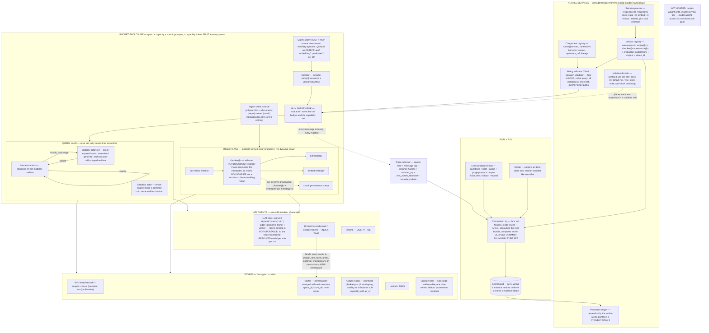
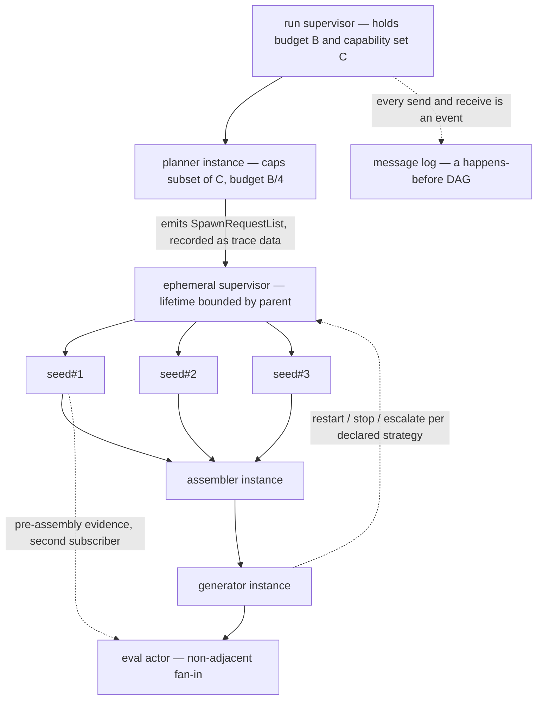

# D5 Actor Kernel — control flow emerges from message passing, not from a declared topology

## Position

Every other variant in this lineup runs a declared-graph engine or a single graph executor, so the lineup's first axis — *what the kernel actually is* — goes unvaried, and the fitting contract inherits "the kernel interprets a declared topology" as an assumption nobody argued against. D5 argues against it. The claim is that the three primitives DQ-1 makes mandatory are not features to be added to a graph engine; they are the *default behaviour* of a message-passing executor, and adding them to a graph engine is paying for them twice. A subgraph is a spawned actor set under a supervisor. Fan-out/join is sending N messages and awaiting N replies. Non-adjacent fan-in is a second subscriber on a mailbox. A planner-emitted ephemeral subgraph is a list of spawn requests against declared templates — never a graph the executor must first learn to trust. The cost D5 exists to expose is that a topology which is emergent at runtime is harder to check before it runs, and machine service #5 plus contract clause 1 are settled and fail-closed. **The verdict of this document is that D5 survives that test but does not survive it for free: the validator's guarantee set is strictly smaller than a declared-graph kernel's, one settled validator check (`provides`) weakens from proof to reachability, one settled check (query-encoder vs namespace `space_id`) moves from load-time to spawn-time, and the run acquires a nondeterminism source in a measurement loop that RT-selfimprove already shows has no statistical headroom.** Those four costs are named precisely below rather than designed away.

---

## The five axes

| Axis | D5's position | Justification |
|---|---|---|
| **Kernel graph-execution style** | Actor / message-passing executor; a subgraph is a spawned actor set under a supervisor | The three DQ-1 primitives are native rather than added node types, and the ephemeral-subgraph case — the sharpest gap in GAP-SWEEP §4.1 — reduces to spawn requests over pre-declared templates, so an LLM never authors a structure the executor must interpret. |
| **Sandbox containment depth** | Confined systemd unit: `confinement.enable`, `mode = "full-apivfs"`, `PrivateNetwork`, `RuntimeMaxSec` | The spike-004 substrate finding, and in D5 it stops being a special regime: the containment boundary and the actor boundary are the same boundary, so isolation granularity equals model granularity. Unit confinement is FS-level only — "doesn't cover network namespaces" — hence `PrivateNetwork` named explicitly [docs-verified, NIX-LEVERAGE constraints]. |
| **Promotion mechanics** | The sandbox actor is swapped for an actor set behind the **same mailbox contract** | Promotion becomes a substitution rather than a re-authoring, which makes it *partial*: a facade actor set can handle three message types natively and forward two to the still-confined engine. This attacks D's second named risk (the promotion path rotting into "everything stays in the sandbox forever") structurally rather than with discipline. |
| **Instrument placement** | Kernel services | The six machine services are kernel-owned and are **not addressable in the wiring's mailbox namespace** — see DQ-2. They are reached by typed, capability-gated machine calls whose results are resolved at spawn and frozen for the run. |
| **Comparison depth** | Inferred from the mailbox boundaries a piece of evidence crossed | Depth becomes a measured property of evidence rather than a label attached to a regime. A half-promoted part has an honest intermediate depth, which a regime label cannot express, and the rig can compare on the *deepest common boundary type set* instead of RT-modularity's shallowest common denominator. |

---

## Anatomy

The fixed anatomy (BRIEF §4 minimum edit set), specialized to D5. Ingest lane with source polymorphism and per-chunk provenance; four service boxes; harness as a wrapper with a back-edge and a stacking self-edge; rig connected; budget as an enclosure; `EMB -.binds.-> VEC`.



Two rules the diagram asserts and the rest of this document depends on:

- **Index-time clients bind artifacts; query-time clients do not.** Rerank and generator upgrades are free; extractor and embedder upgrades cost a rebuild. Embedder identity is mandatory in the contract — the machine refuses to write vectors it cannot attribute [derived from ANATOMY-REVIEW #16, whose evidence is code-verified: `_generate_collection_suffix()` returns `None` when `model_name` is absent while `embedding_dim` is required, so two different models at the same dimension collide in one collection].
- **The ingest lane is statically pinned.** Recipe actors are singletons resolved at load, not spawned dynamically. This is a D5-specific narrowing and it is load-bearing: SA-1 requires recipe identity to be a content hash of *resolved* inputs, which is only computable before the run if the recipe's actors and their dependency closure are known before the run. D5's dynamic-topology freedom is therefore a **query-side property only**. Said plainly rather than buried: the variant's thesis applies to half the machine.

---

## Execution model

### What a wiring declares

Same JSON document, same identity rules, same arm mechanics as WIRING-SPEC-DRAFT §2–§5. Nothing about actors requires a new format, and that is a positive finding: `config_hash` by RFC 8785, arms as RFC 7386 merge-patch, all-violations-at-once with JSON-Pointer paths, cycles reported as data, component kind as a tagged sum — all unchanged [settled, spike 004].

What changes is what the named nodes *are* and what an edge *means*:

```json
{
  "wiring_version": "1",
  "templates": {
    "seed":     { "component": "vector-seed@1.4.0", "config": { "topK": 40 },
                  "mailbox": { "accepts": "QuerySpec", "emits": "ScoredItemBatch" },
                  "caps": ["read:vector", "read:kv"] },
    "planner":  { "component": "subquery-planner@0.3.0", "config": {},
                  "mailbox": { "accepts": "QuerySpec", "emits": "SpawnRequestList" },
                  "caps": ["llm:planner"],
                  "may_spawn": [ { "template": "seed", "max": 8 },
                                 { "template": "expand", "max": 8 } ] },
    "assemble": { "component": "block-assembler@2.2.0", "config": { "order_policy": "best_last" },
                  "mailbox": { "accepts": ["ScoredItemBatch", "AnswerDraft"], "emits": "ContextPackageList" },
                  "caps": ["read:kv", "machine:pack"] }
  },
  "sends": { "planner": ["seed", "expand"], "seed": ["assemble"], "assemble": ["generate"] },
  "supervision": { "root": ["planner", "assemble", "generate"], "planner": ["seed", "expand"] },
  "recipe": { "chunker": "chunk", "extraction": "graph", "embedding": "embed" },
  "harnesses": [ { "component": "crag@1.0.0", "config": { "max_rounds": 3 } } ],
  "provides": ["answer"]
}
```

`templates` is a map of **template id → actor template**, exactly as `nodes` was a map of node id → instance: an id is a position in this wiring, never an instance identity. `sends` and `may_spawn` are partial orders over named templates, cycles legal and reported as data. The delta from a declared graph is confined to the semantics of one arrow:

| | Declared-graph kernel | D5 actor kernel |
|---|---|---|
| An edge means | "the output of A flows to B, **once**, in this run" | "A **may** send this message type to B, **zero or more times**, at times A chooses" |
| Arity | declared (fan-out is a node with declared arity) | runtime, bounded by a declared cap |
| Ordering | topological, declared | causal, emergent |
| The static object | the run's topology | the run's **type**: the template alphabet, the may-send/may-spawn relation, the capability sets |

**Every static property a declared-graph kernel has that D5 lacks is a property that depended on an edge meaning "exactly once, in this order."** That is the whole trade, and it is the finding this variant contributes to the lineup whether or not it wins. [inference — the central analytical claim of this document]

### Is this a declared graph with different words?

The brief warns against quietly reintroducing one. The honest answer: D5 declares a *vocabulary and a capability lattice*, not a topology. A declared-graph wiring says "these nine nodes run in this order." A D5 wiring says "these nine templates exist, this one may spawn up to eight of that one, each child's capabilities are a subset of its parent's, and here is the type of every message that may cross every mailbox." The run then determines how many of each exist and in what order they speak. The template graph is a static *abstraction* of an unbounded family of runtime actor graphs — a type for the run, in the same sense a class is a type for its instances. If a variant declared the topology and merely called the nodes actors, it would not be this variant.

Where the distinction genuinely earns its keep is DQ-1's second clause, below.

### DQ-1.1 — fan-out / join

Native. The fanning actor sends N messages and awaits N replies; the join is its continuation. N is a runtime value; the wiring declares a `max` at the spawn site and the validator **refuses a spawn site with no declared cap** (a static check of a runtime guard's presence, which is exactly the guarantee a declared-graph kernel gives for a loop bound — neither proves a bound, both prove an owner).

The budget consequence is the strongest thing in this section. GAP-SWEEP §3.7.2 requires **multiplicative budget accounting under fan-out** — "N branches, not one accumulating loop" — and names it as an extension no candidate provides. In D5 the budget is a capability token, and a capability token is *split* at spawn: a parent holding budget B spawning N children hands out N sub-budgets summing to ≤ B, and a child physically cannot spend what it was not handed. Multiplicative accounting is not an extension; it is what handing a capability to a child means. Goal 10's "no component owns its own loop limits" is likewise structural: an actor's limits arrive in its spawn message. [inference]

### DQ-1.2 — ephemeral subgraph

This is where the actor position pays. GAP-SWEEP §4.1 calls Plan\*RAG the sharpest capability gap in the sweep: an LLM emits a fresh sub-query DAG per query, and if the two lifecycles are conflated every planned query silently becomes an untracked modality.

In a declared-graph kernel the emitted object is a *graph*, and a graph arriving at runtime is a structure the validator never saw. The kernel must therefore either validate an arbitrary graph mid-run (a validator invocation inside the execution plane) or accept an unvalidated structure.

In D5 the emitted object is a **`SpawnRequestList`: a list of `(template_id, config)` pairs over templates already declared, validated, and capability-bounded in the wiring.** Each request is checked at spawn against three things that were all resolved before the run: the template exists in this wiring's alphabet; the config validates against that template's config schema; the requested count is within the declared `max` at this spawn site. There is no runtime graph validation because there is no runtime graph — there is a runtime *multiset over a static alphabet*. The planner is the versioned artifact; the emitted `SpawnRequestList` is recorded verbatim as trace data; the spawned set is supervised with a sub-budget and dies with its supervisor. Versioned wirings and ephemeral plans have separate lifecycles by construction rather than by rule.

**This is the cleanest answer to DQ-1.2 available in the lineup, and it is a direct consequence of the assigned axis position.** [inference]

### DQ-1.3 — non-adjacent fan-in

Native for expression: the eval component (GAP-SWEEP N28) declares a mailbox accepting `["ScoredItemBatch", "AnswerDraft"]` and both the pre-assembly evidence producer and the generator list it in `sends`. No special edge kind, no "sibling read" primitive.

Weaker for verification, and this must be said in the same breath. A declared-graph kernel knows both inbound edges exist and that a topological order puts both producers before the consumer. D5 knows the *types* match and that a path exists; it does not know both messages will arrive, nor in what order. Residue: the eval actor may fire on one input and time out on the other. Bounded, not rejected — every `ask` carries a machine-owned deadline drawn from the budget, expiry produces a traced partial result, and partial results are first-class (traced and scored, never discarded). **"Non-adjacent fan-in is native" is true of expression and one grade weaker in verification.** [inference]

### The runtime shape



**The completed run's trace is an event DAG for free.** Each actor has exactly one parent, so the spawn tree is a tree; message events are ordered by causality, so the message graph is acyclic in time even when the *template* graph has cycles. DQ-2's "a completed run's trace is an unrolled DAG" is not a construction D5 performs — it is what a message log is. [inference]

---

## Can this be validated before it runs?

The question the variant exists to answer. Machine service #5 type-checks wirings and caps *before* execution; contract clause 1 makes declarations machine-enforced preconditions and the validator fail closed. Both are settled and non-negotiable.

### What is statically checkable

**1. Mailbox types — fully.** Every declared send site is checked against the target mailbox's `accepts` schema. This is the same check as socket-type conformance across a `deps` edge, moved from edges to ports, at the same cost.

The hard case is a computed target: `send(reply_to, ...)` where `reply_to` arrived inside a message. It is checkable **iff addresses are unforgeable and typed**: a message schema declares `reply_to: Mailbox<Answer>`, so the carried address arrives with its type and the send site is checked against the carried type. This requires two rules:

> **Addresses are unforgeable capabilities.** The only ways to obtain a mailbox address are (a) declared in the wiring at spawn, and (b) received in a message field whose schema declares the mailbox type. There is **no registry-by-name lookup at runtime** and no address arithmetic.

Without those rules, static send typing collapses entirely and D5 falls. With them it holds. The two rules are the object-capability discipline, and the analogous engineering history is instructive: untyped actor systems that permitted "any message to any actor" ended up with optimistic (success-typing) analysis rather than fail-closed checking, and the typed-actor rewrites exist precisely because of it [paper-claim, from general knowledge of Erlang/dialyzer and Akka Typed; not verified this session and not load-bearing on its own].

**2. Spawn-site capability sets — fully.** Each `may_spawn` entry names a template and the capability set the child receives; the validator enforces **capability monotonicity**: a child's set must be a subset of its spawner's. Amplification is rejected at load. This is stronger than a declared-graph kernel's node-level capability declaration, because the lattice is checked along the spawn relation rather than per node.

**3. The declared supervision tree — fully.** Every template names a supervisor; the validator checks the supervision relation is a tree (one supervisor per template, root reachable, every template covered), that each supervisor declares a strategy from an enumerated tagged sum (`{restart:{max_restarts:N}}` / `{stop:{}}` / `{escalate:{}}`), and that restart budgets are present and finite.

**4. Bounded spawn arity — as guard-presence, not as a bound.** The validator refuses any spawn site without a declared `max`, and refuses a `max` that is not an integer or a named machine-owned budget reference. It does not and cannot prove that runtime N ≤ k without the guard; it proves the guard exists and that the machine, not the component, owns it. Identical in kind to a declared-graph kernel's loop budget.

**5. Template-graph reachability, acyclicity-as-data, structural integrity, registry resolution, recipe references, capability declaration coverage.** All unchanged from WIRING-SPEC-DRAFT §4. Cycles in `sends` are legal and reported as `{cycle: [...]}` data.

All five are checks over a **finite, static, JSON-encoded object** — the template alphabet and two relations over it. There is nothing here a bespoke validator, CUE, or a hardened `lib.evalModules` could not do at the measured cost. **Service #5 is implementable for D5 and it fails closed.**

### What is not statically checkable, and what the machine does about it

| Residue | Why it escapes | Machine's answer |
|---|---|---|
| **Multiplicity** — will the generator run at all? exactly once? | An actor may be spawned 0..N times; the validator sees a may-spawn edge, not a count | **Weakened check + runtime hard gate.** See below. |
| **Message ordering / protocol conformance** — does the assembler receive evidence before the answer request? | A protocol property; provable only with session types, which require a declared global protocol — i.e. a declared topology in disguise | **Accepted unverified.** Type-correct-but-wrong ordering is a quality defect, caught by the eval gate, not the validator. |
| **Deadlock** — two actors awaiting each other | Undecidable in general | **Bounded at runtime.** Every `ask` carries a machine-owned deadline from the budget; expiry is a traced partial result. Note: no declared-graph kernel proves termination of a loop-with-condition either, so this is not a differentiator. |
| **Unbounded spawn depth** (recursive spawn) | Depth is a runtime value | **Bounded at runtime** by a machine-owned spawn-depth cap and a total-live-actor cap, both in the budget object. |
| **Orphan replies** — a reply nobody reads | Liveness | **Traced and flagged.** Unconsumed messages at run end are recorded; the rig may treat a nonzero count as a hard-gate failure. |
| **Scheduler interleaving** | Nondeterminism | **Recorded, and eliminated for eval runs.** See the disadvantage section — this is D5's most expensive residue. |

**The `provides` weakening, stated plainly.** WIRING-SPEC-DRAFT §4 check 5 requires `provides` to be satisfied — at least one of `retrieve | answer`. In a declared-graph kernel this is structural: an edge path from query to answer emission exists and will be taken. In D5 the validator can only check **reachability in the may-send relation** — that a path exists by which an answer *could* be emitted. A D5 wiring can therefore be fully valid and produce no answer, because every actor on the path chose not to send.

D5's answer is not to widen the check but to move it: **`provides` becomes a validator reachability check plus a runtime hard gate.** A run that emits no message of the declared `provides` type is a failed run, recorded as such, and — per RT-selfimprove §2.5.6 — the regression suite is a *veto*, never a score component, so a challenger arm that silently stops answering cannot be averaged into a promotion. This is cheap (one counter) and it converts the weakening from silent to loud. But it is honestly a weakening: a defect a declared-graph validator rejects for free now costs a rig run to discover.

### The cost, quantified against the loop that matters

RT-selfimprove §4 states the ordering principle for mutation safety: **permit a mutation class in proportion to how well the machine can verify it before running it.** Class 2 (wiring/topology mutation over already-trusted components) is ranked second-permitted and "highest practical reward" precisely because it is statically checkable.

D5 does not remove class 2 from the statically-checkable set — the mutation surface is the template graph (alphabet, may-send, may-spawn, capability sets, caps, config, mailbox targets), and every one of those is checked. What D5 removes is the *multiplicity band*: mutations that produce a valid template graph whose runs have a nonsensical shape. Those are rejected at the validator in a declared-graph kernel and only at the eval gate in D5. RT-selfimprove §2.7 prices an adjudicated decision at **~2 M tokens**. So D5's static-verifiability cost is denominated in rig runs, and the honest way to state it is:

> **D5 moves a band of defects from a 22 ms validator to a 2 M-token decision.** How wide that band is, is an empirical question this document cannot settle — and it is D5's first falsifier.

### Does D5 still satisfy DQ-2?

Yes, on three separate readings, and one of them is a genuine strength.

- **The spec is DAG-plane data.** A D5 wiring is JSON — a template alphabet and two relations over it — content-addressed by JCS hash exactly like any other wiring. Its content may describe cycles in `sends`; the cycles live inside the value, and the two-plane note explicitly forbids disqualifying a variant for that.
- **A completed run's trace is an unrolled DAG.** The spawn tree is a tree by construction and the message log is a happens-before DAG by causality. D5 gets this for free rather than by unrolling.
- **The artifact plane is not a runtime control channel — but only because of an explicit rule.** This is the real hazard of an actor kernel and it must be stated as a prohibition, because the model's own vocabulary invites the violation: if everything is a mailbox, then `ask(ledger, "what is active?")` is a natural thing to write, and a component that branches on the answer has turned the artifact plane into a control channel.

> **Rule (D5, load-bearing for DQ-2): the kernel services are not addressable in the wiring's mailbox namespace.** Registry, artifact registry, ledger, validator, eval bundle, and reindex planner have no mailbox a wiring template may name. Artifact-plane values reach an actor only as **spawn-time frozen resolutions** — resolved before the actor exists, carried in its spawn message, immutable for its lifetime. A wiring actor can read what it was handed; it can never query the plane during a run.

With that rule D5 passes DQ-2. Without it, D5 merges the planes and is disqualified. It is one sentence in the contract and it is the single most important sentence in this variant.

### Does a spawned actor set have identity under clause 2?

Yes, with one property that is new and must be named.

An actor template's identity is ordinary: `(name@version, config_hash, resolved_dependency_ids)` with `config_hash` including the environment hash, hashed by JCS over the author-supplied input JSON. Templates are known at load; their instance identities are resolvable at load.

A **spawned instance** whose config was computed at runtime (the planner's sub-query) has its identity minted at spawn:

```
instance_hash = H(template_instance_hash, JCS(spawn_config), parent_instance_hash, ordinal)
```

This is still a content hash of resolved inputs — clause 2 satisfied — but it is **resolved at spawn rather than at load**. The consequence is precise and worth carrying into the contract: *the identity scheme must not assume that the set of instances is known before the run.* A design that pre-computes the full instance table at validation time works for a declared graph and does not work here.

Reconstructability (goal 7's "the system as run yesterday is reconstructable") therefore needs three artifacts, not two: the wiring spec, **the message log with the spawn tree and every spawn config**, and **the scheduler seed**. The first two are already required by DQ-2 and goal 9. The third is D5's addition and it is not free — see the disadvantages.

---

## The sandbox boundary

**What is enforced.** Deny-by-default network, filesystem, and store-write, plus a wall-clock watchdog and a per-arm process boundary — machine service #2, specified behaviourally. The substrate implementation named in the deployment document only: `systemd.services.<name>.confinement.enable` with `mode = "full-apivfs"` for the filesystem, `PrivateNetwork = true` (and declarative `nixos-containers` where a full network namespace is wanted) because unit confinement is documented as filesystem-level only and "doesn't cover network namespaces", and `RuntimeMaxSec` as the watchdog [docs-verified, NIX-LEVERAGE]. Store-write scoping is machine service #3: writes are scoped to `(recipe@version, namespace)` with copy-on-write for experimental arms, and cache keys include the component version.

**By what mechanism.** In D5 the confined unit *is* the actor. The unit's sandboxing options are the materialization of the actor's declared capability set, and the actor's mailbox — a socket into the unit — is the only channel in or out. This gives three things no other placement gives:

1. **Isolation granularity equals model granularity.** An A/B arm is an actor set under one supervisor; place that supervisor's subtree in a confined unit and the arm is contained, exactly. Per-arm process boundary is not an added requirement, it is where the boundary already was.
2. **The untrusted-code answer is structural.** RT-selfimprove ranks LLM-generated component code last-permitted with "static verifiability: none". In D5 an LLM-written component is a template with a capability set, run in a confined unit, reachable only by typed messages. The blast radius is the capability set, and the capability set was checked by the validator against the subset rule.
3. **The sandbox stops being a separate regime.** "Kernel-style execution" and "sandbox-style hosting" become a *placement* property of an actor, not two executors. This is the strongest simplification D5 offers against D's first named risk (two regimes to maintain).

**What crosses it.** Typed messages, and nothing else. Concretely: the shared corpus feed (machine-owned KV of chunks + doc-status) is delivered as messages or as a read-only bind mount declared in the capability set; evidence and answers come back as typed messages carrying `ScoredItem`s with `kind`, `Score = {value, semantics, space_id}`, machine-minted `ChunkRef`s, and a `counted_by` stamp on every token number.

**The cost of this elegance, named.** Location transparency is also a lie about failure. A confined unit killed by `RuntimeMaxSec` presents to the wiring as a mailbox timeout, indistinguishable from a slow in-process actor; partial failure, latency, and concurrency all differ across the boundary while the wiring says they do not. The mitigation is not architectural, it is a trace obligation: **every message event records the placement of both endpoints and, on failure, the failure cause** (deadline expiry vs supervisor stop vs unit kill vs capability denial). Without it, a systematically slower confined arm reads as a quality regression.

**And the corpus-feed hazard D inherits and D5 does not fix.** ANATOMY-REVIEW #2 lands hardest on D: chunker strategy `V` consumes the embedder, so chunk *boundaries* are a function of the embedding model [code-verified, F3], which makes "the shared KV is paradigm-neutral" false. D5's answer is the same as any D variant's and is placed here rather than invented: embedder-dependent chunkers are **recipe-bound and excluded from the shared lane**, declared per-chunk in the provenance stamp. The actor kernel contributes nothing to this problem.

---

## Promotion

**The mechanic.** A sandbox part is an actor with a mailbox contract `M`. Promotion is: build a native actor set that accepts `M`, run it as an arm against the sandbox actor on the same feed and the same eval bundle, and on a gate pass, repoint the alias so `M` resolves to the native set. The wiring that referenced the part does not change — it referenced a mailbox contract, not an implementation. Promotion is an **atomic alias repoint plus a generation record** (~1 ms, `rename(2)`-atomic, multi-artifact in one swap), never a build [measured, spike 004].

**Why this matters more than it sounds.** In a declared-graph kernel, promotion is a *re-authoring*: the opaque node becomes a subgraph, so the wiring changes, so every wiring that pinned it revs, so RT-upgradability §3's version-skew drown applies to the promotion path itself. In D5 the wiring is unchanged and the substitution happens behind the contract. Two consequences:

- **Promotion is partial by default.** A facade actor set can answer three message types natively and forward two to the still-confined engine, then absorb them one at a time. Each step is independently gated, independently rolled back by repointing, and independently attributable. The "port is a week and the sandbox version works fine" drift (RT-selfimprove §5.1's *drifters*) loses its force when the port has a five-step ladder instead of one cliff.
- **Re-promotion is the same operation.** RT-upgradability §1 names D's real failure as a one-way promotion path with no ritual for absorbing an upstream improvement after the port. In D5 the sandbox engine and the native set are interchangeable at one mailbox, so "sandbox@latest vs kernel@ours on the same feed" is an ordinary two-arm wiring, runnable on every upstream release rather than a special rig mode.

**What gates it.** Machine service #1, unchanged and not re-litigated: A/A null distribution, paired significance (exact McNemar for binary, paired bootstrap for continuous), a minimum-effect floor stated in the UI, a confirmation rule (win twice on disjoint subsets), epoch-level FDR, and the regression suite as **hard gates never averaged into the score**. D5 adds two arm-admission conditions of its own:

- **Both arms must have been run under the same scheduler determinism setting**, and the A/A null must have been established under that setting. Comparing a deterministic-scheduler arm against a production-scheduler arm compares two different variance regimes.
- **The comparison must have a non-empty deepest-common-boundary set beyond the answer boundary when the mutation is internal to an actor set.** A mutation that restructures an actor set but is only measurable at the answer boundary is flagged underpowered rather than promoted on a shallow read.

**What is discarded.** Losing arms are tombstoned per RT-selfimprove §1.3: code and artifacts deleted, ~200 bytes retained (mutation id, parent, effect size, decision, evidence pointer) so a stateless proposer cannot re-propose the same loser every epoch. Sandbox parts follow D-1 and D-2 from RT-upgradability: **excluded from the default selector** (a sandbox part cannot accidentally become load-bearing) and carrying a **TTL with recorded-reason renewal**. Both are adopted here without modification; D5's partial-promotion ladder reduces the pressure on D-2 but does not replace it.

---

## Instruments

All six machine services live in the **kernel**, are owned by the machine, and are unreachable from the wiring's mailbox namespace (the DQ-2 rule above). Ownership:

| # | Service | Owner | D5-specific note |
|---|---|---|---|
| 0 | **Eval bundle@version** — questions + gold + judge + judge prompt + corpus snapshot hash; dev/holdout; sealed holdout | Kernel, versioned artifact | The judge is an LLM client role and is version-coupled like any other; role→binding is hot-updatable at runtime [code-verified, F5], so the trace records the resolved judge model per run. |
| 1 | **Promotion Gate** | Kernel | Plus D5's two arm-admission conditions above. |
| 2 | **Isolation Domain + manifest enforcement** | Kernel; materialized per confined unit | The capability set is the unit's sandboxing options; the mailbox is the only channel. Granularity equals actor granularity. |
| 3 | **Artifact Ownership + CoW + reference-counted GC** | Kernel | Write capability is handed to an actor at spawn as part of its capability token, so "which instance may write this namespace" is answerable statically along the spawn relation. Cache keys include the component version — cache poisoning is the insidious failure. |
| 4 | **Promotion Ledger** | Kernel, append-only | Running an arm SHALL NOT append. The active-wiring pointer is a projection; if pointer and ledger disagree, the ledger wins. |
| 5 | **Static Mutation Validator** | Kernel, runs at load | The five checks in the validation section. Implementation stays a build-phase choice among bespoke JSON-Schema-plus-graph-validator, CUE, or hardened `lib.evalModules` — the actor semantics change what is checked, not what can implement the check. |

Two placements that follow from goal-10 and clause-5 rather than from the actor position, stated so they are not lost: **budget is a machine object split at spawn**, and **token counting is a machine service** using the consuming model's tokenizer, stamped `counted_by`, with `machine.pack(blocks, budget, consumer_model_ref)` owning the packing. RT-modularity Attack 1a shows why: N parts counting tokens with N tokenizers makes the rig's headline number unit-inconsistent, and a token miscount is a *measurement* bug that teaches the machine a false fact about a component.

---

## Comparison depth

**The mechanism.** Every message that crosses a mailbox is an observation point. Each piece of evidence carries the set of **boundary types** it crossed — typed by the *message schema*, not by the actor id — and its depth is that set. A native actor set produces evidence that crossed `QuerySpec → ScoredItemBatch → ContextPackageList → AnswerDraft`; a confined whole engine produces evidence that crossed `QuerySpec → Answer`. Depth is computed, not declared by regime.

**Why typed by message schema rather than actor position.** Two arms with different template alphabets have no common node ids, so node-boundary comparison requires identical structure — which is exactly the comparison the rig most wants to make and structurally cannot. A `ContextPackageList` crossing a boundary in arm A is comparable to a `ContextPackageList` crossing a boundary in arm B regardless of which actor emitted it. **The rig compares on the intersection of boundary *types*, and reports the deepest common one.**

**What this fixes.** RT-modularity Attack 4 records a structural flaw in D that CANDIDATES.md omits: because the rig compares kernel parts deeply and sandbox parts shallowly, *any cross-regime metric is defined at the shallowest common denominator*, so the promotion decision — "is porting this worth it?" — is always made on the least informative evidence the system produces. Under D5 that is no longer forced. A half-promoted facade with three native boundaries and one forwarded one has three comparable boundaries with its fully-native challenger, and the rig says so. The regime label is replaced by a measurement.

**And a free instrument.** RT-upgradability's amendment B-2 asks the registry to publish a *decomposition ratio* per part (nodes / declared stages) so the one-node-graph slide is self-evidencing. In D5 the count of distinct typed boundaries an arm's evidence crossed **is** that ratio, measured from traces rather than declared. A part that has quietly become one actor doing everything advertises it in its own comparison output.

**The honest cost.** Evidence-level boundary labelling means message-level tracing, and message-level tracing is more voluminous than node-level tracing. RT-selfimprove §1.1 already estimates ~29 GB/yr of traces at node granularity; D5's message log is strictly larger. The mitigation is the one already specified — aggregates forever, raw IO for 30 days or for promoted/contested experiments only — but D5 hits that policy sooner and harder.

---

## Scenario S1 — Embedder swap (query-side and index-side)

**What invalidates.** Under SA-2's sub-recipe stamps: the **vector namespaces only**. KV carries the chunker stamp, the graph carries the extraction stamp, each vector namespace carries the embedding stamp. Changing any of `(model_id, revision, dim, metric, normalization, query_prefix, doc_prefix, pooling, namespace_text_convention)` mints a new `EmbeddingSpace` id, and namespaces are **immutable in space** — a new namespace is created, an existing one is never mutated. Upstream's own physical separation is the precedent and the warning: `_generate_collection_suffix()` → `f"{model_name}_{dim}d"` keeps models apart, but returns `None` when `model_name` is absent while only `embedding_dim` is required, so two different models at the same dimension collide in one collection [code-verified, F1]. The contract's answer is that embedder identity is mandatory and the machine refuses to write vectors it cannot attribute.

**What is reused.** The graph and the extraction output — the expensive side, ~1,786 entangled lines and all the tokens [code-verified, spike 001] — and the KV chunks. **Unless chunker strategy `V` is in play**, where chunk boundaries are a function of the embedding model [code-verified, F3]; then the chunk text itself changes, KV invalidates too, and the reindex planner escalates from re-embed to rebuild. Per-chunk provenance is what makes this decidable at the granularity it actually varies; F7 records that no such field exists upstream today [code-verified negative].

**What the reindex planner classifies.** `recipe@vA → recipe@vB ⇒ {reuse | re-embed | re-extract | rebuild}` with a cost estimate, read from the artifact registry. Here: `re-embed` for `F`/`R`/`P` chunkers, `rebuild` for `V`.

**In-flight A/B arms straddling the migration.** D5-specific mechanic: an arm is a supervised actor set whose **artifact bindings are resolved at spawn and frozen for its lifetime**. An arm spawned before the migration keeps its resolved namespace ids and space ids until it dies. Because the new embedding produces a *new namespace* rather than mutating one, and because machine service #3 gives experimental arms copy-on-write write scope, a straddling arm is never corrupted — it is **stale**, and the staleness view (derived from artifact registry × currently-pinned component versions) marks it as such.

**How the rig avoids mis-attribution.** Three mechanisms, none of them new:
- Every `ScoredItem` carries `Score = {value, semantics, space_id}`; the rig **refuses to compare across differing `space_id`** rather than publishing a wrong number.
- Every run records `refs_in / refs_resolved`; a run where `resolved < in` fails, which converts the worst silent failure — a confident sourceless answer with a normal token count — into a loud one.
- The scoreboard carries `(corpus@v, eval@v, judge@v)` and the instance hashes; scores are comparable only within a fixed triple.

Without these, the failure is exactly RT-modularity Attack 2: same dimension, different space, cosine values still in range, threshold now calibrated against the wrong distribution, the rig reports "wiring 2 is worse", true and for the wrong reason, and lineage records a false causal claim about the component under test.

**The D5-specific cost, stated.** Because query-side actors are spawned dynamically and role→binding is hot-updatable at runtime [code-verified, F5], the query encoder's resolved model is a **spawn-time** fact. The check "the query encoder's `reads_space` equals the namespace's `space_id`" therefore runs at spawn, not at load. It still fails closed — the spawn is refused and the run produces a traced partial result — but it fails *during* a run rather than rejecting a wiring. A declared-graph kernel with statically resolved clients catches this at load. **This is the general residue made concrete: a check that could be static becomes a spawn-time check because the thing it checks is resolved at spawn.**

**Who decides.** The reindex planner classifies and prices; a human or a policy triggers; the promotion gate never sees a cross-space comparison because the rig refuses to construct one.

---

## Scenario S2 — LightRAG ships v2 upstream

**Which components have upstream deltas, and how you know.** `upstream_ref` (repo + tag/commit + file/symbol) on component registry entries turns "LightRAG 1.6" into a diff-able list — "these 4 of 23 components have upstream deltas" — instead of a re-port decision made blind. This is a should-fix from the anatomy review, nearly free, and it is what makes the rest of this scenario mechanical. The outstanding drift caveat (`api_version` 0312 in the fork vs 0313 in the vendored copy [code-verified, spike 001]) gets a field to be pinned in rather than a memory to rely on.

**What a re-port costs.** Split by side, per spike 001's line counts: the query side is ~794 lines across five stages with plain-data boundaries — days per component; the index side is ~1,786 lines welded to LightRAG's entity/relation ontology, and ingest is a mixin on the `LightRAG` class depending on `self.full_docs`, `self.doc_status`, `self.tokenizer`, `self._process_extract_entities` [code-verified, F6], so cutting ingest off the part is real, un-costed work and the single largest port cost. The store contract is **subtracted from** `base.py`, never adopted: 43 abstract methods across five storage base classes, of which `full_entities`, `full_relations`, `entity_chunks`, `relation_chunks` are LightRAG-specific KV namespaces a phrase-graph part needs none of [code-verified, RT-upgradability §1]. Upstream's own migration mechanism is version-free heuristic sniffing — check emptiness, backfill once, in place — which cannot answer "what version is *this* artifact?" and is therefore unusable as a foundation [code-verified, `storage_migrations.py`].

**What the sandbox absorbs versus what the kernel must re-implement.** The sandbox absorbs the whole of v2 immediately, as a confined unit behind one mailbox contract, at the cost of one adapter actor. The kernel re-implements only what the diff-able list says changed *and* the rig says is worth taking. D's genuine and non-obvious asset applies unchanged: same corpus feed, comparable evidence, so **this is the only architecture family that can measure whether upstream v2 is worth adopting rather than guessing from a changelog.**

**D5's specific contribution, and its specific limit.** The contribution is that absorption is *incremental*: because the sandbox engine and a native actor set are interchangeable at the same mailbox, v2's better extraction prompt can be taken as a single template version bump inside an otherwise-unchanged kernel set, and the standing "sandbox@latest vs kernel@ours" comparison is an ordinary two-arm wiring runnable on every upstream release. This is the mechanism RT-upgradability §1 says D is missing ("promotion is one-way; there is no re-promotion path"), supplied structurally rather than as a ritual. The limit is that D5 does nothing for the port cost itself — 1,786 entangled index-side lines are 1,786 entangled lines whatever the kernel executes.

**Is the answer a diff-able list or a blind decision?** A diff-able list, on two conditions that are cheap and must be adopted: `upstream_ref` on registry entries, and the standing upstream-delta comparison scheduled on release rather than remembered.

---

## Scenario S3 — One full mutate → A/B → promote cycle

Every service touched, in order.

1. **Mutation operator** emits an RFC 7386 merge-patch against the incumbent wiring — JSON only, never code, never a format the validator must sandbox. In D5 the mutation surface is the template graph: alphabet, `sends`, `may_spawn` (including caps), capability sets, `supervision`, config, and mailbox targets. Class-1 (config) and class-2 (topology) mutations are permitted; class-4 (LLM-written component code) is gated on the isolation domain existing and on classes 1–3 having a track record.
2. **Arm assembly.** Patch applied; the resulting wiring hashed by JCS over the author-supplied input JSON; the base independently re-validated with no arms applied, because an arm's override is filtered before type checking and silently masks base type errors [measured, spike 004].
3. **Service #5 — Static Mutation Validator.** Registry resolution; mailbox-type conformance at every declared send site; capability monotonicity along every `may_spawn` edge; spawn-cap presence; supervision-tree well-formedness with finite restart budgets; template-graph reachability for `provides`; recipe references; structural integrity. **All violations returned at once with JSON-Pointer paths** — one-error-per-run costs an LLM repair round trip per defect, and round trips dominate the ~22 ms of evaluation. Cycles in `sends` returned as `{cycle: [...]}` data, never thrown. Fails closed.
4. **Service #2 — Isolation Domain.** Each arm's root supervisor is placed in a confined unit; the arm's declared capability set is materialized as that unit's sandboxing options (`full-apivfs`, `PrivateNetwork`, `RuntimeMaxSec`); deny-by-default network, filesystem, and store-write; wall-clock watchdog.
5. **Service #3 — Artifact Ownership.** The arm receives copy-on-write write scope for `(recipe@version, namespace)`; cache keys include the component version so a mutated extractor cannot poison a shared LLM cache under a colliding key.
6. **Service #0 — Eval bundle@version** supplies questions, gold passages, judge, judge prompt, and the corpus snapshot hash, from the dev split; the sealed holdout is not touched.
7. **Both arms run.** D5-specific: under a **fixed scheduler seed with deterministic message ordering**, so the arm-to-arm difference is not contaminated by interleaving variance. The trace records, per run: the spawn tree with every instance hash and every spawn config, the full message log with placement of both endpoints and failure causes, the resolved model per role, `counted_by` on every token number, `refs_in / refs_resolved`, every `space_id` touched, and the boundary-type set each piece of evidence crossed. The planner's emitted `SpawnRequestList` is recorded verbatim as trace data. **Running an arm does not append to the promotion ledger.**
8. **Rig** collects paired per-question scores at the **deepest common boundary type set** across the two arms, reads the artifact registry for provenance, writes the scoreboard with instance hashes and evidence depth.
9. **Service #1 — Promotion Gate.** Sees: paired per-question scores, the stored A/A null distribution for this eval bundle *at this determinism setting*, the hard-gate regression suite results, the evidence-depth labels, and the arm-admission facts. Decides promote / reject / inconclusive against a minimum-effect floor, paired significance, the confirmation rule (win twice on disjoint subsets), and epoch-level FDR.

   **What the gate refuses**, explicitly:
   - comparisons spanning differing `space_id` — refusal, not a number;
   - comparisons spanning differing `counted_by` unless it re-counts centrally on a canonical tokenizer;
   - any run where `refs_resolved < refs_in`;
   - any run that emitted no message of the declared `provides` type (the D5 runtime hard gate replacing the weakened static check);
   - any arm whose A/A null was established under a different scheduler determinism setting;
   - any comparison whose deepest common boundary set is the answer boundary alone when the mutation was internal to an actor set — flagged underpowered rather than promoted;
   - any regression-suite failure, as a veto, never averaged into the score.
10. **Service #4 — Promotion Ledger.** One append-only record: mutation id, class, parent, arms, effect size, gate decision, evidence pointer, proposer id. Distinct from the lineage tree — lineage says what exists, the ledger says what was decided and why.
11. **Alias repoint.** `promote-next` or `promote-now` from the verb ladder (`check` / `preview` / `run` / `promote-next` / `promote-now`), one gate implementation serving every transition with the verb as a parameter. The repoint is a `rename(2)`-atomic alias swap, ~1 ms, multi-artifact in one swap, never a build. The active-wiring pointer is regenerated as a projection of the ledger; if the two disagree, the ledger wins.
12. **Loser handling.** Rejected arm tombstoned: code and artifacts deleted, ~200 bytes retained so the proposer cannot re-propose it forever. Proposer hit-rate per mutation class recorded in the ledger.

---

## Advantages

1. **All three DQ-1 primitives are native rather than added node types**, and the ephemeral-subgraph case is the cleanest in the lineup: the planner emits spawn requests over a pre-declared, pre-validated, capability-bounded template alphabet, so no LLM-authored *structure* ever needs runtime validation. A declared-graph kernel must either validate an arbitrary graph mid-run or accept one unvalidated.
2. **Promotion is a substitution behind a mailbox contract, so it can be partial.** A five-step strangler ladder replaces a one-week cliff, each step independently gated and independently rolled back by a repoint. This attacks D's second named risk (promotion rotting into permanent sandbox residency) structurally, and it supplies the re-promotion path RT-upgradability says D lacks.
3. **Multiplicative budget accounting under fan-out is free.** Budget is a capability token split at spawn; a child cannot spend what it was not handed. GAP-SWEEP §3.7.2 lists this as an extension no candidate provides.
4. **Containment granularity equals model granularity.** Per-arm process isolation and untrusted-mutation hosting land exactly on a boundary the model already has, and the kernel/sandbox split becomes a placement property rather than two executors — the largest available reduction of D's "two regimes to maintain" cost.
5. **Comparison depth is measured, not declared.** The cross-regime shallowest-common-denominator flaw RT-modularity records against D stops being forced, half-promoted parts get an honest intermediate depth, and RT-upgradability's decomposition-ratio amendment (B-2) falls out of the trace for free.
6. **The trace is a happens-before DAG by construction**, so DQ-2's unrolled-DAG requirement is satisfied by what a message log already is rather than by an unrolling step.
7. **The wiring format does not change.** Same JSON, same JCS identity, same merge-patch arms, same all-violations-at-once validator, same cycles-as-data. The delta from the settled wiring spec is the semantics of one arrow and three added declarations (`mailbox`, `may_spawn`, `supervision`).

---

## Disadvantages

1. **The validator's guarantee set is strictly smaller.** `provides` weakens from a structural property to a reachability claim plus a runtime hard gate. Multiplicity properties ("exactly one generator runs", "the recipe is built once") leave the static set entirely. A band of defects moves from a 22 ms check to a ~2 M-token adjudicated decision, and it hits class-2 mutation, which RT-selfimprove ranks as the highest-practical-reward class precisely because it was statically checkable.
2. **Scheduler nondeterminism widens the A/A null, in a loop with no headroom.** RT-selfimprove §2.1 already puts the realistic minimum detectable effect at +20–25 pp on a 30–50 question set, with judge self-disagreement alone contributing ≈±4.7 pp at n=40. D5 adds an independent variance source. The mitigation — a deterministic seeded scheduler with record-and-replay for eval runs — works, and buys a second problem: **the eval run no longer measures production behaviour**, so a concurrency-sensitive regression is invisible to exactly the instrument meant to catch it. Both horns are real; this is D5's most expensive property.
3. **Reconstructability needs a third artifact.** "The system as run yesterday" requires the wiring spec, the message log with spawn tree and spawn configs, **and** the scheduler seed. Goal 7 scores down accordingly, and trace retention policy (aggregates forever, raw IO 30 days) bites sooner because the message log is strictly larger than a node-level trace.
4. **Location transparency hides partial failure.** A unit killed by `RuntimeMaxSec` and a slow in-process actor present identically at the mailbox. Fixable only by a trace obligation (placement of both endpoints, failure cause on every failed message), never by the model itself.
5. **Two vocabularies, and humans read the wrong one.** The template graph is static and readable; the actor graph is what actually ran. A reviewer looking at a wiring sees the alphabet and infers a topology that may not occur. The declared-graph kernels have one object and it is the one that runs.
6. **The actor freedom is query-side only.** SA-1 requires recipe identity to be a content hash of resolved inputs, so the ingest lane must be statically pinned singletons. Half the machine — and per spike 001 the expensive, entangled half — gets none of the variant's claimed benefits.
7. **The one-actor slide is detected, not prevented.** B's named aging failure ("opaque nodes tempt teams to stuff whole modalities into one node") has an exact analogue here, and while the boundary-crossing metric makes it self-evidencing, nothing stops it.
8. **No prior art to adopt, and the adopt list points elsewhere.** PRIOR-ART's recommendation is a Haystack-*shaped* executor — typed sockets, wiring-time validation, cycles, subgraph-as-node — vendored, never depended on. An actor kernel means writing a mailbox scheduler, a supervision tree, capability-carrying budgets, and a deterministic-replay test mode from nothing. That is a real build-cost delta against every other variant in the lineup, and it is not offset by any of the advantages above.

---

## Disqualifier check

| DQ | Verdict | Mechanism |
|---|---|---|
| **DQ-1 — Executor primitives** | **PASS** | Fan-out/join = send N, await N, with a declared cap the validator requires and a budget split at spawn. Ephemeral subgraph = a `SpawnRequestList` over pre-declared templates, supervised, sub-budgeted, with the planner as the versioned artifact and the emitted list recorded verbatim as trace data. Non-adjacent fan-in = a second subscriber on a mailbox, typed by the mailbox's `accepts` union. All three are the executor's default behaviour, not added node types. Verification of fan-in ordering is one grade weaker than a declared graph's — stated, not hidden. |
| **DQ-2 — Two-plane separation** | **PASS, conditional on one rule** | The wiring is DAG-plane JSON whose content may describe cycles in `sends` (legal, reported as data). A completed run's trace is a spawn tree plus a happens-before message DAG. The condition: **kernel services are not addressable in the wiring's mailbox namespace**, and artifact-plane values reach an actor only as spawn-time frozen resolutions. Without that rule an actor kernel merges the planes and is disqualified; with it, it does not. |
| **DQ-3 — Second identity vocabulary** | **PASS** | Mailbox addresses are runtime capabilities, never identity: they are not recorded as identity in traces, are not stable across runs, and cannot be looked up by name. Unix socket paths, systemd unit names, and Nix store paths name nothing in the model. Identity remains SA-1 for recipes and `(name@version, config_hash, resolved_dependency_ids)` for instances, with spawn-minted instance hashes closing over the parent hash and ordinal. |
| **DQ-4 — Environment-unpinned identity** | **PASS** | `config_hash` includes a build/runtime environment digest for every template; a spawned instance's hash closes over its template's instance hash, so the environment pin propagates down the spawn tree automatically. A confined unit's closure is part of the environment digest of the actor it hosts. |
| **DQ-5 — Wirings with evaluation semantics** | **PASS, with one named temptation** | The wiring is JSON. The temptation an actor kernel creates is expressing routing strategies, dispatchers, or supervision decisions as predicates or expressions. Rule: **routing and supervision strategies are enumerated tagged sums** (`{round_robin:{}}`, `{by_message_type:{...}}`, `{restart:{max_restarts:3}}`), and spawn caps are integers or named machine-owned budget references — never expressions. The validator never evaluates anything. |

---

## Rubric scoring

Honest, and no variant scores all ten.

| # | Goal | Score | Reasoning |
|---|---|---|---|
| 1 | Single responsibility | **Strong** | An actor is a job with a mailbox; the boundary is enforced by the message type, not by convention. |
| 2 | Explicit contract | **Strong, with a larger surface** | Mailbox message types are the contract and they are checked. But the contract surface is every message type rather than every edge type, so there is more of it to design and freeze. |
| 3 | Capability manifest | **Strongest axis** | Capabilities are literally the spawn token, checked for subset-monotonicity along the spawn relation and materialized as the confined unit's sandboxing options. Declaration and enforcement are the same object. |
| 4 | Swappable | **Strongest axis** | Same mailbox contract means substitutable, which is the promotion mechanic itself, and it supports partial substitution behind a facade. |
| 5 | Composable | **Mixed — the honest score-down** | Loops, branches, fan-out, and harness stacking are native (a harness interposes on a mailbox and re-sends, which is wrapping rather than sequencing). But *declared* composability is weaker: you cannot read the run's shape off the spec. |
| 6 | Artifact-shareable | **Par** | Same as any D variant, and dependent on the ingest lane being statically pinned. The `V`-chunker hazard is inherited unimproved. |
| 7 | Version-controlled | **Partial — the second score-down** | Templates and wirings version normally. Instance identity is minted at spawn rather than resolved at load, and reconstructability needs the message log and the scheduler seed alongside the spec. Goal 7's "the system as run yesterday is reconstructable" holds only with all three. |
| 8 | Mutable | **Strong, permitted slightly less confidently** | The mutation surface is the template graph and is statically checked; the multiplicity band is not, so RT-selfimprove's permit-in-proportion-to-static-verifiability principle admits class-2 mutation with marginally less confidence than a declared graph does. |
| 9 | Observable | **Strongest axis, at a volume cost** | The message log is a total observation of the execution plane, including the selector's choice, harness loop decisions, and store/client spend. Every arrow in the anatomy emits. The cost is trace size. |
| 10 | Budget-obedient | **Strongest axis** | Budget is a capability split at spawn; multiplicative fan-out accounting and "no component owns its own loop limits" are structural rather than policed. |

**Weakest two: 5 and 7.** Both trace to the same root — the run's shape is a runtime fact — which is the variant's thesis and therefore the right place for it to cost something.

---

## Machine services — where each lives and what it costs this variant

| # | Service | Location | Cost specific to D5 |
|---|---|---|---|
| 0 | Eval bundle@version | Kernel artifact | Must additionally pin the **scheduler determinism setting**, because a score is comparable only within a fixed variance regime. One extra field in the bundle. |
| 1 | Promotion Gate | Kernel service | Two extra arm-admission conditions (matching determinism setting; non-empty deepest-common-boundary set beyond the answer boundary for internal mutations). The A/A null must be re-established per determinism setting, doubling A/A calibration runs if both settings are used. |
| 2 | Isolation Domain | Kernel, per confined unit | **Cheaper here than elsewhere.** The boundary already exists at actor granularity; the capability set is the unit's options; the mailbox is the only channel. This is the one service the actor position makes materially easier. |
| 3 | Artifact Ownership + CoW + GC | Kernel | Write capability travels in the spawn token, so "which instance may write here" is answerable along the spawn relation. Reference counting must count *spawned instances*, not just pinned wirings, or a long-lived ephemeral set holds artifacts past their intended life. |
| 4 | Promotion Ledger | Kernel, append-only | Unchanged. Running an arm never appends; the pointer is a projection. |
| 5 | Static Mutation Validator | Kernel, at load | **The service that pays.** Same implementation options and roughly the same runtime cost, but a strictly smaller guarantee set: types, capabilities, spawn-template closure, supervision, cap presence, and reachability — not multiplicity, ordering, deadlock-freedom, or answer-emission. |

---

## Contract clauses

1. **Declarations are machine-enforced preconditions; validator runs before execution, fails closed.** Satisfied, with the guarantee set enumerated above and the two weakenings named (`provides` → reachability + runtime hard gate; query-encoder `space_id` check → spawn-time). The clause as written requires every *declaration* to be checked before execution and to fail closed — it does not require the run to be statically total, and no variant's kernel makes a loop-with-condition statically total either.
2. **Identity closes over the closure.** Satisfied. Templates resolve at load; spawned instances mint `H(template_instance_hash, JCS(spawn_config), parent_instance_hash, ordinal)` at spawn. The contract must not assume the instance set is enumerable before the run — a D5-specific requirement that also happens to be the correct general shape once any variant permits ephemeral subgraphs.
3. **Machine-minted refs with provenance.** Satisfied unchanged. `ChunkRef = (corpus_id, recipe@version, ordinal, content_hash)`; `machine.deref` raises on unknown; an assembler may not emit a package containing unresolved refs; every run records `refs_in / refs_resolved` and the rig fails runs where they differ. Positional/dense indices (Fast-GraphRAG's csr columns, RAPTOR's ints) are permitted only as part-local projections with a declared, auditable bijection.
4. **Interpretation travels with the value.** Satisfied, and it does more work here than elsewhere: since messages cross mailboxes rather than typed edges between known nodes, the *message* is the only place interpretation can live. `ScoredItem` carries `kind`; `Score = {value, semantics, space_id}`; vector namespaces are stamped with an `EmbeddingSpace` id; graph edges declare weight semantics and whole-graph algorithms declare what they require; rankers declare `presumes_graph`. Attack 4's four silent failures — PPR on LLM-confidence weights, range-normalizing fusion across incommensurable scores, degree ranking on a call graph, cross-space seeding — are caught by mailbox-type conformance at the send site.
5. **Structured prompt boundary.** Satisfied, and load-bearing for the harness story. Assemblers emit `List[ContextPackage]` of typed blocks with a declared `order_policy`; rendering happens once in a machine-owned renderer pinned by the wiring; token counting is `machine.pack(blocks, budget, consumer_model_ref)` stamped `counted_by`. A harness actor that re-sends a modified context (FLARE's `ctx_increase: 'replace'`) manipulates **blocks in a message**, never spliced text — which removes the delimiter-regex failure at its root instead of versioning a delimiter.

---

## What would falsify this variant

Concrete and observable, in decreasing order of decisiveness:

1. **Address unforgeability fails for a real modality.** If any surveyed or planned part genuinely requires runtime mailbox lookup by name — a service-discovery pattern, a dynamic subscriber registry, a part that must address an actor it was never handed — then static send typing collapses, mailbox types stop being checkable at load, and **D5 falls**. This is the single assumption the whole validation argument rests on, and it is cheap to test: walk the 45 gap-sweep types and the 24-system survey for one that needs it.
2. **The static-verifiability gap is wide.** Build the validator over a corpus of mutated wirings in both forms — declared-graph and D5 template-graph — and count the defects each catches before execution. If the actor validator catches materially fewer *real* defects, the cost is confirmed at ~2 M tokens per escaped defect, and D5 is the wrong kernel for a machine whose central loop is machine-authored mutation.
3. **Scheduler nondeterminism eats the effect size.** Measure the A/A null width with the production scheduler and with the seeded deterministic one. If the production-scheduler null is wider than the deterministic null by a non-trivial fraction of the minimum detectable effect at the eval-set size, then D5's improvement loop is only operable under deterministic replay, and the eval instrument no longer measures the system that ships. Given RT-selfimprove §2.1's finding that the loop has no headroom to spend, this is close to disqualifying on its own.
4. **`provides` reachability admits non-answering wirings at a nonzero rate.** If mutation output contains wirings that pass reachability and never emit an answer, the settled check is genuinely weakened rather than merely reformulated, and the runtime hard gate is a patch over a hole the other variants do not have.
5. **The message log's cost dominates.** If message-granular tracing pushes trace volume past the point where the retention policy can keep promoted and contested experiments raw, then the observability advantage inverts into an evidence-loss risk.
6. **The build cost is decisive.** If writing a mailbox scheduler, supervision tree, capability-carrying budgets, and deterministic replay is measurably more work than adopting a Haystack-shaped executor plus three added node types, the variant loses on economics regardless of its architectural merits. PRIOR-ART's adopt list already points the other way.

---

## Contract skeleton implied

What D5 would freeze into the fitting contract (SPIKE-PLAN step 8), separated into what it contributes *even if it loses* and what is D5-only.

**Contributions that stand regardless of which variant wins:**

1. **Edge semantics must be a named property of the contract, not an unstated assumption of the kernel.** The contract must say whether an edge means "exactly once, in this order" or "may send, zero or more times", because the validator's entire guarantee list is a function of that answer. Every static property in dispute across this lineup traces back to it. Writing it down is the single most valuable thing this variant contributes.
2. **The identity scheme must permit instances that are minted at spawn.** `(name@version, config_hash, resolved_dependency_ids)` plus a spawn-time closure `H(template_hash, JCS(spawn_config), parent_hash, ordinal)`. Any variant that permits ephemeral subgraphs needs this shape; a contract that assumes the instance table is enumerable at load forecloses DQ-1.2 for everyone.
3. **Budget is a splittable capability, not a global counter.** Multiplicative fan-out accounting (GAP-SWEEP §3.7.2) is unimplementable against an accumulating counter and free against a splittable token.
4. **Evidence depth is a measured property of the boundaries a value crossed, typed by message/socket schema, not a label attached to a regime.** This is what lets the rig compare at the deepest common boundary rather than the shallowest denominator, and it makes the decomposition ratio a measurement.

**D5-only boundaries, if D5 wins:**

5. **Mailbox contract** — `{name, accepts: <schema | union>, emits: <schema>}`, with addresses as unforgeable typed capabilities obtainable only by wiring declaration or by a typed message field. No registry-by-name.
6. **Spawn declaration** — `may_spawn: [{template, max, caps}]`, with capability monotonicity (child ⊆ parent) and a mandatory cap that is an integer or a named machine-owned budget reference.
7. **Supervision declaration** — a tree over templates, one supervisor each, strategy as an enumerated tagged sum with a finite restart budget. A restarted actor is a new instance with a new hash, and the trace records both.
8. **The plane rule** — kernel services have no mailbox in the wiring's namespace; artifact-plane values reach actors only as spawn-time frozen resolutions. Without this sentence D5 is disqualified under DQ-2.
9. **`provides` is a validator reachability check plus a runtime hard gate**, and the gate is part of the regression suite (a veto, never averaged).
10. **The run's reproducibility triple** — wiring spec + message log (spawn tree, spawn configs, placements, failure causes) + scheduler seed. All three or the run is not reconstructable.
11. **Trace obligations at every mailbox crossing** — instance hashes of both endpoints, placement of both endpoints, resolved model per role, `counted_by`, `space_id`, `refs_in / refs_resolved`, boundary type. This is the observability advantage and the volume cost in one line.

---
*Variant D5 of four, drafted 2026-08-10 against D-VARIANTS/BRIEF.md. Not committed. Evidence tags: `[code-verified]` claims are inherited with attribution from ANATOMY-REVIEW F1–F7, spike 001 line counts, and spike 004 measurements — nothing was verified against source in this pass. Everything else is `[inference]` unless marked otherwise; the actor-systems prior-art remarks are `[paper-claim, unverified this session]` and nothing load-bearing rests on them.*
