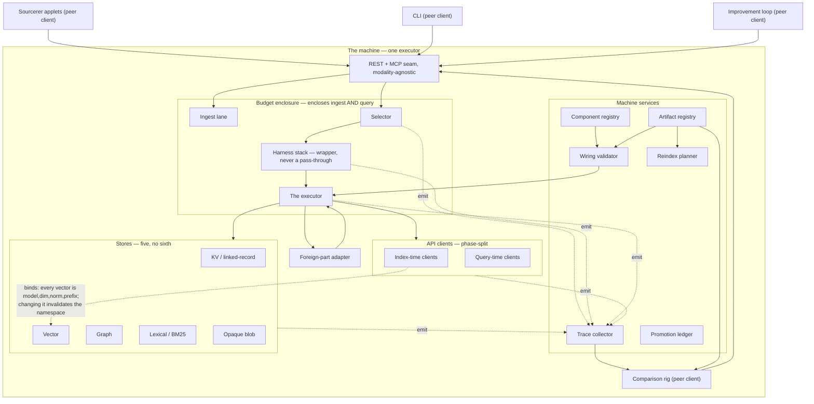
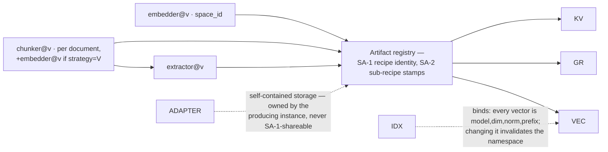

# Machine Anatomy and Component Inventory

This document is drawn *from* `CONTRACT.md` and states nothing `CONTRACT.md` has not already frozen; where drawing the anatomy exposes something `CONTRACT.md` does not settle, this document records it in `## §F`, naming the anatomy exercise that exposed it, and states no rule of its own here — contract repair belongs to Phase 3's PARTS-04. [docs-verified] [CONTEXT D-04]

The `—` and `unresolved` values found throughout `## §D` are not admissions of incompleteness. Under D-05, they are Phase 3's worklist: Phase 3 re-projects the affected entries as part of each contract repair, and a repair is not complete until `CONTRACT.md` and this file agree. A reader should not mistake a sourced silence for an unfinished entry. [docs-verified] [CONTEXT D-05]

Every restriction recorded here reads as a capability **not yet earned**, never as a permanent prohibition — the framing `CONTRACT.md` §6 and §8 already state for decomposition and opaque-node admission, carried forward from Phase 1. [docs-verified] [CONTRACT §6] [CONTRACT §8]

## Reading order

- A **component owner** starts at `## §D` and `## §C`.
- A **part author** starts at `## §E` and `## §C`.
- A **Phase 3 reader** starts at `## §F`.
- A **red-teamer** starts at `## Appendix A`.

## Conventions

This document reuses `CONTRACT.md`'s Conventions section wholesale — the RFC 2119 keyword rule, the four-value claim-tag vocabulary (`[code-verified]` / `[docs-verified]` / `[paper-claim]` / `[inference]`), and the tagging rule (every normative clause carries exactly one claim tag and at least one trace tag, placed at the end of the clause) — rather than redefining any of it, per D-04's "states nothing `CONTRACT.md` has not already frozen." [docs-verified] [CONTRACT Conventions]

**Trace tags used in this document.** `[CONTRACT §N]` is the dominant trace tag here, since D-04 means nearly everything in this document cites a contract clause. `[CONTEXT D-NN]` names one of this phase's own locked decisions in `02-CONTEXT.md`. `[ANATOMY-REVIEW #N]` names one of the twenty findings this document disposes of. `[two-plane-separation]` names `.planning/notes/two-plane-separation.md`. `[new-synthesis]` is reserved for the rare defect-register wording the D-04 carve-out allows — a clause with no prior source in the record.

**The per-section shape.** Every `## §X` section below carries a Satisfies line naming its `ANAT-NN` requirement id(s). A Falsifier line appears only where a section states a normative rule of its own — under D-04 that is rare, and this document does not manufacture one where none exists; most sections here project `CONTRACT.md` rather than assert new rules.

## §A — The two planes

**Satisfies:** ANAT-03, ANAT-04

### §A.1 — Standing rules

These three rules bind every component without exception, per §11 and §2. Entries in `## §D` **MUST NOT** repeat them (§11, §2) — stating them once here is what makes the per-entry `Plane:` line discriminating rather than boilerplate.

1. Artifact-plane values are resolved at load and passed in as data. A component MUST NOT query the component registry, the promotion ledger, the scoreboard, or the artifact registry during a run — a control channel is a read. [docs-verified] [CONTRACT §11]
2. The execution plane MUST NOT read mutable decision state — scoreboard, ledger, active pointer — mid-run. [docs-verified] [CONTRACT §11]
3. Undeclared is denied, not warned: a capability absent from a component's `effects[]` or capability declarations is refused at wire time. [docs-verified] [CONTRACT §2] [CONTRACT §14]

### §A.2 — Plane-value legend

Every `Plane:` line in `## §D` takes exactly one of five values: `artifact`, `execution`, `both`, `outside`, `—`. The first four MUST cite the clause that settles them. `—` means the contract does not settle this entry's plane; the reader is directed to that entry's `Crossings:` line. [docs-verified] [CONTRACT §11]

`CONTRACT.md` §11 contains no membership statement — its clauses are rules about *when* a value may be read and *which direction* it may travel. Across the whole contract exactly six things are placed by name: the component registry, the promotion ledger, the scoreboard and the artifact registry (§11 ¶1), the active pointer (§11 ¶2), and the wiring validator, which §11 ¶2 puts on both sides. [docs-verified] [CONTRACT §11]

`outside` exists because §17 puts a `self-contained` engine's own storage outside the machine's model entirely, and `two-plane-separation.md` says "Never Nix, never the artifact plane" of the confinement substrate — "outside both planes" is a real membership fact a crossings list cannot express, and it is the alien modality's defining property that Phase 3's third stress case exists to pin down. [docs-verified] [CONTRACT §17] [two-plane-separation]

Roughly eleven of the forty-four inventory entries take a sourced value; the rest read `—`.

### §A.3 — Crossing catalogue (open)

This catalogue's handles are `CONTRACT.md` clause references, never invented identifiers. The catalogue is **open, not closed**: a §11-only reading misses crossings that §8's admission conditions, §14's wire-time capability check, §17's adapter normalization and the two-plane doctrine note each contribute.

- Load-time resolution of artifact-plane values into a run — component registry, ledger, scoreboard, artifact registry. [docs-verified] [CONTRACT §11]
- The validator's invocation on a planner-emitted plan against the load-frozen snapshot. [docs-verified] [CONTRACT §11]
- The emitted plan's recording as trace data, never registered, aliased, or ledgered. [docs-verified] [CONTRACT §11]
- Wire-time capability and `feed_tier` checks — undeclared is denied, and a chunk-tier feed is refused across an embedder-coupled boundary. [docs-verified] [CONTRACT §14]
- The adapter's evidence normalization to the `ItemKind` union at the foreign boundary. [docs-verified] [CONTRACT §17]
- The confinement substrate's ownership split — "Never Nix, never the artifact plane" of the execution plane's owner. [docs-verified] [two-plane-separation]

### §A.4 — Boundary table

A row here restates what the entries in `## §D` already state; where the two disagree, the entries govern. This table exists because a per-entry-only shape is the shape that produced `ANATOMY-REVIEW #16`, `#10` and `#11` — the index-time/vector-store binding, the budget enclosure, and the trace fan-in are edges no single entry's `Accepts:`/`Emits:` line can hold on its own.

| From | To | What crosses | Kind | Governing clause |
|---|---|---|---|---|
| `IDX` | `VEC` | every vector is a function of (model, dim, normalization, prefix); changing the index-time embedder invalidates the namespace | BINDS | §4 (`EmbeddingSpace` id hash; embedder identity mandatory); [ANATOMY-REVIEW #16] |
| `IDX` | `KV` | under an embedder-coupled chunker strategy, chunk boundaries are a function of the embedding model, so the chunk artifact's sub-recipe stamp includes embedder identity and the artifact is recipe-bound rather than shared | BINDS | §14.4 (`feed_tier` cross-check); §2 (embedder-coupling refusal); §7 (partial-coverage registration refusal, repaired at D8 — the same sub-recipe stamp this binding describes is exactly what a per-document coverage gap silently rides along inside) |
| `BUD` | `INGEST` | the budget enclosure | ENCLOSES | §9 (scope of enclosure; merge-side apportionment, repaired at D4); [ANATOMY-REVIEW #10] [PARTS-01 D4] |
| `BUD` | `SEL` | the budget enclosure | ENCLOSES | §9 (merge-side apportionment, repaired at D4); [ANATOMY-REVIEW #10] [PARTS-01 D4] |
| `BUD` | `HARN` | the budget enclosure | ENCLOSES | §9 (merge-side apportionment, repaired at D4); [ANATOMY-REVIEW #10] [PARTS-01 D4] |
| `BUD` | `EXEC` | the budget enclosure | ENCLOSES | §9 (merge-side apportionment, repaired at D4); [ANATOMY-REVIEW #10] [PARTS-01 D4] |
| `BUD` | `IDX` | the budget enclosure | ENCLOSES | §9 (merge-side apportionment, repaired at D4); [ANATOMY-REVIEW #10] [PARTS-01 D4] |
| `BUD` | `QRY` | the budget enclosure | ENCLOSES | §9 (merge-side apportionment, repaired at D4); [ANATOMY-REVIEW #10] [PARTS-01 D4] |
| `SEL` | `TRACE` | selector decisions | FAN-IN | §10, §4 (provenance, repaired at D9); [ANATOMY-REVIEW #11] [PARTS-01 D9] |
| `HARN` | `TRACE` | harness loop decisions | FAN-IN | §10, §4 (provenance, repaired at D9); [ANATOMY-REVIEW #11] [PARTS-01 D9] |
| `EXEC` | `TRACE` | run trace data | FAN-IN | §10, §4 (provenance, repaired at D9); [ANATOMY-REVIEW #11] [PARTS-01 D9] |
| `APICL` (`IDX` + `QRY`) | `TRACE` | resolved model per role per run, tokens, `counted_by` | FAN-IN | §10, §4 (provenance, repaired at D9); [ANATOMY-REVIEW #11] [PARTS-01 D9] |
| `STORES` (`KV`, `VEC`, `GR`, `LEX`, `BLOB`) | `TRACE` | store spend and IO refs | FAN-IN | §10, §4 (provenance, repaired at D9); [ANATOMY-REVIEW #11] [PARTS-01 D9] |
| `REG` | `VAL` | component registry entries (`name@version`, `effects[]`, `upstream_ref`) | call | §7 |
| `AREG` | `VAL` | artifact registry entries | call | §7 |
| `HARN` | `EXEC` | a wiring to run | call | §1, §2 |
| `VAL` | `EXEC` | a validated wiring plan | call | §3, §11 |
| `EXEC` | `STORES` (`KV`, `VEC`, `GR`, `LEX`, `BLOB`) | reads and writes | call | §3 |
| `EXEC` | `APICL` (`IDX` + `QRY`) | LLM and rerank calls | call | §14 |
| `EXEC` | `ADAPTER` | query object, corpus feed handle, budget, injected LLM endpoint | call | §17 |
| `ADAPTER` | `EXEC` | `List[ScoredItem]` or `Answer`, plus a trace stub | call | §4, §17 |
| `SEAM` | `ADAPTER` | a `mutates_store` call made outside any wiring's `deps` graph, traced as a seam-level event | call | §18, §2, §14.4; [PARTS-03 X1] |
| `TRACE` | `RIG` | trace records | call | §10 |
| `SEAM` | `SEL` | `QueryObject` | call | §18.1 |
| `SEAM` | `INGEST` | the ingest source | call | §18 |
| `SEAM` | `APPLETS` | `ResponseEnvelope` | call | §18.2 |
| `SEAM` | `CLI` | `ResponseEnvelope` | call | §18.2 |
| `SEAM` | `LOOP` | `ResponseEnvelope` | call | §18.2 |
| `APPLETS` | `SEAM` | `QueryObject` | call | §18.1 |
| `CLI` | `SEAM` | `QueryObject` | call | §18.1 |
| `LOOP` | `SEAM` | `QueryObject` | call | §18.1 |
| `INGEST` | `chunker` | the corpus feed at a declared `feed_tier` | call | §14.4 |
| `INGEST` | `AREG` | sub-recipe stamps (SA-2) | call | §7 |
| `INGEST` | `GR` | extraction writes | call | §14.2 |
| `SEL` | `HARN` | the resolved wiring | call | §18.4 |
| `AREG` | `MIG` | artifact registry rows the reindex planner classifies | call | §7 |
| `MIG` | `AREG` | a classification per artifact | call | §6 |
| `AREG` | `RIG` | artifact rows for a comparison run | call | §7 |
| `LEDG` | `VAL` | the resolved active pointer | call | §11 |
| `LEDG` | `SEL` | the resolved active pointer | call | §11 |
| `SELPOL` | `SEL` | the pinned routing policy | call | §10, §19.8; [ANATOMY-REVIEW #19] |
| `LEDG` | `SELPOL` | the promoted policy version | call | §11 |
| `LEDG` | `MUTPROP` | prior mutation records | call | §7 |
| `MUTPROP` | `GATE` | a proposed mutation (an arm) | call | §7 |
| `EVALSET` | `RIG` | questions, gold answers, the judge instance, corpus snapshot hash, calibration setting | call | §10 |
| `EVALSET` | `GATE` | the calibration setting keying the A/A null | call | §4 |
| `RIG` | `SCORER` | a request to score N wirings on one corpus | call | §5 |
| `RIG` | `BOARD` | run rows | call | §5 |
| `SCORER` | `BOARD` | a score per run | call | §10 |
| `BOARD` | `GATE` | pooled run rows | call | §11 |
| `GATE` | `LEDG` | the ledger append that **is** the decision | call | §6 |
| `chunker` | `embedder` | `List[text_chunk]` | call | §13.4 row 1 |
| `chunker` | `extractor` | `List[text_chunk]` | call | §13.4 row 1 |
| `chunker` | `AREG` | the sub-recipe stamp (SA-2) | call | §13.4 row 1 |
| `embedder` | `AREG` | the sub-recipe stamp (SA-2) | call | §13.4 row 2 |
| `extractor` | `GR` | `List[derived_finding]` | call | §13.4 row 3 |
| `extractor` | `AREG` | the sub-recipe stamp (SA-2) | call | §13.4 row 3 |
| `retriever` | `grader/filter` | `List[ScoredItem]` | call | §13.4 row 4 |
| `grader/filter` | `ranker/reranker` | `List[ScoredItem]` | call | §13.4 row 5 |
| `rewriter` | `retriever` | a query object | call | §13.4 row 6 |
| `ranker/reranker` | `assembler` | `List[ScoredItem]` | call | §13.4 row 7 |
| `assembler` | `generator` | `List[ContextPackage]` | call | §13.4 row 8 |
| `generator` | `EXEC` | `Answer` | call | §13.4 row 9 |
| `ADAPTER` | `external-tool` | the query object, corpus feed handle, budget, and injected LLM endpoint | call | §17 |
| `external-tool` | `ADAPTER` | the foreign engine's raw output, prior to normalization | call | §17 |
| `planner` | `TRACE` | the verbatim plan | call | §11 |
| `planner` | `EXEC` | an emitted ephemeral-subgraph plan | call | §11 |
| `chunk-pooler` | `AREG` | `List[text_chunk]` with `Score` attached | call | §13.4 row 13 |
| `chunk-pooler` | `KV` | `List[text_chunk]` with `Score` attached | call | §13.4 row 13 |
| `SA-3` | `AREG` | the post-migration artifact | call | §6 |
| `SA-3` | `RIG` | the parity-run acceptance test | call | §6 |
| `KV` | `AREG` | the artifact's namespace and scope classification | call | §3 |
| `VEC` | `AREG` | the artifact's `space_id` and namespace | call | §4 |
| `BLOB` | `AREG` | the sidecar provenance manifest | call | §7 |

## §B — The machine, drawn

**Satisfies:** ANAT-01

Two mermaid diagrams re-derived from `D-VARIANTS/D4-one-machine.md` §Anatomy: the machine anatomy, and the recipe/artifact zoom. Node ids are carried over verbatim from D4 — they are the ids `ANATOMY-REVIEW.md`'s own findings reference by name.

**The diagram-authority clause.** The diagrams restate what `## §D`'s entries and `## §A.4`'s table state; where a diagram and an entry disagree, **the entry and the table govern**. This is what keeps a picture from acquiring authority D-04 does not grant it.

The rule the `binds` edge carries: **index-time clients bind artifacts; query-time clients do not** — rerank, judge and generator upgrades are free, extractor and embedder upgrades cost a rebuild. [docs-verified] [CONTRACT §4] [ANATOMY-REVIEW #16]

The recipe/artifact zoom:

**Two hazards, carried from D4 with their tags intact:**

- The chunker is selected per document and strategy `V` consumes the embedder [code-verified] [ANATOMY-REVIEW F2/F3], so chunk boundaries are a function of the embedding model — the shared-KV claim survives only for the strategies that are not embedder-coupled, and it survives as a checked property (the `IDX → KV` `BINDS` row above), not an assertion.
- LLM role→binding is hot-updatable at runtime [code-verified] [ANATOMY-REVIEW F5], so the trace records the resolved model per role per run, never the role name — a mid-run judge re-point would otherwise turn a measured improvement into the judge's drift.

**`NOT HOSTED: model-weight write · model-serving tier`** — licensed by §12's declared non-goals and §14.4's `model-weight-access` row; this machine does not host either. [docs-verified] [CONTRACT §12] [CONTRACT §14.4]

**Where D4's diagram is not carried over unexamined.** D4 draws `RIGBOX` (the rig, scorer, eval bundle, scoreboard and gate) *inside* the `MACHINE` boundary, while `CONTRACT.md` §18.3 names the comparison rig a **peer client** across the seam alongside the applets, the CLI and the improvement loop. `CONTRACT.md` does not settle whether the rig is machine-side or a consumer — this is recorded as a `## §F` row rather than resolved by choosing a side; the diagram above draws `RIG` on the boundary (a peer client into `SEAM`) rather than nesting it inside `MACHINE`.

## §C — Boundary types

**Satisfies:** ANAT-03

One glossary, complete now. Every boundary cell in `## §D` and `## §A.4` names the type only — `CONTRACT.md` §4 is restated in exactly one place rather than at roughly twenty boundaries.

- `ScoredItem{ref, kind, score, provenance, payload}`. [docs-verified] [CONTRACT §4]
- `Score{value, semantics, space_id}` — a bare numeric score with no declared semantics or space is not conformant, because nothing downstream could tell a cosine value from a BM25 value from a reranker logit. [docs-verified] [CONTRACT §4]
- `ChunkRef(corpus_id, recipe@version, ordinal, content_hash)` — dereferencing a ref that cannot be resolved MUST raise rather than return a default value. [docs-verified] [CONTRACT §4]
- `ItemKind` — the **open** seven-member union: `text_chunk`, `graph_path`, `code_snippet`, `fact_with_validity_interval`, `page_image_ref`, `sql_result_set`, `derived_finding` (which MUST carry `derived_from`). [docs-verified] [CONTRACT §4]
- `ContextPackage` — blocks plus `order_policy`, machine-rendered only; an assembler's return type MUST be `List[ContextPackage]`. [docs-verified] [CONTRACT §4]
- `Answer` — `text | numeric-array | ranked-items`. [inference] [CONTRACT §13.4]

Cited only, since boundary cells for the seam and the vector store need to name them: `EmbeddingSpace` (§4), `QueryObject` (§18.1's four members), `ResponseEnvelope` (§18.2's closed field set). [docs-verified] [CONTRACT §4] [CONTRACT §18]

## §D — Component inventory

**Satisfies:** ANAT-03

**Legend.**

| # | id | Name | Group | Governing clause |
|---|---|---|---|---|
| 1 | `SEAM` | REST + MCP seam | Seam and lanes | §18 |
| 2 | `INGEST` | Ingest lane | Seam and lanes | §3, §9 |
| 3 | `SEL` | Selector | Seam and lanes | §8 condition 7 |
| 4 | `HARN` | Harness stack | Seam and lanes | — |
| 5 | `EXEC` | The executor | Seam and lanes | §2, §10 |
| 6 | `BUD` | Budget enclosure | Seam and lanes | §9 |
| 7 | `REG` | Component registry | Machine services | §7 |
| 8 | `AREG` | Artifact registry | Machine services | §7 |
| 9 | `VAL` | Wiring validator | Machine services | §3, §14 |
| 10 | `MIG` | Reindex planner | Machine services | §6 |
| 11 | `TRACE` | Trace collector | Machine services | §10 |
| 12 | `LEDG` | Promotion ledger | Machine services | §6 |
| 13 | `KV` | KV / linked-record store | Stores | §14.2 |
| 14 | `VEC` | Vector store | Stores | §4, §14.2 |
| 15 | `GR` | Graph store | Stores | §14.2 |
| 16 | `LEX` | Lexical / BM25 store | Stores | — |
| 17 | `BLOB` | Opaque blob store | Stores | §7, §14.2 |
| 18 | `IDX` | Index-time API clients | API clients | §4 |
| 19 | `QRY` | Query-time API clients | API clients | §14.3 |
| 20 | `EVALSET` | Eval bundle | Rig-adjacent | §10 |
| 21 | `SCORER` | Scorer | Rig-adjacent | §5 |
| 22 | `RIG` | Comparison rig (the fourth peer client, §18.3) | Rig-adjacent | §18.3 |
| 23 | `BOARD` | Scoreboard | Rig-adjacent | §5 |
| 24 | `GATE` | Promotion gate | Rig-adjacent | §5 |
| 25 | `SELPOL` | Selector policy | Versioned instruments | §10 |
| 26 | `MUTPROP` | Mutation proposer | Versioned instruments | §10 |
| 27 | `ADAPTER` | Foreign-part adapter | Foreign-part boundary | §17 |
| 28 | `chunker` | Chunker | Primitive part types | §13.4 row 1 |
| 29 | `embedder` | Embedder | Primitive part types | §13.4 row 2 |
| 30 | `extractor` | Extractor | Primitive part types | §13.4 row 3 |
| 31 | `retriever` | Retriever | Primitive part types | §13.4 row 4 |
| 32 | `grader/filter` | Grader / filter | Primitive part types | §13.4 row 5 |
| 33 | `rewriter` | Rewriter | Primitive part types | §13.4 row 6 |
| 34 | `ranker/reranker` | Ranker / reranker | Primitive part types | §13.4 row 7 |
| 35 | `assembler` | Assembler | Primitive part types | §13.4 row 8 |
| 36 | `generator` | Generator | Primitive part types | §13.4 row 9 |
| 37 | `external-tool` | External-tool | Primitive part types | §13.4 row 10 |
| 38 | `planner` | Planner | Primitive part types | §13.4 row 11 |
| 39 | `claim-extractor` | Claim-extractor | Primitive part types | §13.4 row 12 |
| 40 | `chunk-pooler` | Chunk-pooler | Primitive part types | §13.4 row 13 |
| 41 | `SA-3` | Migration component | Primitive part types | §13.4 row 14, §6 |
| 42 | `APPLETS` | Sourcerer applets (peer client) | Peer consumers | §18.3 |
| 43 | `CLI` | CLI (peer client) | Peer consumers | §18.3 |
| 44 | `LOOP` | Improvement loop (peer client) | Peer consumers | §18.3 |

Group I entries are named as consumers with no internals drawn because the anatomy stops at the machine boundary, per D-03. The fourth peer client `CONTRACT.md` §18.3 names — the comparison rig — is entry 22.

**Scope fence.** Rig internals, the trace schema, eval-bundle versioning, promote/rollback and the run lifecycle are Phase 5, `RIG-01`..`RIG-07` — this document names those boxes (entries 20–24) and stops; each entry below names the `RIG.md` section that now fills it. [inference] [new-synthesis] [RIG §RUN] [RIG §TR] [RIG §EV] [RIG §PR] [RIG §AA] [RIG §LC]

**Entry shape.** Each entry carries: a heading `### N. \`ID\` — Name`; `Contract:` (the clauses that govern this box); `Plane:` (one of the five `## §A.2` values, with citation); `Crossings:` (`none (analysed)`, a clause list, or `unresolved — <question>`); `Accepts:`/`Emits:` (`from/to <id>: <GlossaryType>`, or `none (terminal — <reason>)`); and, on machine-service entries only, `MAY:`/`MUST NOT:` lines per §11's and §14's per-service capability rules. Neighbours are named by node id.

All forty-four entries are written below, in ascending id order.

### 1. `SEAM` — REST + MCP seam

Contract: §18.1 (query object members and the refusal rule), §18.2 (the closed response envelope — carries a fired guard's observability through its existing "degradation path … the run actually took" field, per §19.8's D10 repair; no new envelope field minted; `ScoredItem.provenance` (§4, repaired at D9) is redacted at this seam and reachable only through the envelope's trace reference, never as a field of its own — the closed-envelope rule is what this redaction discharges; §4's enrichment-policy clause, repaired at D11, is what the evidence references this envelope carries actually render against — an undeclared enrichment on a block is refused before it can reach this seam at all), §18.3 (four peer clients, none privileged), §18.4 (the four selectors), §18.5 (the tool-surface-growth rule). [docs-verified] [CONTRACT §18] [PARTS-01 D10] [PARTS-01 D9] [PARTS-04 D11]
Plane: — (no clause places the seam itself on a plane; §11's closing consequence clause derives seam ownership from the load-frozen-snapshot rule but states no plane membership for the seam box itself). [inference] [CONTRACT §11]
Crossings: §18.3 (the machine, not any one client, owns the public surface every consumer's load-frozen-snapshot read derives from), §18.1 (refusal, never silent drop, of an unconsumable query-object member), §18.4 (a consumer selects by alias, capability, harness name, or the default — never by wiring, node id, or instance hash), §18.5 (a tool grows per part, never per modality). [docs-verified] [CONTRACT §18]
Accepts: from `APPLETS`/`CLI`/`RIG`/`LOOP`: `QueryObject{text?, embedding?, predicates?, profile_ref?, formal_query?}` — `profile_ref` repaired at `PARTS-06` G4, for a recommendation query (`GS-N39`) carrying no `text` at all; on the ingest side, one of `documents | repo | stream | vault | interaction-log | live-only | nothing`, now matching `CONTRACT.md §13.4` row 1's own enum verbatim, widened at `PARTS-06` G9 to close this entry's pre-existing lead over that row. [docs-verified] [CONTRACT §18] [CONTRACT §13.4] [PARTS-06 G4] [PARTS-06 G9] [D4-one-machine.md §Anatomy]
Emits: to `SEL`: `QueryObject`; to `INGEST`: the accepted ingest source; to `APPLETS`/`CLI`/`RIG`/`LOOP`: `ResponseEnvelope`; to `ADAPTER`: a `mutates_store` call made outside any wiring's `deps` graph, traced as a seam-level event (repaired at X1). [docs-verified] [CONTRACT §18] [PARTS-03 X1]

### 2. `INGEST` — Ingest lane

Contract: §13.4 rows 1–3 (`chunker`, `embedder`, `extractor` entry-point signatures); §9 (the budget encloses ingest — an extraction run is the most expensive thing the machine does); §2 (the embedder-coupling refusal); §14.4 (the `feed_tier` cross-check against embedder-coupled recipes); §7's partial-coverage registration refusal (repaired at D8) — the sub-recipe stamp `INGEST` hands to `AREG` (per this entry's own `Emits:` line) must reflect only documents the sub-recipe was actually applied to in full, since a per-document coverage gap on the ingest side is exactly the fact `§7`'s refusal fires on. [docs-verified] [CONTRACT §13.4] [CONTRACT §9] [CONTRACT §2] [CONTRACT §14.4] [PARTS-01 D8]
Plane: — (ingest is not among the six things `## §A.2` places by name). [inference] [CONTRACT §11]
Crossings: unresolved — under an embedder-coupled chunker strategy the chunk artifact's sub-recipe stamp includes the embedder identity, making the artifact recipe-bound rather than shared [code-verified] [ANATOMY-REVIEW F2] [ANATOMY-REVIEW F3]; but CONTRACT.md does not itself fix a per-chunk provenance field on stored chunks, and ANATOMY-REVIEW F7 records a code-verified negative — no `chunker_name`/`chunk_method`/`recipe`/`provenance` field exists on stored chunks upstream — so whether the machine's own chunk artifact carries a checkable per-chunk stamp, or only a per-run sub-recipe stamp at the artifact-registry level (§7's SA-2), is not settled by any clause read so far; see `## §F`. [inference] [ANATOMY-REVIEW F7]
Accepts: from `SEAM`: the ingest source (`documents | repo | stream | vault | interaction-log | live-only | nothing`). [docs-verified] [CONTRACT §18]
Emits: to `chunker`: the corpus feed at a declared `feed_tier` (`embedder`/`extractor` receive it from `chunker` in turn, per entries 28–30, not restated here); to `AREG`: the produced artifact's sub-recipe stamps (chunker, extraction, embedding, per SA-2); to `GR`: extraction writes; to `KV`/`VEC`: the embedder-coupled case only, via the `IDX → KV`/`IDX → VEC` `BINDS` rows (`## §A.4`), not restated as separate call edges here. [docs-verified] [CONTRACT §7] [CONTRACT §14.4]

### 3. `SEL` — Selector

Contract: §18.4 (the four selectors and the default selector); §8 condition 7 (an `opaque`-effective-depth part is excluded from the default selector, MAY be selected explicitly); §19.8 (the guard-granularity rule, repaired at D10 — `SEL` routes per-query where the resolved wiring's guard is declared per-query, and per-session where it is declared per-instance, per the policy `SELPOL` pins). [docs-verified] [CONTRACT §18] [CONTRACT §8] [PARTS-01 D10]
Plane: — (the selector is not among the six things `## §A.2` places by name; its *policy*, entry 25 `SELPOL`, is a separate versioned instrument). [inference] [CONTRACT §11]
Crossings: §18.4 (a consumer selects by stable alias, declared capability, harness by name, or the default selector — never by wiring, node, or instance identity), §8 condition 7 (an `opaque` part is excluded from the default selector for as long as its effective depth is `opaque`, but MAY be selected explicitly). [docs-verified] [CONTRACT §18] [CONTRACT §8]
Accepts: from `SEAM`: `QueryObject` plus the named selector (alias, capability, harness name, or none); from `LEDG`: the resolved active pointer; from `SELPOL`: the pinned routing policy, both read once at load. [docs-verified] [CONTRACT §18] [CONTRACT §11]
Emits: to `HARN`: the resolved wiring; to `TRACE`: the selector's decision (the `FAN-IN` row already in `## §A.4`). [docs-verified] [CONTRACT §10] [ANATOMY-REVIEW #11]

The policy that governs `SEL`'s routing is entry 25 `SELPOL` — see that entry for the policy's own versioning rather than restating it here. [inference] [new-synthesis]

### 4. `HARN` — Harness stack

Contract: §1 (the `harnesses` ordered array; harness order read from array position, never merge semantics); §18.4 (harnesses stack and are selectable independently of the modality they wrap). [docs-verified] [CONTRACT §1] [CONTRACT §18]
Plane: — (not among the six things `## §A.2` places by name). [inference] [CONTRACT §11]
Crossings: §1 (the ordered `harnesses` array read from array position), §18.4 (harness stacking); [ANATOMY-REVIEW #8] (a harness wraps a part and calls it repeatedly; it is never a mandatory pass-through, and harnesses stack on themselves). [docs-verified] [CONTRACT §1] [CONTRACT §18] [ANATOMY-REVIEW #8]
Accepts: from `SEL`: the resolved wiring; from `EXEC`: the wrapped part's output, on each of its N calls (the wrap-and-loop shape [ANATOMY-REVIEW #8] requires, distinct from a single forward pass). [inference] [ANATOMY-REVIEW #8]
Emits: to `EXEC`: a wiring to run, on each of its N calls; to `TRACE`: harness loop decisions (the `FAN-IN` row already in `## §A.4`). [docs-verified] [CONTRACT §1] [ANATOMY-REVIEW #11]

### 5. `EXEC` — The executor

Contract: §2 — the executor owns every loop and its halt condition; §10 — the executor is itself a versioned instrument, named in every trace it touched; §19.8 — the executor is where a data-guarded node's declared guard is evaluated and stamped on the run record, per its declared granularity (per-query or per-instance) and the equal-node-set rule, both landed by the D10 repair; §13.3 — the widened `join` schema (repaired at D3/H2): a `join` node MAY now exercise a declared effect itself, not merely recombine branch outputs, so `EXEC` runs a `join`'s own store/API calls exactly as it runs any primitive part's; §9 — the executor is where an apportioning node's declared budget policy (repaired at D4) is applied, and where each contributing branch's realised spend is stamped for the run record. [docs-verified] [CONTRACT §2] [CONTRACT §10] [CONTRACT §19] [CONTEXT D-10] [CONTRACT §13.3] [PARTS-01 D3] [PARTS-02 H2] [PARTS-01 D10] [PARTS-01 D4]
Plane: execution — `two-plane-separation.md`'s "Owner: the kernel executor … Never Nix, never the artifact plane," together with §11's execution-plane clauses. [docs-verified] [two-plane-separation] [CONTRACT §11]
Crossings: §11 ¶2 (MAY invoke the validator on a planner-emitted plan against the load-frozen snapshot; MUST NOT read mutable decision state mid-run). [docs-verified] [CONTRACT §11]
Accepts: from `HARN`: a wiring to run; from `VAL`: a validated wiring plan; from `ADAPTER`: `List[ScoredItem]` or `Answer`, plus a trace stub; from `generator`: `Answer`, the run's terminal output; from `planner`: an emitted ephemeral-subgraph plan, invoked against `VAL` per this entry's own `MAY:` line. [docs-verified] [CONTRACT §1] [CONTRACT §3] [CONTRACT §11] [CONTRACT §17]
Emits: to `KV`/`VEC`/`GR`/`LEX`/`BLOB`: reads and writes; to `IDX`/`QRY`: LLM/rerank calls; to `ADAPTER`: the query object, corpus feed handle, budget and injected LLM endpoint for an opaque node; to `TRACE`: run trace data. [docs-verified] [CONTRACT §3] [CONTRACT §17]
MAY: invoke `VAL` on a planner-emitted plan against the load-frozen snapshot, per §11 ¶2; a part MAY declare degradation paths in its manifest for use under budget pressure, per §9. [docs-verified] [CONTRACT §11] [CONTRACT §9]
MUST NOT: read mutable decision state — scoreboard, ledger, active pointer — mid-run, per §11 ¶2; no component MAY own its own loop or halt condition — the executor owns every loop, per §2. [docs-verified] [CONTRACT §11] [CONTRACT §2]

### 6. `BUD` — Budget enclosure

Contract: §9 in full (splittable capability token; spend/capacity separation; multiplicative fan-out accounting; **merge-side apportionment, repaired at D4** — every budget a node spends is either its own allocation or a declared apportionment at the node holding the allowance, entered into that node's own `config_hash`, with a run-record stamp of each branch's realised share; standing-corpus budget with store-owned eviction; enclosure over ingest and query; first-class partial/budget-halted runs; degradation paths); §13.4 row 7's **capacity declaration paired with an `unbounded` cardinality value, repaired at D5** — a candidate-set transformer whose output size is a function of store state rather than of its input names its capacity bound here, on this enclosure's own spend/capacity vocabulary, not on a fifteenth `§13.4` row. [docs-verified] [CONTRACT §9] [PARTS-01 D4] [PARTS-04 D5]
Plane: — (not among the six things `## §A.2` places by name). [inference] [CONTRACT §11]
Crossings: none (analysed) — §9 in full, including its intra-node-concurrency scope decision (repaired at `V-7`, closing `PARTS.md ## §R N11`: a node's own internal parallelism is out of this enclosure's budget-shape scope by design, private to the node, metered only through the node's own aggregate spend and wall-clock at its declared boundary — this enclosure adds no per-node concurrency-cap field); the six `ENCLOSES` rows already in `## §A.4` (`BUD → INGEST`, `BUD → SEL`, `BUD → HARN`, `BUD → EXEC`, `BUD → IDX`, `BUD → QRY`) are this entry's relationship, and this entry points at them rather than restating them as call edges, per D-09. [docs-verified] [CONTRACT §9] [ANATOMY-REVIEW #10] [MODEL-RED-TEAM V-7] [PARTS §R N11]
Accepts: none (terminal — a budget is a capability token issued at the start of a run, not a box any other component's `Emits:` line targets). [inference] [new-synthesis]
Emits: to `INGEST`/`SEL`/`HARN`/`EXEC`/`IDX`/`QRY`: the enclosing budget token (the six `ENCLOSES` rows in `## §A.4`). [docs-verified] [CONTRACT §9] [ANATOMY-REVIEW #10]

**Scope fence.** How a run stops (budget-halt, watchdog, manual), the mechanical scoring/tier-labeling of a partial run beyond the first-class-partial-run rule stated above, and the `checkpoint?` resume semantics `## §2` names but does not specify, are `RIG.md ## §LC`'s scope (RIG-07); this entry states the budget's object shape and enclosure, not the run-lifecycle mechanics. [docs-verified] [CONTRACT §9] [RIG §LC]

### 7. `REG` — Component registry

Contract: §7 — bytes, never deleted, `upstream_ref` per entry and per realized node, decomposition record; §1 — the `(name@version, config_hash, resolved_dependency_ids)` identity tuple this registry's entries key against is the same tuple a node's cache-partition key MUST derive from and nothing else, repaired at D7. [docs-verified] [CONTRACT §7] [PARTS-04 D7]
Plane: artifact — §11 ¶1 names the component registry among the four things a component MUST NOT query during a run. [docs-verified] [CONTRACT §11]
Crossings: §7 (registration and retention), §11 ¶1 (load-time resolution only). [docs-verified] [CONTRACT §7]
Accepts: none (terminal — populated at component-registration time, an authoring-time act outside the run-time dataflow this document draws). [inference] [new-synthesis]
Emits: to `VAL`: registry entries (`name@version`, `effects[]`, `upstream_ref`), read once at load. [docs-verified] [CONTRACT §7]
MAY: be read by `VAL` at load, per §11 ¶1's load-time resolution rule. [docs-verified] [CONTRACT §11]
MUST NOT: be queried by any component during a run, per §11 ¶1's control-channel-is-a-read rule. [docs-verified] [CONTRACT §11]

### 8. `AREG` — Artifact registry

Contract: §7 (gigabyte-sized, deletion-capable; each entry records namespace, sub-recipe stamps, corpus, `space_id`, producing instance; namespace distinguishes the three §3 artifact scopes; sidecar provenance manifests for blob artifacts; retention tiers `runnable`/`readable`/`tombstoned`; a scheduled reconstructability probe; GC keyed on recipe-version reachability, counting runtime-minted instances; **partial-coverage registration refusal, repaired at D8** — a sub-recipe stamp MUST NOT be registered over a corpus to which it was not applied in full, refused untimed per `§0.4`'s registration-refusal precedent, framed as a capability not yet earned pending `§6`'s coverage predicate). [docs-verified] [CONTRACT §7] [PARTS-01 D8]
Plane: artifact — §11 ¶1 names the artifact registry among the four things a component MUST NOT query during a run. [docs-verified] [CONTRACT §11]
Crossings: §7 (registration and retention; the namespace field distinguishes `shared`/`quarantined`/`self_storage` per §3; the partial-coverage refusal fires at registration, upstream of every later read; a transient store write — `writes_kv`/`writes_vector`/`writes_graph`/`writes_lexical`, repaired at D1 — is never registered here at all, carrying no namespace, sub-recipe stamp, corpus or producing-instance binding this registry's shape requires), §11 ¶1 (load-time resolution only), §3 (the blast-radius rule the namespace field must be able to distinguish), §5 (the fifth refusal condition — differing resolved artifact ids across the arms being compared — is the instrument a post-split comparison is refused under, repaired at D8). [docs-verified] [CONTRACT §7] [CONTRACT §3] [CONTRACT §11] [PARTS-01 D8] [PARTS-04 D1]
Accepts: from `INGEST`, `chunker`, `embedder`, `extractor`, `chunk-pooler`: sub-recipe stamps (SA-2) and corpus binding; from `KV`: the artifact's namespace and scope classification; from `VEC`: the artifact's `space_id` and namespace; from `BLOB`: the sidecar provenance manifest; from `MIG`: a classification per artifact; from `SA-3`: the post-migration artifact; from a promoted decomposition (§6): a decomposition record with its computed ratio. [docs-verified] [CONTRACT §7]
Emits: to `VAL`: artifact registry entries, read once at load; to `MIG`: the artifact rows the reindex planner classifies; to `RIG`: artifact rows for a comparison run. [docs-verified] [CONTRACT §7] [CONTRACT §6]
MAY: be read by `VAL` at load, and by `MIG` and `RIG` at their own load/plan time, per §11 ¶1's load-time resolution rule. [docs-verified] [CONTRACT §11]
MUST NOT: be queried by any component during a run, per §11 ¶1's control-channel-is-a-read rule; register a sub-recipe stamp over a corpus to which it was not applied in full, per §7's partial-coverage refusal (repaired at D8) — the refusal fires only where the registration attempt itself covers a partially-applied sub-recipe, never as a static property of the recipe. [docs-verified] [CONTRACT §11] [PARTS-01 D8]

### 9. `VAL` — Wiring validator

Contract: §3 — computes depth and derives `execution_mode`, never declared; §14 — the wire-time capability check, extended by the `read-namespace` sub-capability's instance-grain typecheck (repaired at D2); §19 — the granularity criterion `VAL` checks a published node set against, including `§19.9`'s `calls_embedding` reachable-strategy declaration and `§19.8`'s data-guard declaration (repaired at D10): `VAL` checks at load that a data-guarded node names its guard, its evaluating node, its emitted-when-skipped value and its declared granularity, and that the declaration is folded into the node's `config_hash`; §13.3 — the widened `join` schema (repaired at D3/H2), whose no-undeclared-effects rule and mandatory arm-precedence declaration `VAL` checks at load exactly as it checks any other node's declared `effects[]`; §13.4 row 7 — the cardinality-bound declaration (repaired at D5) checked at load exactly as any other mandatory declaration; §13.2 ¶4 — the fan-in fusion-policy declaration (repaired at D6), checked wherever a `join`'s arms differ in emitted score semantics; §7 — the partial-coverage registration refusal (repaired at D8) is enforced at registration, upstream of `VAL`'s own load-time read of `AREG` entries (per this entry's `Accepts:` line) — `VAL` requires no new check of its own, since it only ever sees whatever `AREG` has admitted, and the resolved artifact ids it hands `EXEC` already reflect any corpus split the refusal forced. [docs-verified] [CONTRACT §3] [CONTRACT §14] [CONTRACT §19] [PARTS-04 R1] [PARTS-04 R3] [CONTRACT §13.3] [PARTS-01 D3] [PARTS-02 H2] [PARTS-01 D10] [PARTS-01 D8] [PARTS-04 D2] [PARTS-04 D5] [PARTS-04 D6]
Plane: both — §11 ¶2 puts it on both sides: it reads the load-frozen artifact-plane snapshot, and the execution plane MAY invoke it on a planner-emitted plan. [docs-verified] [CONTRACT §11]
Crossings: §1 (validator behaviour — all violations at once, JSON-Pointer paths, cycles as data), §3, §14, §11 ¶2, §19 (the granularity criterion `§19.1`–`§19.10` a load-time check now enforces — a knob-scope repair under `§19.4`/R1, that clause's own precedence extension where the knob sentence and the swappable-inner-algorithm exclusion both capture one site (`§19.4`/R6), limb (c)'s union-of-other-operations evaluation scope repaired at `§19.4`/`V-5` (closing `## §R N7`'s per-site/circularity ambiguity), the fusion-neighbour absorption rule repaired at `§19.4`/`V-6` (closing `## §R N8`), and an effects-union repair under `§19.9`/R3, all load-time-checkable exactly as any other declared-effects mismatch already is), §13.3 (a `join` node's declared effects — where it exercises one beyond its branches' union, per the widened rule — and its mandatory arm-precedence field are checked at the same load-time pass, not deferred to run time). [docs-verified] [CONTRACT §1] [CONTRACT §3] [CONTRACT §14] [CONTRACT §19] [PARTS-04 R1] [PARTS-04 R3] [PARTS-04 R6] [CONTRACT §13.3] [PARTS-01 D3] [MODEL-RED-TEAM V-5] [MODEL-RED-TEAM V-6]
Accepts: from `REG`: component entries; from `AREG`: artifact entries; from `LEDG`: the resolved active pointer, read once at load, per §11 ¶1. [docs-verified] [CONTRACT §7] [CONTRACT §11]
Emits: to `EXEC`: a validated wiring plan. [docs-verified] [CONTRACT §3]
MAY: be invoked by the execution plane on a planner-emitted plan against the load-frozen snapshot, per §11 ¶2; a part MAY declare its `effects[]` and capabilities, which `VAL` checks for compatibility, per §2, §13, §14. [docs-verified] [CONTRACT §11] [CONTRACT §2] [CONTRACT §13] [CONTRACT §14]
MUST NOT: validate against anything but the load-frozen snapshot — no mid-run re-query of `REG` or `AREG`, per §11 ¶1; a part MUST NOT declare or request its own depth or `execution_mode` — both are computed and derived by the validator, never declared, per §3; a part MUST NOT publish an unlifted, unrecorded coupling as a granularity finding, per §19.1's mandatory disposition. [docs-verified] [CONTRACT §11] [CONTRACT §3] [CONTRACT §19]

### 10. `MIG` — Reindex planner

Contract: §6 (the four-way classification `{reuse | re-embed | re-extract | rebuild}`, walking SA-2 sub-recipe stamps forward from what changed; a `consumes_embedder` chunker's KV output escalates `re-embed` to `rebuild`); §7's partial-coverage registration refusal (repaired at D8) — because a partially-applied sub-recipe is refused registration under a whole-corpus stamp rather than being admitted, `MIG` never receives an artifact row carrying an invisible coverage gap that would otherwise keep classifying `reuse` forever; this narrows, but does not itself answer, `## §F` DR-11's boundary question. [docs-verified] [CONTRACT §6] [PARTS-01 D8]
Plane: — (not among the six things `## §A.2` places by name). [inference] [CONTRACT §11]
Crossings: none (analysed) — §6's classification clause, §7's GC-keyed-on-recipe-version-reachability rule as the retention question the planner's classification feeds, and §7's partial-coverage refusal (repaired at D8) as the upstream reason a `reuse`-forever artifact row cannot arise from a per-document coverage gap. [docs-verified] [CONTRACT §6] [CONTRACT §7] [PARTS-01 D8]
Accepts: from `AREG`: artifact registry rows (namespace, sub-recipe stamps, corpus, producing instance). [docs-verified] [CONTRACT §7]
Emits: to `AREG`: a classification per artifact (`reuse`/`re-embed`/`re-extract`/`rebuild`), each with an associated cost. [docs-verified] [CONTRACT §6]

**Scope fence.** The planner's costing model — how a `re-embed` or `rebuild` classification is priced against a token or time budget — is `RIG.md ## §CM.2`'s scope, with the affordability verdict over that price at `## §F3` (RIG-03, RIG-04); this entry states the four-way classification and its recipe-hash basis, not the pricing function. [docs-verified] [CONTRACT §6] [RIG §CM.2] [RIG §F3]

### 11. `TRACE` — Trace collector

Contract: §10 — the five versioned instruments and the trace's contents; §9 — the run-record stamp of each contributing branch's realised budget share (repaired at D4) is carried in this record, alongside the existing budget/trace fields §10 already requires; §4 — `ScoredItem.provenance` (repaired at D9) is redacted at the public seam (§18.2) and reachable to a consumer only through this collector's own trace record, which is where the set-valued, machine-stamped provenance §4 requires actually lives. [docs-verified] [CONTRACT §10] [PARTS-01 D4] [PARTS-01 D9]
Plane: — (no clause places the collector; the two-plane note places run-trace *data* on the artifact plane but says nothing about the collector itself). [inference] [two-plane-separation]
Crossings: unresolved — §10 states the trace's contents and the five versioned instruments, but no clause states whether a part may read the trace mid-run, and no clause places the collector itself on either plane. The D4 and D9 repairs each add a further obligation this record carries — a realised budget-share stamp, and reachable `ScoredItem.provenance` — without answering either open question above; DR-01/DR-02 stay unresolved. [inference] [CONTRACT §10] [PARTS-01 D4] [PARTS-01 D9]
Accepts: from `SEL`, `HARN`, `EXEC`, `IDX`/`QRY`, `KV`/`VEC`/`GR`/`LEX`/`BLOB` — the five FAN-IN emitters `## §A.4` names; from `planner`: the verbatim plan, recorded as trace data per §11 — a `call` edge distinct from the five FAN-IN emitters above. [docs-verified] [CONTRACT §10] [CONTRACT §11] [ANATOMY-REVIEW #11]
Emits: to `RIG`: trace records. [docs-verified] [CONTRACT §10]

**Scope fence.** The snap-in catalog and the porting protocol that would let a foreign engine's evidence normalize into this trace collector's record shape are Phase 4 scope, `PARTS-06`/`PARTS-07` — this entry names the evidence-normalization boundary (`## §17`, the `ADAPTER` entry below) and stops. [inference] [new-synthesis]

**RIG.md discharge.** This record's own field-by-field shape — the run-level and per-node fields, the token-accounting split, and the schema/instance pair that validate against it — is `RIG.md ## §TR`'s (RIG-02); this entry states the collector's placement and its unresolved DR-01/DR-02 questions, not the field table. [docs-verified] [RIG §TR]

### 12. `LEDG` — Promotion ledger (with the active pointer as its projection)

Contract: §6 (mutation promotion as atomic alias repoint plus generation record; the ledger append **is** the promotion decision; the active pointer is a projection derived from the ledger, not an independent record; the ledger wins on disagreement; running an arm never appends; **promotion provenance, repaired at RIG-05's D-07** — every generation record carries a `promotion_provenance` field distinguishing `gate_adjudicated` from `operator_asserted`, required and never inferable by absence, with a cross-field rule tying it to `promotion_trace_ids`), §7 (the ledger record schema: mutation id, class, parent, arm instance hashes, effect size, verdict, evidence pointer, proposer id, depth label, tier-of-decision, decomposition ratio, opaque-node TTL renewals, parity records, and the same D-07 repair's `promotion_provenance`/`promotion_trace_ids` widening; **`change_origin`, repaired at Phase 6's `V-1`** — every generation record additionally carries `change_origin`, exactly one of `human_edit` or `machine_mutation`, orthogonal to `promotion_provenance` and never inferable from `proposer id` or `class` alone). [docs-verified] [CONTRACT §6] [CONTRACT §7] [CONTEXT D-07] [CONTEXT V-1]
Plane: artifact — §11 ¶1 names the promotion ledger among the four things a component MUST NOT query during a run; §11 ¶2 additionally names the active pointer among the mutable decision state the execution plane MUST NOT read mid-run. [docs-verified] [CONTRACT §11]
Crossings: §6 (ledger-append-is-the-decision; ledger-wins-on-disagreement; running-an-arm-never-appends), §7 (the ledger record schema; proposer hit-rate per mutation class derivable by query over it; `change_origin` distinguishing a human-authored delta from an automated `MUTPROP` mutation, repaired at `V-1`), §11 ¶1 and ¶2 (load-time resolution; mid-run mutable-decision-state denial). The active pointer rides on this entry rather than taking its own legend row because it is a projection of the ledger, and the ledger wins on disagreement — it is not a second source of truth needing its own crossings line. [docs-verified] [CONTRACT §6] [CONTRACT §7] [CONTRACT §11] [CONTEXT V-1]
Accepts: from `GATE`: a promotion decision (mutation id, class, parent, arm instance hashes, effect size, verdict, evidence pointer, proposer id, depth label, tier-of-decision, decomposition ratio where applicable, `change_origin`). [docs-verified] [CONTRACT §7] [CONTEXT V-1]
Emits: to `VAL`/`SEL`: the resolved active pointer, read once at load, per §11 ¶1; to `SELPOL`: the promoted policy version; to `MUTPROP`: prior mutation records queried for per-class hit-rate — all read once at load, per this entry's own `MAY:` line. [docs-verified] [CONTRACT §11]
MAY: be read by any component at load, as the source of the load-frozen active-pointer snapshot, per §11 ¶1. [docs-verified] [CONTRACT §11]
MUST NOT: be appended to by running an arm — only a promotion appends, per §6. [docs-verified] [CONTRACT §6]

### 13. `KV` — KV / linked-record store

Contract: §14.2 (`run` scope, multi-writer; **read-namespace**, repaired at D2), §3 (the three artifact scopes and the blast-radius rule; a `writes_kv` transient write sits outside this rule by design, repaired at D1), §1 (the cache-partition-key clause, repaired at D7, binding any KV-hosted cache key to the identity tuple). [docs-verified] [CONTRACT §14.2] [CONTRACT §3] [PARTS-04 D1] [PARTS-04 D2] [PARTS-04 D7]
Plane: — (stores are not among the six things `## §A.2` places by name). [inference] [CONTRACT §11]
Crossings: §14.2 (a part declares a run-scoped write intent naming the scope `run` rather than `corpus` or `session`; the machine checks every writer into a `run`-scoped key is declared multi-writer-aware, and that the scope tears down at run end; a part reading this store declares which instance/namespace it reads, per the new `read-namespace` row, repaired at D2), §3 (the `quarantined` scope, added by the spike-005 amendment, is what makes the opaque-ingest middle state legal: an opaque node MAY write `quarantined` and MUST NOT write `shared`; a `writes_kv` transient write, repaired at D1, carries no artifact scope at all — neither `quarantined`, `shared`, nor `self_storage`), §1 (a KV-hosted response-cache's partition key MUST derive from the identity tuple plus declared inputs only, repaired at D7 — LightRAG's doubly-mode-partitioned cache key is the measured case). [docs-verified] [CONTRACT §14.2] [CONTRACT §3] [PARTS-04 D1] [PARTS-04 D2] [PARTS-04 D7]
Accepts: from `EXEC`: reads and writes, including a transient `writes_kv` cache write outside any artifact scope (repaired at D1); from `INGEST`: chunk/doc-status writes, recipe-bound under an embedder-coupled chunker strategy (the `IDX → KV` `BINDS` row already in `## §A.4`); from `chunk-pooler`: pooled `text_chunk` writes with `Score` attached. [docs-verified] [CONTRACT §3] [CONTRACT §4] [PARTS-04 D1]
Emits: to `EXEC`: read results; to `AREG`: the artifact's namespace and scope classification; to `TRACE`: store spend and IO refs (the `FAN-IN` row already in `## §A.4`). [docs-verified] [CONTRACT §3] [ANATOMY-REVIEW #11]

### 14. `VEC` — Vector store

Contract: §14.2 (`score_all`; multi-vector + MaxSim; namespaces; `self-knn`, landed at `[PARTS-02 H1]`; `read-namespace`, repaired at D2), §4 (`EmbeddingSpace`; namespace immutability; `reads_space`/`writes_space` typechecked at load); §13.1's part-local-projection cross-reference (repaired at D3/H2) — a dense, whole-vertex-space read from this store (`score_all`, per the row below) feeds a vector-sum `join` only through that join's own `ref`-keyed projection, never as a positional read this store's own port exposes. [docs-verified] [CONTRACT §14.2] [CONTRACT §4] [CONTRACT §13.1] [PARTS-02 H2] [PARTS-02 H1]
Plane: — (not among the six things `## §A.2` places by name). [inference] [CONTRACT §11]
Crossings: §14.2 (a part declaring `score_all` requires exhaustive scoring rather than top-k, and the machine checks the hosting store actually implements it; a multi-vector space shape is distinct from a single-vector one; namespaces stay immutable within a space once created; a part declaring `self-knn` requires an index-time bulk nearest-neighbour pass of a namespace against itself, distinct from `score_all`'s exhaustive-vs-top-k axis and from `namespaces`' write-scoping axis — HippoRAG 2's `add_synonymy_edges` is the measured case, `[PARTS-02 H1]`; a part reading this store declares which instance/namespace it reads via the new `read-namespace` sub-capability, checked at the instance grain distinct from `EmbeddingSpace`'s space grain, repaired at D2 — LightRAG's graph modes reading `naive`'s own chunk store under the shared embedding function is the measured case), §4 (`EmbeddingSpace` id hashed from model/revision/dim/metric/normalization/prefixes/pooling/namespace-text-convention; embedder identity mandatory). The `IDX → VEC` `BINDS` row already in `## §A.4` is this entry's binding relationship; this entry points at it rather than restating it, per D-09. [docs-verified] [CONTRACT §14.2] [CONTRACT §4] [PARTS-02 H1] [PARTS-04 D2]
Accepts: from `EXEC`: reads and writes; from `INGEST`: embedding writes bound to a declared `EmbeddingSpace` (the `IDX → VEC` `BINDS` row). [docs-verified] [CONTRACT §4]
Emits: to `EXEC`: scored results; to `AREG`: the artifact's `space_id` and namespace; to `TRACE`: store spend and IO refs (the `FAN-IN` row already in `## §A.4`). [docs-verified] [CONTRACT §4] [ANATOMY-REVIEW #11]

### 15. `GR` — Graph store

Contract: §14.2 (pointwise ops implied by the store type; `formal-query-language`; bulk-export); §13.1's part-local-projection cross-reference (repaired at D3/H2) — the `bulk-export` row below is what serves a whole-graph, per-node reset vector to a vector-sum `join` (HippoRAG 2's PPR reset weights being the measured case), and that dense array is never a container shape this store's own port carries — only the join's `ref`-keyed output is. [docs-verified] [CONTRACT §14.2] [CONTRACT §13.1] [PARTS-02 H2]
Plane: — (not among the six things `## §A.2` places by name). [inference] [CONTRACT §11]
Crossings: §14.2 (a schema-validated `formal-query-language` query string, checked against the store's declared schema before execution, alongside pointwise ops and bulk-export; bulk-export serving whole-graph reads such as PPR with a per-node reset vector, rather than an N-call pointwise emulation). §14.2's graph row does not itself declare a `validity` (`valid_at`/`invalid_at`, `created_at`/`expired_at`) sub-capability parallel to `score_all` — ANATOMY-REVIEW #13 proposes one, and §14.4 carries a part-declared `temporal` capability tied to §8's `as_of` admission condition, but no clause in §14.2 freezes a graph-store-side `validity` sub-capability to match it; see `## §F`. A candidate-set transformer reading this store whose output cardinality is a function of what the store returns — LightRAG's uncapped entity/relation expanders are the measured case — MUST declare a traversal cap or an explicit `unbounded` value paired with a `§9` capacity declaration, per `§13.4` row 7's cardinality-bound repair at D5; this store itself gains no new declaration, since the bound is stated on the reading node, not the store. [docs-verified] [CONTRACT §14.2] [inference] [ANATOMY-REVIEW #13] [PARTS-04 D5]
Accepts: from `EXEC`: reads and writes (pointwise, formal-query, or bulk-export, per the declared capability); from `INGEST`: extraction writes; from `extractor`: `List[derived_finding]` (each carrying `derived_from`). [docs-verified] [CONTRACT §14.2] [CONTRACT §4]
Emits: to `EXEC`: query results; to `TRACE`: store spend and IO refs (the `FAN-IN` row already in `## §A.4`). [docs-verified] [ANATOMY-REVIEW #11]

### 16. `LEX` — Lexical / BM25 store

Contract: §14.1 (the `reads_lexical` effect); §14.2 (the analyzer/scoring sub-capability row, repaired at `V-3`, this plan's Task 2, closing `## §F` `DR-06` and `PARTS.md ## §R N2`'s Lexical-side gap). [docs-verified] [CONTRACT §14.1] [CONTRACT §14.2] [MODEL-RED-TEAM V-3]
Plane: — (not among the six things `## §A.2` places by name). [inference] [CONTRACT §11]
Crossings: §14.2 (a part declares the analyzer/tokenizer and scoring function — BM25 variant, stemming rule — its lexical index was built with, and the machine checks the resolved store's actual analyzer/scoring function matches the declared one before the wiring is admitted, per the `V-3` repair). This closes `DR-06`: KV, Vector, Graph, Blob and Lexical now each get a row in `§14.2`'s table on equal footing — `Recipe`'s prior row, which this store's own gap was compared against, is relocated to a recipe-level clause by the same repair (`V-2`), so the table's five rows are five genuine store types, not four plus a mislabeled fifth. [docs-verified] [CONTRACT §14.2] [MODEL-RED-TEAM V-2] [MODEL-RED-TEAM V-3]
Accepts: from `EXEC`: reads and writes. [inference] [CONTRACT §14.1]
Emits: to `EXEC`: query results; to `TRACE`: store spend and IO refs (the `FAN-IN` row already in `## §A.4`). [inference] [ANATOMY-REVIEW #11]

### 17. `BLOB` — Opaque blob store

Contract: §14.2 (`addressable-subrange`), §7 (machine-owned sidecar provenance manifests for blob artifacts); §2/§14.1 (the `reads_blob` effect, repaired at `V-4`, this plan's Task 2, closing `PARTS.md ## §R N4`). [docs-verified] [CONTRACT §14.2] [CONTRACT §7] [MODEL-RED-TEAM V-4]
Plane: — (not among the six things `## §A.2` places by name). [inference] [CONTRACT §11]
Crossings: §14.2 (a part declares a timestamp or byte-span address into an opaque blob — video/audio — and the machine checks the requested subrange resolves inside the blob's declared bounds before the read issues), §7 (a blob artifact carries a machine-owned sidecar provenance manifest, since not every blob format has one of its own), §2 (a part reading this store MUST declare `reads_blob`, the base effect the `addressable-subrange` sub-capability above is now checked against — before this repair no such member existed, and `CATALOG.md ## §T` rows `GS-N34`/`GS-N35` had catalogued `addressable-subrange` reads with nothing to declare them under). [docs-verified] [CONTRACT §14.2] [CONTRACT §7] [MODEL-RED-TEAM V-4] [CATALOG §T]
Accepts: from `EXEC`: reads and writes, addressed by subrange where declared. [docs-verified] [CONTRACT §14.2]
Emits: to `EXEC`: the addressed subrange; to `AREG`: the sidecar provenance manifest; to `TRACE`: store spend and IO refs (the `FAN-IN` row already in `## §A.4`). [docs-verified] [CONTRACT §7] [ANATOMY-REVIEW #11]

### 18. `IDX` — Index-time API clients

Contract: §14.3 (role-addressable LLM/rerank clients — an **open, extensible role list**, repaired at D12, naming `keyword`/`query`/`vlm` beyond SYNTHESIS's five and separating role from scheduler priority class; the six capability flags `logprobs`/`prefix_continuation`/`prompt_cache`/`requires_model`/`cross_call_logprob_merge`/`prefix_cache_aware` — the last two repaired at `PARTS-06` G5 — each with a required degradation path except `requires_model`, whose only conformant response to an unmet pin is refusal; wire-time refusal of a required-but-unoffered flag; the distinct `encode`-client flag table — `output_shape`/`multi_output_per_call`/`matryoshka.dims[]`/`encode-tokens`, the last repaired at `PARTS-06` G6 — for the machine-owned embedding client this entry also hosts, index-side), §10 (the trace records the resolved model per role per run, never the role name, because role→binding is hot-updatable at runtime); §1/§5 — a KV-hosted response-cache write an index-time client's call may trigger is bound by the cache-partition-key clause and the cache-bypassed determinism re-run, both repaired at D7. [docs-verified] [CONTRACT §14.3] [CONTRACT §10] [PARTS-04 D12] [PARTS-04 D7] [PARTS-06 G2] [PARTS-06 G5] [PARTS-06 G6]
Plane: — (not among the six things `## §A.2` places by name). [inference] [CONTRACT §11]
Crossings: §14.3 (the four capability flags and the wire-time refusal rule), §10 (the resolved model per role per run, never the role name [ANATOMY-REVIEW F5]), §4 (embedder identity mandatory — the machine refuses to write a vector it cannot attribute to a declared `EmbeddingSpace`). The `IDX → VEC` and `IDX → KV` `BINDS` rows already in `## §A.4` are this entry's discriminating relationship — index-time clients bind artifacts — and this entry points at those rows rather than restating them, per D-09. [docs-verified] [CONTRACT §14.3] [CONTRACT §10] [CONTRACT §4]
Accepts: from `EXEC`: an index-time LLM/embedding call, at a declared role. [docs-verified] [CONTRACT §14.3]
Emits: to `EXEC`: the model's response; to `VEC`: embedding writes bound to a declared `EmbeddingSpace` (`BINDS`, `## §A.4`); to `KV`: chunk writes recipe-bound under an embedder-coupled chunker strategy (`BINDS`, `## §A.4`), and, where a node bound to this client declares `writes_kv`, a transient response-cache write outside any artifact scope (repaired at D1); to `TRACE`: the resolved model per role per run, tokens, `counted_by` (the `FAN-IN` row already in `## §A.4`, `APICL → TRACE`). [docs-verified] [CONTRACT §4] [ANATOMY-REVIEW #11] [PARTS-04 D1]

The practical payoff, stated in the contract's own terms: extractor and embedder upgrades cost a rebuild. [docs-verified] [CONTRACT §4] [ANATOMY-REVIEW #16]

### 19. `QRY` — Query-time API clients

Contract: §14.3 (the same role-addressable clients and capability flags as `IDX`, including the open-role-list/priority-separation repair at D12, and the two flags `cross_call_logprob_merge`/`prefix_cache_aware` repaired at `PARTS-06` G5 — REPLUG's ensembled-distribution merge and RAGCache/TurboRAG's KV-cache-reuse ordering are both query-time concerns, so this entry, not `IDX`, is where either flag is actually exercised in the query-side chain), §10 (resolved model per role per run); §1/§5 — a KV-hosted response-cache write a query-time client's call may trigger (e.g. `keywords`'s or `generate`'s cache write, D1) is bound by the cache-partition-key clause and the cache-bypassed determinism re-run, both repaired at D7. [docs-verified] [CONTRACT §14.3] [CONTRACT §10] [PARTS-04 D12] [PARTS-04 D7] [PARTS-06 G5]
Plane: — (not among the six things `## §A.2` places by name). [inference] [CONTRACT §11]
Crossings: §14.3 (the four capability flags and the wire-time refusal rule; the role list is open and extensible, and a role binding alone does not determine the scheduler priority class, repaired at D12), §10 (the resolved model per role per run, never the role name [ANATOMY-REVIEW F5]). This entry carries no artifact-binding relationship — that is its discriminating fact against `IDX`: a query-time client's output (a rerank score, a judge verdict, a generated answer) is consumed and discarded within the run, never written into a stored artifact namespace the way `IDX`'s embedding and chunk writes are (`## §A.4`'s `IDX → VEC` / `IDX → KV` rows) — a `writes_kv` transient cache write (D1) is the one exception, carrying no artifact scope either, so it does not reopen this discriminating fact. [docs-verified] [CONTRACT §14.3] [ANATOMY-REVIEW #16] [PARTS-04 D12] [PARTS-04 D1]
Accepts: from `EXEC`: a query-time LLM/rerank call, at a declared role. [docs-verified] [CONTRACT §14.3]
Emits: to `EXEC`: the model's response (a score, a rewritten query, a generated answer); to `KV`: where a bound node declares `writes_kv`, a transient response-cache write outside any artifact scope (repaired at D1); to `TRACE`: the resolved model per role per run, tokens, `counted_by` (the `FAN-IN` row already in `## §A.4`, `APICL → TRACE`). [docs-verified] [ANATOMY-REVIEW #11] [PARTS-04 D1]

The practical payoff, stated in the contract's own terms: rerank, judge and generator upgrades are free. [docs-verified] [CONTRACT §4] [ANATOMY-REVIEW #16]

### 20. `EVALSET` — Eval bundle@version

Contract: §10 (an eval bundle carries questions, gold answers, a judge instance, a judge prompt hash, a corpus snapshot hash, and the determinism/concurrency setting the bundle was calibrated under; split into `dev`/`holdout`/`sealed`; both target families — gold-passage and answer-level). [docs-verified] [CONTRACT §10]
Plane: — (not among the six things `## §A.2` places by name). [inference] [CONTRACT §11]
Crossings: none (analysed) — §10 in full, and §4's pooling-key rule that the bundle's determinism/concurrency setting keys the A/A null. [docs-verified] [CONTRACT §10] [CONTRACT §4]
Accepts: none (terminal — authored and versioned outside the run-time dataflow this document draws, exactly as `REG`'s component-registration act is). [inference] [new-synthesis]
Emits: to `RIG`/`GATE`: questions, gold answers, the judge instance, the corpus snapshot hash and the calibration setting, for a comparison run. [docs-verified] [CONTRACT §10]

**Scope fence.** Bundle sizing derived from the target minimum detectable effect (MDE), and the affordability verdict for that sizing, are `RIG.md ## §EV`'s scope (RIG-03, RIG-04); this entry states the instrument's content and the dev/holdout/sealed split, not the sizing arithmetic. [docs-verified] [CONTRACT §10] [RIG §EV]

### 21. `SCORER` — Scorer

Contract: §10 (the judge is one of the five versioned instruments, named in every trace it touched). [docs-verified] [CONTRACT §10]
Plane: — (not among the six things `## §A.2` places by name). [inference] [CONTRACT §11]
Crossings: none (analysed) — §10's versioned-instrument rule. The judge is an LLM client role and is therefore version-coupled like any other role-addressable client `IDX`/`QRY` host; a mid-A/B judge re-point turns a measured improvement into the judge's drift, which is why §10 requires the judge be named in every trace it touched rather than assumed fixed. [docs-verified] [CONTRACT §10] [ANATOMY-REVIEW #3] [ANATOMY-REVIEW F5]
Accepts: from `EVALSET`: gold answers and the judge instance; from `RIG`: a request to score N wirings on one corpus, and the candidate answers under comparison. [docs-verified] [CONTRACT §10]
Emits: to `BOARD`: a score per run, tagged with the judge instance's resolved model. [docs-verified] [CONTRACT §10]

### 22. `RIG` — Comparison rig

Contract: §5 (the gate's verb ladder and verdict vocabulary the rig drives), §18.3 (the comparison rig is one of the seam's four peer clients); §5's eleventh refusal condition and §9's merge-side apportionment obligation (repaired at D4) — the rig must be handed each arm's realised branch budget share for the gate to check it; §4's provenance definition (repaired at D9) — the rig reads `ScoredItem.provenance` from the trace record it already receives (`TRACE → RIG`), never from the closed response envelope; §5's cache-bypassed determinism re-run and its arm-execution-order/cache-hit-miss run-record stamp (repaired at D7) — a `T3` claim the rig evaluates MUST NOT rest on a cache-served re-run, and a comparison the rig runs reads the stamped arm order to diagnose a run-order-dependent result. [docs-verified] [CONTRACT §5] [CONTRACT §18.3] [PARTS-01 D4] [PARTS-01 D9] [PARTS-04 D7]
Plane: — (this entry sits on the boundary plan 01 task 2 already recorded in `## §F`: §18.3 names the comparison rig a peer client across the seam, while D4 draws it inside the machine). [inference] [CONTRACT §18.3]
Crossings: unresolved — see the `## §F` row "Comparison rig's placement — machine-side or peer client" already recorded from `## §B`'s diagram-derivation task; this entry restates the same open question rather than duplicating a new row for it. [inference] [CONTRACT §18.3]
Accepts: from `SEAM`: a comparison request, as one of the four peer clients; from `AREG`: artifact rows for the arms under comparison; from `TRACE`: run trace records (the `TRACE → RIG` call row already in `## §A.4`); from `EVALSET`: questions, gold answers, the judge instance, the corpus snapshot hash and the calibration setting; from `SA-3`: the parity-run acceptance test. [docs-verified] [CONTRACT §10] [CONTRACT §18.3]
Emits: to `SCORER`: a request to score N wirings on one corpus; to `BOARD`: run rows. `EVALSET`'s own content reaches `RIG` as an `Accepts:`-side read (above), not a separate request this entry sends. [docs-verified] [CONTRACT §5]

**Scope fence.** Rig internals, the trace schema, eval-bundle versioning, promote/rollback and the run lifecycle are Phase 5, `RIG-01`..`RIG-07` — this entry names the box and stops, and its own parallel-run model is closed in `RIG.md ## §RUN` (RIG-01). The rig is one of §18.3's four peer clients and is therefore not additionally listed among the Group I peer consumers (`APPLETS`/`CLI`/`LOOP`). [docs-verified] [CONTRACT §18.3] [RIG §RUN]

### 23. `BOARD` — Scoreboard

Contract: §4 (the pooling key `(eval_bundle@v, corpus@v, judge_instance, tier, counted_by, feed_tier)` and the `counted_by` rule), §5 (per-`(bundle@v, tier, metric)` A/A nulls). [docs-verified] [CONTRACT §4] [CONTRACT §5]
Plane: artifact — §11 ¶1 names the scoreboard among the four things a component MUST NOT query during a run. [docs-verified] [CONTRACT §11]
Crossings: §4 (the pooling key; `counted_by` on every token number), §5 (the gate calibrates a per-`(bundle@v, tier, metric)` A/A null and sets its promotion floor at that null's p95), §11 ¶1 (load-time resolution only). [docs-verified] [CONTRACT §4] [CONTRACT §5] [CONTRACT §11]
Accepts: from `SCORER`: run rows keyed by the pooling key, each carrying its depth label and tier-of-decision; from `RIG`: run rows for a comparison run. [docs-verified] [CONTRACT §4] [CONTRACT §5]
Emits: to `GATE`: pooled run rows for a promotion decision, read once at load, per §11 ¶1. [docs-verified] [CONTRACT §11]
MAY: be read by `GATE` at load, per §11 ¶1's load-time resolution rule. [docs-verified] [CONTRACT §11]
MUST NOT: be queried by any component during a run, per §11 ¶1's control-channel-is-a-read rule. [docs-verified] [CONTRACT §11]

### 24. `GATE` — Promotion gate

Contract: §5 in full (the verb ladder `check | preview | run | promote-next | promote-now`; the eight-member verdict vocabulary, each carrying an evidence pointer and tier-of-decision; the refusal list, now eleven conditions, the eleventh being differing realised branch budget shares, repaired at D4; the parity-not-gain rule for decompositions; the cache-bypassed determinism re-run, repaired at D7 — a mismatch on a cache-bypassed re-run downgrades a node out of `T3` exactly as any other determinism mismatch does; the batch-width floor correction, repaired at `RIG-06`'s `R2` — the gate corrects its own p95 floor for batch width, nested inside its existing epoch-level FDR correction, before applying it to any of a batch's N candidate arms; the fifth refusal condition narrowed to the artifact set under comparison, repaired at `RIG-06`'s `N6`; and "arms under comparison" clarified to cover both merge-patch arms of one wiring and independently-registered wirings compared directly, repaired at `RIG-06`'s `N9`). [docs-verified] [CONTRACT §5] [PARTS-01 D4] [PARTS-04 D7] [CONTEXT D-08] [CONTEXT D-11]
Plane: — (not among the six things `## §A.2` places by name; the gate's *decision* is what the ledger records, but the gate box itself is not one of §11's six named items). [inference] [CONTRACT §11]
Crossings: none (analysed) — §5 in full. A decomposition is gated on parity, not gain: its measured difference from the pre-decomposition original falls inside the A/A band, or it names its declared deviations explicitly. [docs-verified] [CONTRACT §5]
Accepts: from `BOARD`: pooled run rows for the arms under comparison; from `MUTPROP`: a proposed mutation (an arm), carrying the proposer id the ledger records; from `EVALSET`: the calibration setting keying the A/A null (§4). [docs-verified] [CONTRACT §5] [CONTRACT §7] [CONTRACT §4]
Emits: to `LEDG`: the ledger append that **is** the decision, its generation record carrying `promotion_provenance: gate_adjudicated` per `§6`'s RIG-05/D-07 repair — the gate itself never produces an `operator_asserted` record, since that provenance belongs to the distinct manual path `RIG.md ## §PR` states. [docs-verified] [CONTRACT §6] [CONTEXT D-07]

### 25. `SELPOL` — Selector policy@version

Contract: §10 (one of the five versioned instruments); §19.8 (the guard-granularity rule, repaired at D10, is what this entry's routing decision — per-query or per-session — now reads, in place of the open question ANATOMY-REVIEW #19 raised). [docs-verified] [CONTRACT §10] [PARTS-01 D10]
Plane: — (not among the six things `## §A.2` places by name). [inference] [CONTRACT §11]
Crossings: §19.8 (the guard-granularity rule, repaired at D10, settles this entry's open question: `SELPOL` routes `SEL`'s selection per-query where a guard is declared at per-query granularity, and configures it per-session — i.e. per-instance, fixed at `config_hash` resolution — where a guard is declared at per-instance granularity; a wiring's own guard declaration states which, this entry does not fix one answer for every case), §10 (one of the five versioned instruments, per this entry's `Contract:` line); `SELPOL` pins `SEL` and routes through the same branch → A/B → promote loop as any other component [ANATOMY-REVIEW #19]. [docs-verified] [CONTRACT §19.8] [PARTS-01 D10] [ANATOMY-REVIEW #19]
Accepts: from `LEDG`: the promoted policy version, read once at load. [docs-verified] [CONTRACT §11]
Emits: to `SEL`: the pinned routing policy. [docs-verified] [ANATOMY-REVIEW #19]

### 26. `MUTPROP` — Mutation proposer@version

Contract: §10 (one of the five versioned instruments); §7 (the ledger record schema names a proposer id per mutation, and proposer hit-rate per mutation class is derivable by query over that schema). [docs-verified] [CONTRACT §10] [CONTRACT §7]
Plane: — (not among the six things `## §A.2` places by name). [inference] [CONTRACT §11]
Crossings: none (analysed) — §7's ledger-record-schema rule that proposer hit-rate per mutation class is derivable by query, not a separate statistics service maintained alongside the ledger. [docs-verified] [CONTRACT §7]
Accepts: from `LEDG`: prior mutation records, queried for per-class hit-rate. [docs-verified] [CONTRACT §7]
Emits: to `GATE`: a proposed mutation (an arm), carrying the proposer id the ledger records. [docs-verified] [CONTRACT §7]

### 27. `ADAPTER` — Foreign-part adapter (the opaque-node boundary)

Contract: §17 — the foreign-part adapter contract; §8 — the eleven admission conditions; §2/§14.1/§14.4 — the `mutates_store` effect and `mutable-store` capability, repaired at X1, for a query-time-callable mutation on a part's own backing store outside the `writes_artifact` shape (`codebase-memory-mcp`'s `manage_adr`/`delete_project`). [docs-verified] [CONTRACT §17] [CONTRACT §8] [PARTS-03 X1]
Plane: outside — §17's rule that a `self-contained` engine's own storage is its own business and is never SA-1-shareable, because the machine has no visibility into it. [docs-verified] [CONTRACT §17]
Crossings: §8 (all eleven admission conditions apply), §17 (transport, corpus-feed handoff, evidence normalization, storage and scope); a `mutates_store`-declaring part invoked outside any wiring's `deps` graph is traced at `SEAM`'s boundary as a seam-level event rather than a run-record row, per X1's tracing-home decision. [docs-verified] [CONTRACT §8] [CONTRACT §17] [PARTS-03 X1]
Accepts: from `EXEC`: the query object, the corpus feed handle, a budget, and the injected LLM endpoint; from `external-tool`: the foreign engine's raw output, prior to normalization; from `SEAM`: a `mutates_store` call made outside any wiring's `deps` graph (repaired at X1). [docs-verified] [CONTRACT §17] [PARTS-03 X1]
Emits: to `EXEC`: `List[ScoredItem]` or an `Answer`, plus a trace stub, normalized to the `ItemKind` union at this boundary; to `external-tool`: the query object, corpus feed handle, budget, and injected LLM endpoint, unpacked for the foreign engine. [docs-verified] [CONTRACT §4] [CONTRACT §17]

This boundary gets its own entry rather than riding on the executor's precisely because it is the only box whose plane value is `outside`. The storage-and-scope rule — an opaque MCP part MAY write `quarantined` and MUST NOT write `shared` — is §3's blast-radius rule restated at this boundary, not a new rule. [code-verified] [CONTRACT §3]

**The fourteen primitive part types (entries 28–41).** Each below projects one row of `CONTRACT.md` §13.4, in the table's own row order, per D-02. Two things hold across all fourteen and are stated once here rather than repeated per entry: **no `MAY:`/`MUST NOT:` lines** — those are per-machine-service under D-11, and a part type is not a machine service; what a part may call is `## §E`'s matrix, not a line on these entries. And each entry's `Contract:` line takes the form `CONTRACT.md §13.4 row N — entry-point signature and mandatory declarations; not restated here` plus any further clauses that bind the type — reproducing §13.4's columns 3 and 4 is the one thing these entries must not do, since a second copy of a signature is a copy that drifts. `Plane:` reads `—` on all fourteen: a part type is a role in a recipe or a wiring, and the contract places none of them on a plane by name; that is the correct sourced value, not an omission. `Crossings:` names the clauses that bind the type beyond its §13.4 row. `Accepts:`/`Emits:` name the neighbours and `## §C` glossary types — the whole added value of these entries, since §13.4 gives signatures but names no neighbours. Where a type's neighbours are not settled by any clause, `Crossings:` says so in the `unresolved —` form and `## §F` gets a matching row, rather than inventing a canonical wiring the contract does not authorize.

### 28. `chunker` — Chunker

Contract: §13.4 row 1 — entry-point signature and mandatory declarations; not restated here; §2 (embedder-coupling refusal); §1 (recipe role `chunker`); the `source` enum, widened at `PARTS-06` G9 to match this entry's own `SEAM`-entry (1) precedent — `vault`/`interaction-log` reduce to `documents`/`stream` for every declared-capability purpose, `live-only`/`nothing` name the two-node-floor entries with no chunker node at all. [docs-verified] [CONTRACT §13.4] [CONTRACT §2] [CONTRACT §1] [PARTS-06 G9]
Plane: — (a part type is a role in a recipe, not one of the six things `## §A.2` places by name). [inference] [CONTRACT §11]
Crossings: the chunker strategy is selected **per document**, and one strategy (`consumes_embedder`) consumes the embedder, so chunk boundaries are a function of the embedding model [code-verified] [ANATOMY-REVIEW F2] [ANATOMY-REVIEW F3]; this recipe-role dependency is what the `IDX → KV` `BINDS` row (`## §A.4`) states as an artifact consequence — this entry points at that row rather than restating it, per D-09. Per-chunk provenance is the same open question the `INGEST` entry (`## §D` entry 2) already carries in `## §F`; not restated as a second row here. A field a downstream node attaches to this entry's own `List[text_chunk]` output beyond the chunk's resolvable content — LightRAG's content-heading backfill is the measured case — is governed by `§4`'s enrichment-policy clause (repaired at D11), discussed at the `assembler` entry (35) and the `SEAM` entry (1); it is not this entry's own concern, since the enrichment happens downstream of the chunker. [code-verified] [ANATOMY-REVIEW F2] [ANATOMY-REVIEW F3] [PARTS-04 D11]
Accepts: from `INGEST`: the corpus feed at a declared `feed_tier`. [docs-verified] [CONTRACT §13.4]
Emits: to `embedder` (where the strategy is embedder-coupled) or `extractor`: `List[text_chunk]`; to `AREG`: the sub-recipe stamp (SA-2). [docs-verified] [CONTRACT §13.4] [CONTRACT §7]

### 29. `embedder` — Embedder

Contract: §13.4 row 2 — entry-point signature and mandatory declarations; not restated here; §4 (`EmbeddingSpace`; `writes_space` typed and typechecked at load); §19.9 — the `calls_embedding` effects member (R3) names this entry's own client call, and any other node whose reachable strategy calls the same client, including via a runtime fallback; §14.3's `encode`-client flag table (`output_shape`/`multi_output_per_call`/`matryoshka.dims[]`, repaired at `PARTS-06` G2) — a part bound to this entry's own `encode()` client MAY depend on any of the three. [docs-verified] [CONTRACT §13.4] [CONTRACT §4] [CONTRACT §19] [PARTS-04 R3] [PARTS-06 G2]
Plane: — (not one of the six things `## §A.2` places by name). [inference] [CONTRACT §11]
Crossings: wraps the machine-owned `encode()` client, per §13.4 row 2's own note; `writes_space` typed per §4's `EmbeddingSpace` id hash (model/revision/dim/metric/normalization/prefixes/pooling/namespace-text-convention); the `IDX → VEC` `BINDS` row (`## §A.4`) is this entry's boundary consequence — index-time clients bind artifacts — and this entry points at that row rather than restating it, per D-09; §19.9's `calls_embedding` member is this entry's own declared effect, and per the fallback ruling any other node reaching the same client only through a store-internal fallback declares it too. [docs-verified] [CONTRACT §13.4] [CONTRACT §4] [CONTRACT §19] [PARTS-04 R3]
Accepts: from `chunker`: `List[text_chunk]`. [docs-verified] [CONTRACT §13.4]
Emits: to `VEC`: embedding writes bound to a declared `EmbeddingSpace` (the `IDX → VEC` `BINDS` row); to `AREG`: the sub-recipe stamp (SA-2). [docs-verified] [CONTRACT §4] [CONTRACT §7]

### 30. `extractor` — Extractor

Contract: §13.4 row 3 — entry-point signature and mandatory declarations; not restated here; §2 (embedder-coupling refusal where this role consumes a chunk-tier feed). [docs-verified] [CONTRACT §13.4] [CONTRACT §2]
Plane: — (not one of the six things `## §A.2` places by name). [inference] [CONTRACT §11]
Crossings: materialised as graph-store writes; each emitted `derived_finding` MUST carry `derived_from`, per §4's authored-evidence rule; §2's embedder-coupling refusal applies where this role consumes a chunk-tier feed under an embedder-coupled recipe. [docs-verified] [CONTRACT §13.4] [CONTRACT §4] [CONTRACT §2]
Accepts: from `chunker`: `List[text_chunk]`, at a declared `feed_tier`. [docs-verified] [CONTRACT §13.4]
Emits: to `GR`: `List[derived_finding]` (each carrying `derived_from`); to `AREG`: the sub-recipe stamp (SA-2). [docs-verified] [CONTRACT §4] [CONTRACT §7]

### 31. `retriever` — Retriever

Contract: §13.4 row 4 — entry-point signature and mandatory declarations; not restated here; §4's provenance definition (repaired at D9) — a retriever's emitted `ScoredItem`s carry machine-stamped provenance at this socket boundary, single-producer at this position in the query-side chain until a later fan-in makes it set-valued. [docs-verified] [CONTRACT §13.4] [PARTS-01 D9]
Plane: — (not one of the six things `## §A.2` places by name). [inference] [CONTRACT §11]
Crossings: `effects[]` subset of `reads_kv`/`reads_vector`/`reads_graph`/`reads_lexical`, checked at wire time per §2's undeclared-is-denied rule — now additionally checked at the store-**instance** grain via the `read-namespace` sub-capability, repaired at D2, since a declared `reads_vector` effect alone does not name which vector store instance is read; accepted/emitted `ItemKind` per §13.1; where this retriever's own candidate-set output feeds a `join` alongside a sibling retriever emitting differing score semantics, the `join`'s fusion-policy declaration (§13.2 ¶4, repaired at D6) governs the fan-in, not this entry. This is the first entry in the query-side chain — the data contract at each boundary from here through entry 36 `generator` is readable boundary to boundary from these entries alone. [docs-verified] [CONTRACT §2] [CONTRACT §13.1] [PARTS-04 D2] [PARTS-04 D6]
Accepts: from `SEAM`/`rewriter`: a query object `{text?, embedding?, predicates?, profile_ref?, formal_query?}` — `profile_ref` repaired at `PARTS-06` G4, a recommendation-driven retriever (`GS-N39`) resolving a stored profile artifact rather than reading `text` — resolved against its declared `effects[]` subset of `reads_kv`/`reads_vector`/`reads_graph`/`reads_lexical` via `EXEC`'s own store calls (the `EXEC → STORES` row already in `## §A.4`, not restated as a separate edge here). [docs-verified] [CONTRACT §13.4] [CONTRACT §18.1] [CONTRACT §2] [PARTS-06 G4]
Emits: to `grader/filter`: `List[ScoredItem{ref, kind, score, provenance, payload, metadata}]` (kind per recipe) — `metadata` repaired at `PARTS-06` G3, an open reserved-key bag (`as_of`/`valid_at`/`authority_rank`/`hierarchy_path`/`span`/`blob_ref`) a downstream `assembler` (entry 35) or `SEAM` response may read selectively. [docs-verified] [CONTRACT §13.4] [CONTRACT §4] [PARTS-06 G3]

### 32. `grader/filter` — Grader / filter

Contract: §13.4 row 5 — entry-point signature and mandatory declarations; not restated here. [docs-verified] [CONTRACT §13.4]
Plane: — (not one of the six things `## §A.2` places by name). [inference] [CONTRACT §11]
Crossings: accepted `ItemKind` set equals emitted set — a subset-selection transform; `effects[]` MAY include `calls_llm`, checked at wire time. [docs-verified] [CONTRACT §13.4] [CONTRACT §2]
Accepts: from `retriever`: `List[ScoredItem]`. [docs-verified] [CONTRACT §13.4]
Emits: to `ranker/reranker`: `List[ScoredItem]`, subset-selected. [docs-verified] [CONTRACT §13.4]

### 33. `rewriter` — Rewriter

Contract: §13.4 row 6 — entry-point signature and mandatory declarations; not restated here. [docs-verified] [CONTRACT §13.4]
Plane: — (not one of the six things `## §A.2` places by name). [inference] [CONTRACT §11]
Crossings: `effects[]` incl. `calls_llm`; the query-multiplication case (e.g. RAG-Fusion) requires an explicit `fanout` node per §2 — a `fanout` node's arity is static or taken from an upstream node's output socket, and budget accounting downstream MUST be multiplicative — named here as a neighbour rather than folded into this entry's own behaviour. [docs-verified] [CONTRACT §13.4] [CONTRACT §2] [CONTRACT §9]
Accepts: from `SEAM`: a query object. [docs-verified] [CONTRACT §13.4]
Emits: to `retriever`: a query object; where multiple queries are produced, to `fanout`: the multiplied query set. [docs-verified] [CONTRACT §13.4] [CONTRACT §2]

### 34. `ranker/reranker` — Ranker / reranker

Contract: §13.4 row 7 — entry-point signature and mandatory declarations; not restated here; §19.4 — the granularity criterion's knob-scope rule (R1) and its precedence extension where the knob sentence and the swappable-inner-algorithm exclusion both capture one site (R6) are what decide whether a candidate-set-transformer boundary at this row is its own node or fused into a neighbour, and, where fusion is chosen, `V-6`'s guard-scope-match/tightest-dataflow absorption rule now states which neighbour receives it — `min_rerank_score`'s own placement (`utils.py:5940-5955`), `PARTS.md ## §R N8`'s forcing case, resolves under `V-6`'s first test (guard-scope match with the reranker); §13.3's join clause (repaired at D3/H2) — the boundary against the widened `join` structural kind; §4's provenance definition and fan-in pass-through-or-author rule (repaired at D9) — where this row's candidate-set transformer is itself a fan-in, it is bound by the same rule as any other fan-in. [docs-verified] [CONTRACT §13.4] [CONTRACT §19] [PARTS-04 R1] [PARTS-04 R6] [PARTS-01 D3] [PARTS-02 H2] [PARTS-01 D9] [MODEL-RED-TEAM V-6] [PARTS §R N8]
Plane: — (not one of the six things `## §A.2` places by name). [inference] [CONTRACT §11]
Crossings: `effects[]` MAY include `calls_rerank` or `calls_llm`, checked at wire time — and, per D2's `read-namespace` repair, any `reads_*` effect this row's node exercises is additionally checked at the store-instance grain, not merely the store-type grain; the recurring "candidate-set transformer" signature unifying rerank/fusion/window-replace/auto-merge, per §13.4 row 7's own note; §19.4's knob-scope repair (R1) is the rule that licenses cutting a candidate-set transformer as its own node — a knob is a substitution or bypass point at the boundary, not a numeric parameter of the transformer's internal policy — and where a boundary satisfies both the knob sentence and the swappable-inner-algorithm exclusion, R6's precedence rule resolves it: a genuine external bypass/substitution point cuts even where its alternatives converge to one socket and one effects union, while a site with no such external skip/substitute point (only an internal choice among sub-algorithm variants) stays governed by the exclusion clause. **Cardinality bound, repaired at D5:** where this row's own output cardinality is a function of store state rather than of its input — LightRAG's uncapped entity/relation expanders are the measured case — the node MUST declare a traversal cap or an explicit `unbounded` value paired with a `§9` capacity declaration, on row 7's own Mandatory-declarations cell; no fifteenth row was minted. **Fan-in fusion policy, repaired at D6:** where this row's node is itself a fan-in over arms emitting differing score semantics — LightRAG's positional interleaves are the measured case — it MUST declare a fusion policy (or the emitted semantics `rank_position` for a positional interleave), per §13.2 ¶4's repair, or the edge is refused exactly as any other semantics mismatch. A candidate-set transformer that additionally sources a declared effect beyond this row's own `effects[]` — LightRAG's `_merge_all_chunks` being the forcing case — is a `join` node under §13.3's widened no-undeclared-effects rule, not this row: the boundary is drawn by which effects are declared where, not by the transformer shape alone, since both this row and the widened `join` share the recurring candidate-set-transformer signature. [docs-verified] [CONTRACT §13.4] [CONTRACT §2] [CONTRACT §19] [PARTS-04 R1] [PARTS-04 R6] [CONTRACT §13.3] [PARTS-01 D3] [PARTS-04 D2] [PARTS-04 D5] [PARTS-04 D6]
Accepts: from `grader/filter` or `retriever`: `List[ScoredItem]`. [docs-verified] [CONTRACT §13.4]
Emits: to `assembler`: `List[ScoredItem]`. [docs-verified] [CONTRACT §13.4]

### 35. `assembler` — Assembler

Contract: §13.4 row 8 — entry-point signature and mandatory declarations; not restated here; §4 (`ContextPackage` shape, machine-rendered only; provenance definition and fan-in pass-through-or-author rule, repaired at D9 — a non-adjacent fan-in this row accepts (`List[List[ScoredItem]]`) is bound by the same rule as any other fan-in; the enrichment-policy clause, repaired at D11 — a block MUST be renderable from the refs it names plus a declared machine-owned enrichment policy; the `metadata` bag, repaired at `PARTS-06` G3 — a block MAY render a `metadata` key it recognises, e.g. `hierarchy_path` for a pinpoint citation or `as_of` for a freshness stamp, exactly as it already renders any other `ScoredItem` field, never inventing a citation shape this entry does not already carry). [docs-verified] [CONTRACT §13.4] [CONTRACT §4] [PARTS-01 D9] [PARTS-04 D11] [PARTS-06 G3]
Plane: — (not one of the six things `## §A.2` places by name). [inference] [CONTRACT §11]
Crossings: `order_policy` declared; `requires_block_kinds` MAY be declared, naming the other block kinds a block depends on; the return type MUST be `List[ContextPackage]`, never a bare string, per §4. **Enrichment, repaired at D11:** a field this entry attaches to a block beyond what the block's named refs resolve to MUST be named in a declared enrichment policy or refused — LightRAG's content-heading backfill (attached in place, serialised into the rendered block without touching the underlying chunk's own content, `operate.py:5325-5368`; `utils.py:6626-6647`) is the measured case: the record stays intact and the *rendered* evidence diverges from it, the direction `§18.2`'s "never an inline copy that could silently diverge" framing did not anticipate. [docs-verified] [CONTRACT §13.4] [CONTRACT §4] [PARTS-04 D11]
Accepts: from `ranker/reranker`: `List[ScoredItem]`, or non-adjacent `List[List[ScoredItem]]` fan-in. [docs-verified] [CONTRACT §13.4]
Emits: to `generator`: `List[ContextPackage]`. [docs-verified] [CONTRACT §13.4] [CONTRACT §4]

### 36. `generator` — Generator

Contract: §13.4 row 9 — entry-point signature and mandatory declarations; not restated here; §14.3 (client capability flags a generator MAY require). [docs-verified] [CONTRACT §13.4] [CONTRACT §14.3]
Plane: — (not one of the six things `## §A.2` places by name). [inference] [CONTRACT §11]
Crossings: `requires_block_kinds`; MAY declare `requires_model`/`requires_client_capability` per §14; **`Answer` sits outside the `ItemKind` evidence union** — it is the run's terminal output, not evidence flowing across a `deps` edge, per §13.4 row 9's own note — **true only of the node actually named in a wiring's `provides` list, repaired at `PARTS-06` G1.** A `generator` bound to a `drafter`/`verifier` role (`§14.3`'s open role list) instead emits `Draft` (`§13.1`, minted at G1, closing register row `N5`), which DOES cross a `deps` edge to a downstream `join`/`grader/filter`; a `provides`-named `join`/`grader/filter` MAY itself be the node whose surviving `Draft.content` is read as the terminal `Answer`, with no separate restating `generator` required. This closes the query-side chain: entries 31–36's `Accepts:`/`Emits:` lines carry `ScoredItem` lists between 31–34, `List[ContextPackage]` out of 35, and `Answer` (or, for a `drafter`/`verifier`-bound instance, `Draft`) out of this entry. [docs-verified] [CONTRACT §13.4] [PARTS-06 G1]
Accepts: from `assembler`: `List[ContextPackage]`. [docs-verified] [CONTRACT §13.4]
Emits: to `EXEC`: `Answer` (`text | numeric-array | ranked-items`), the run's terminal output. [docs-verified] [CONTRACT §13.4]

### 37. `external-tool` — External-tool

Contract: §13.4 row 10 — entry-point signature and mandatory declarations; not restated here; §17 (`external-tool` and `opaque` are one admission, not alternative choices); §8 (the full eleven-condition admission set); §2/§14.4 (`mutates_store`/`mutable-store`, repaired at X1 — `codebase-memory-mcp` is the measured case, `## §X`). [docs-verified] [CONTRACT §13.4] [CONTRACT §17] [CONTRACT §8] [PARTS-03 X1]
Plane: — (not one of the six things `## §A.2` places by name; its neighbours run through `ADAPTER`, entry 27, whose own `Plane:` is `outside`). [inference] [CONTRACT §11]
Crossings: `external-tool` (what the node is) and `opaque` (how the machine hosts it) are one admission, per §17 — this entry's own neighbours run through entry 27 `ADAPTER` rather than being drawn directly here. `codebase-memory-mcp` is the named verified precedent: the black-box extreme, hostable with zero machine primitives. [code-verified] [CONTRACT §17]
Accepts: from `ADAPTER`: the query object, corpus feed handle, budget, and injected LLM endpoint (entry 27's boundary, not restated here). [docs-verified] [CONTRACT §17]
Emits: to `ADAPTER`: the foreign engine's raw output, prior to normalization — `ADAPTER` (entry 27) normalizes it to the `ItemKind` union at that boundary, not restated here. [docs-verified] [CONTRACT §4] [CONTRACT §17]

### 38. `planner` — Planner

Contract: §13.4 row 11 — entry-point signature and mandatory declarations; not restated here; §11 (an emitted plan is trace data, never registered, aliased, or ledgered). [docs-verified] [CONTRACT §13.4] [CONTRACT §11]
Plane: — (not one of the six things `## §A.2` places by name; the planner's own version, as a registered component, is distinct from the plan it emits). [inference] [CONTRACT §11]
Crossings: the planner's own version is the versioned artifact — the emitted plan is not, per §13.4 row 11's own note; an emitted plan MUST be JSON over the declared `NodeKind` alphabet, validated before execution against a restricted allowlist plus the planner's own manifest-declared caps, and recorded verbatim as trace data. [docs-verified] [CONTRACT §13.4] [CONTRACT §11]
Accepts: from `SEAM`/`EXEC`: a query object. [docs-verified] [CONTRACT §13.4]
Emits: to `TRACE`: the verbatim plan; to `EXEC`: the ephemeral-subgraph plan for execution. [docs-verified] [CONTRACT §11]

### 39. `claim-extractor` — Claim-extractor

Contract: §13.4 row 12 — entry-point signature and mandatory declarations; not restated here. [docs-verified] [CONTRACT §13.4]
Plane: — (not one of the six things `## §A.2` places by name). [inference] [CONTRACT §11]
Crossings: GAP-SWEEP N26/§3.9 addition, distinct from `grader/filter`, which scores existing evidence rather than generating new findings from output; `effects[]` incl. `calls_llm`. Unresolved — whether the extracted claims feed back into `retriever` for verification, into `SCORER` for judging, or into a receiving box this document does not otherwise name is not settled by any clause read so far; see `## §F`. [docs-verified] [CONTRACT §13.4] [inference]
Accepts: from `generator`: a generated answer (single item). [docs-verified] [CONTRACT §13.4]
Emits: to an unnamed downstream consumer (unresolved — see `## §F`): `List[derived_finding]` (each carrying `derived_from` pointing at the answer). [docs-verified] [CONTRACT §4]

### 40. `chunk-pooler` — Chunk-pooler

Contract: §13.4 row 13 — entry-point signature and mandatory declarations; not restated here; §14.3's `encode-tokens` flag on the machine-owned `encode()` client (repaired at `PARTS-06` G6), which this entry's own upstream `embedder` declares to produce the per-token embeddings this entry pools. [docs-verified] [CONTRACT §13.4] [CONTRACT §14.3] [PARTS-06 G6]
Plane: — (not one of the six things `## §A.2` places by name). [inference] [CONTRACT §11]
Crossings: GAP-SWEEP N9/§3.9 addition, for late-chunking (encode-whole-document-then-chunk) recipes. This entry breaks the chunker→embedder independence the other rows assume: here the embedder runs first over the whole document, and this entry pools per-token embeddings into chunks afterward, reversing the usual `chunker → embedder` recipe order — a real boundary fact, not a cosmetic reordering. `effects[]` incl. `writes_artifact`. [docs-verified] [CONTRACT §13.4]
Accepts: from `embedder` (whole-document encode): per-token embeddings and chunk boundaries (`List[X]`, score semantics = per-token embedding). [docs-verified] [CONTRACT §13.4]
Emits: to `AREG`/`KV`: `List[text_chunk]` with `Score` attached. [docs-verified] [CONTRACT §13.4] [CONTRACT §4]

### 41. `SA-3` — Migration component

Contract: §13.4 row 14 — entry-point signature and mandatory declarations; not restated here; §6 in full (the migration component's complete definition, cited rather than restated). [docs-verified] [CONTRACT §13.4] [CONTRACT §6]
Plane: — (not one of the six things `## §A.2` places by name). [inference] [CONTRACT §11]
Crossings: §6 (declares the specific recipe pairs it bridges, one recipe version forward to the next; lineage-tracked exactly like any other registry component); its acceptance test MUST be a rig parity run over the pre-migration and post-migration artifact sets, naming `RIG` as a neighbour rather than restating the parity procedure here; `unknown` provenance MUST remain readable and MUST NOT be treated as declared-compatible. [docs-verified] [CONTRACT §6]
Accepts: from `AREG`: the pre-migration artifact. [docs-verified] [CONTRACT §6]
Emits: to `AREG`: the post-migration artifact; to `RIG`: the parity-run acceptance test. [docs-verified] [CONTRACT §6]

**Peer consumers (entries 42–44).** The anatomy stops at the machine boundary, per D-03: each of the three below names what crosses the seam in both directions and nothing about its own internals — deliberately short blocks, since there is nothing further this document draws.

### 42. `APPLETS` — Sourcerer applets (peer client)

Contract: §18.3 (peer client, no client privileged over any other); §18.2 (the closed response envelope). [docs-verified] [CONTRACT §18.3] [CONTRACT §18.2]
Plane: — (§18.3 places no client on either plane by name; a peer client is not the self-contained-engine-storage case §17's `outside` value describes, so `outside` is not sourced here). [inference] [CONTRACT §18.3]
Crossings: none (analysed) — §18.1 (the query object it submits), §18.2 (the closed envelope it receives), §18.3 (peer-client parity); nothing about this client's own internals is drawn, per D-03. [docs-verified] [CONTRACT §18]
Accepts: from `SEAM`: `ResponseEnvelope`. [docs-verified] [CONTRACT §18.2]
Emits: to `SEAM`: `QueryObject`. [docs-verified] [CONTRACT §18.1]
Swapping the fitted modality changes no field this consumer sees, per §18.3's invariance rule. [docs-verified] [CONTRACT §18.3]

### 43. `CLI` — CLI (peer client)

Contract: §18.3 (peer client, no client privileged over any other); §18.2 (the closed response envelope). [docs-verified] [CONTRACT §18.3] [CONTRACT §18.2]
Plane: — (§18.3 places no client on either plane by name). [inference] [CONTRACT §18.3]
Crossings: none (analysed) — §18.1, §18.2, §18.3; nothing about this client's own internals is drawn, per D-03. [docs-verified] [CONTRACT §18]
Accepts: from `SEAM`: `ResponseEnvelope`. [docs-verified] [CONTRACT §18.2]
Emits: to `SEAM`: `QueryObject`. [docs-verified] [CONTRACT §18.1]
Swapping the fitted modality changes no field this consumer sees, per §18.3's invariance rule. [docs-verified] [CONTRACT §18.3]

### 44. `LOOP` — Improvement loop (peer client)

Contract: §18.3 (peer client, no client privileged over any other); §18.2 (the closed response envelope). [docs-verified] [CONTRACT §18.3] [CONTRACT §18.2]
Plane: — (§18.3 places no client on either plane by name). [inference] [CONTRACT §18.3]
Crossings: none (analysed) — §18.1, §18.2, §18.3; nothing about this client's own internals is drawn, per D-03. [docs-verified] [CONTRACT §18]
Accepts: from `SEAM`: `ResponseEnvelope`. [docs-verified] [CONTRACT §18.2]
Emits: to `SEAM`: `QueryObject`. [docs-verified] [CONTRACT §18.1]
Swapping the fitted modality changes no field this consumer sees, per §18.3's invariance rule. `CONTRACT.md` §18.3's fourth peer client — the comparison rig — is entry 22 `RIG`, not duplicated here. [docs-verified] [CONTRACT §18.3]

## §E — What a part may call, per machine service

**Satisfies:** ANAT-04

**Universal denials**, stated once: no querying `REG`, `LEDG`, `BOARD` or `AREG` during a run — a control channel is a read (§11 ¶1); no reading mutable decision state mid-run — scoreboard, ledger, active pointer (§11 ¶2); undeclared effects and capabilities are denied at wire time, not warned (§2, §14.1). Entries in `## §D` **MUST NOT** repeat these three: most of ANAT-04's content is a plane rule in disguise, so stating the universal rules once here is what keeps every per-service line below to what actually differs between services. [docs-verified] [CONTRACT §11] [CONTRACT §2] [CONTRACT §14.1]

**Summary matrix — scope.** One row per machine service, indexed over the twenty-six entries in Groups A–F — `## §D` entries 1–26 (Seam and lanes, Machine services, Stores, API clients, Rig-adjacent, Versioned instruments) — not all forty-four entries: a part type (entries 28–41) is not a machine service, and a peer client (entries 42–44) is not one either. `ADAPTER` (27) is the foreign-part boundary, a different kind of box `## §D`'s own entry already covers on its own terms, and is likewise out of this matrix's scope. This is a deliberate omission, not a gap: naming it here lets a reader tell the two apart.

**Convention.** A row here restates what the corresponding `## §D` entry's `MAY:`/`MUST NOT:` lines already state, for the six entries that carry them (`REG`, `AREG`, `VAL`, `EXEC`, `LEDG`, `BOARD`); where the two disagree, the entry governs — the same bulk-index convention `## §A.4` already uses.

| Service | MAY | MUST NOT | Governing clause |
|---|---|---|---|
| `SEAM` | earn a new MCP/REST tool if it exposes a genuinely new operation | gain a per-modality tool for an operation an existing tool already exposes | §18.5 |
| `INGEST` | declare a `feed_tier` and consume the corpus feed at that tier | consume a chunk-tier feed where the recipe is embedder-coupled; hand `AREG` a sub-recipe stamp claiming coverage over a corpus it was not applied to in full (repaired at D8) | §2, §14.4, §7 |
| `SEL` | be selected by a stable alias, a declared capability, a harness name, or the default selector | be selected by naming a wiring, a node id, or an instance hash | §18.4, §19.8 |
| `HARN` | stack with other harnesses and be selected independently of the modality it wraps | have its order inferred from merge semantics — order MUST be read from array position | §1, §18.4 |
| `EXEC` | invoke `VAL` on a planner-emitted plan against the load-frozen snapshot; declare degradation paths in its manifest for use under budget pressure; apply an apportioning node's declared budget policy and stamp each branch's realised share on the run record (repaired at D4) | read mutable decision state mid-run; own its own loop or halt condition — the executor owns every loop | §2, §5, §9, §11, §19.8 |
| `BUD` | declare degradation paths a component falls back to under budget pressure; where it holds the allowance an apportioned node draws from, declare an apportionment policy entering its own `config_hash` (repaired at D4) | conflate spend and capacity into one number; let an apportioning node's policy enter any `config_hash` but its own | §5, §9 |
| `REG` | be read by `VAL` at load | be queried by any component during a run | §7, §11 |
| `AREG` | be read by `VAL`, `MIG` and `RIG` at their own load/plan time | be queried by any component during a run; register a sub-recipe stamp over a corpus it was not applied to in full (repaired at D8) — fires only on the registration attempt's own coverage, never as a static property of the recipe | §7, §11 |
| `VAL` | declare its `effects[]` and capabilities, which `VAL` checks for compatibility | declare or request its own depth or `execution_mode` — both are computed and derived by the validator, never declared; publish an unlifted, unrecorded coupling as a granularity finding | §2, §3, §13, §14, §19 |
| `MIG` | unresolved — see `## §F` | unresolved — see `## §F` | §6, §7 |
| `TRACE` | unresolved — see `## §F` | unresolved — see `## §F` | §9, §10, §4 |
| `LEDG` | be read by any component at load, as the source of the load-frozen active-pointer snapshot | be appended to by running an arm — only a promotion appends | §6, §11 |
| `KV` | write `quarantined` or `self_storage` at any depth, or `shared` only at effective depth `stage`; declare a `run`-scoped write intent; declare a `read-namespace` naming the instance/namespace read (D2); declare `writes_kv` for a transient write outside any artifact scope (D1) | write `shared` below effective depth `stage`; declare `run` scope without being multi-writer-aware; read a namespace it did not declare (D2); register a `writes_kv` transient write as an artifact-registry entry (D1) | §3, §14.2, [PARTS-04 D1], [PARTS-04 D2] |
| `VEC` | declare `score_all`, multi-vector + MaxSim, a namespace sub-capability, `self-knn` (index-time bulk self-referential nearest-neighbour, `[PARTS-02 H1]`), or `read-namespace` (D2) where the store implements it | declare `score_all` against a store that does not implement it — refused, never silently truncated to top-k; write a vector unattributed to a declared `EmbeddingSpace`; read a namespace it did not declare (D2) | §4, §14.2, [PARTS-04 D2] |
| `GR` | declare `formal-query-language`, `bulk-export`, or `read-namespace` (D2) where the store supports it | submit a `formal_query` string the store's declared schema does not validate; read a namespace it did not declare (D2) | §14.2, §18.1, [PARTS-04 D2] |
| `LEX` | declare the analyzer/scoring sub-capability (repaired at `V-3`, closing `DR-06`) | declare an analyzer/scoring function the resolved lexical store does not match | §14.1, §14.2, [MODEL-RED-TEAM V-3] |
| `BLOB` | declare `addressable-subrange` — a timestamp or byte-span address | request a subrange outside the blob's declared bounds | §14.2 |
| `IDX` | declare `logprobs`/`prefix_continuation`/`prompt_cache`/`requires_model` where the resolved client offers it, with a degradation path for any flag but `requires_model`; be bound to any role in the open, extensible role list, `keyword`/`query`/`vlm` named explicitly (D12) | be wired where the resolved client lacks a required flag; expect degradation for an unmet `requires_model` pin — refusal is the only conformant response; infer a scheduler priority class from a role name alone (D12) | §14.3, [PARTS-04 D12] |
| `QRY` | declare `logprobs`/`prefix_continuation`/`prompt_cache`/`requires_model` where the resolved client offers it, with a degradation path for any flag but `requires_model`; be bound to any role in the open, extensible role list (D12) | be wired where the resolved client lacks a required flag; expect degradation for an unmet `requires_model` pin — refusal is the only conformant response; infer a scheduler priority class from a role name alone (D12) | §14.3, [PARTS-04 D12] |
| `EVALSET` | unresolved — see `## §F` | unresolved — see `## §F` | §10 |
| `SCORER` | unresolved — see `## §F` | unresolved — see `## §F` | §10 |
| `RIG` | unresolved — see `## §F` | unresolved — see `## §F` | §5, §18.3, §4 |
| `BOARD` | be read by `GATE` at load | be queried by any component during a run | §4, §11 |
| `GATE` | unresolved — see `## §F` | unresolved — see `## §F` | §5 |
| `SELPOL` | unresolved — see `## §F` | unresolved — see `## §F` | §10, §19.8 |
| `MUTPROP` | unresolved — see `## §F` | unresolved — see `## §F` | §7, §10 |

Where no clause settles a part-facing rule, the cell reads `unresolved` and the question enters `## §F`, per D-13. [inference] [CONTEXT D-13]

## §F — Defect register

**Satisfies:** ANAT-02

This register is Phase 3's worklist under D-05, not a dead-lettered list, and its rows are not admissions of incompleteness: each mirrors a sourced silence already recorded in place, in `## §D`'s `Crossings:` lines and `## §E`'s `unresolved` matrix cells, per D-07 — a reader landing on either should read a deliberate, tracked gap, not an unfinished entry. A repair is not complete until `CONTRACT.md` and this file agree, per D-05; Phase 3's `PARTS-04` is the requirement that consumes this register, one repair per row, each recorded with the exercise that forced it. [docs-verified] [CONTEXT D-05]

| # | Defect | Exposed by | The open question | Recorded in place at | Affects |
|---|---|---|---|---|---|
| DR-01 | Trace collector's mid-run readability | Drawing the `TRACE` entry's `Crossings:` line (`## §D` entry 11) | May a part read the trace collector's contents mid-run, or is trace data write-only from a part's perspective for the run's duration? | `TRACE` entry (`## §D` entry 11), `Crossings:` line; `## §E` summary matrix, `TRACE` row (both cells) | `TRACE` (11), `## §E`'s `TRACE` row |
| DR-02 | Trace collector's plane placement | Drawing the `TRACE` entry's `Plane:`/`Crossings:` lines (`## §D` entry 11) | Is the trace *collector* itself — as against the run-trace data the two-plane note already places on the artifact plane — placed on either plane by any clause? | `TRACE` entry (`## §D` entry 11), `Plane:` line | `TRACE` (11), `## §A.2`'s plane legend |
| DR-03 | Comparison rig's placement — machine-side or peer client | Re-deriving D4's anatomy diagram against `CONTRACT.md` §18.3 (`## §B`); restated while drawing the `RIG` entry's `Crossings:` line (entry 22) | Is the comparison rig a machine-side box, as D4's diagram draws it, or §18.3's fourth peer client — and does `SEAM`'s `Emits:` claim of a `ResponseEnvelope` to `RIG`, or `RIG`'s own `Accepts:` claim of a comparison request, govern the edge between them? | `## §B`, the diagram's "Where D4's diagram is not carried over unexamined" note; `RIG` entry (`## §D` entry 22), `Crossings:` line | `RIG` (22), `SEAM` (1), the `SEAM ↔ RIG` edge (deliberately absent from `## §A.4`, per 02-03-SUMMARY's own note) |
| DR-04 | Ingest lane's per-chunk provenance field | Drawing the `INGEST` entry's `Crossings:` line (`## §D` entry 2); restated while drawing the `chunker` entry's `Crossings:` line (entry 28) | Does the machine's own chunk artifact carry a checkable per-chunk provenance stamp (chunker/embedder identity), or only a per-run sub-recipe stamp at the artifact-registry level (§7's SA-2)? **Narrowed, not closed, by D9:** `CONTRACT.md §4`'s `provenance` definition, repaired at D9 (`PARTS.md ## §R`), settles a query-side question adjacent to this row's — per-item, machine-stamped provenance on `ScoredItem.provenance`, the evidence record a socket boundary carries during a run, set-valued where that item has multiple producers — and settles nothing about the stored chunk artifact this row asks about: D9's stamp is applied at a socket boundary to the evidence record a run produces, and a chunk sitting in the store is not one. That is this register's reading of `§4`'s own machine-stamped-at-the-boundary wording — an inference drawn here, not a rule `CONTRACT.md` states in those terms. The row's two named options are therefore still unselected between, not superseded, and `INGEST`'s and `chunker`'s own `Crossings:` lines — both still reading that the per-chunk stamp is not settled by any clause — are left standing exactly as drawn because they remain accurate, not merely undisturbed. **Recorded agreement:** `PARTS.md ## §R`'s `D9` row and its `## Appendix A` `DR-04` row each recorded this row as answered by that relocation until 2026-08-27, when the v1.0 milestone audit narrowed both to match this register; `PARTS.md ## Appendix A`'s own dated correction note records that reopening and its ground. D-05's "not complete until `CONTRACT.md` and this file agree" is therefore satisfied for `DR-04` — the two documents now state one verdict, and the question stays open under it rather than being closed by either. | `INGEST` entry (`## §D` entry 2), `Crossings:` line; restated at `chunker` entry (entry 28), `Crossings:` line; narrowed at `CONTRACT.md §4`'s provenance clause (repaired at D9), restated at `TRACE` entry (`## §D` entry 11) | `INGEST` (2), `chunker` (28), `embedder` (29), `AREG` (8), the `IDX → KV` `BINDS` row in `## §A.4`; `TRACE` (11) |
| DR-05 | Graph store's `validity` sub-capability | Drawing the `GR` entry's `Crossings:` line (`## §D` entry 15) | Does §14.2's graph-store sub-capability row gain a `validity` (`valid_at`/`invalid_at`, `created_at`/`expired_at`) sub-capability parallel to `score_all`, matching §14.4's part-declared `temporal` capability and §8 condition 11's `as_of` admission rule? | `GR` entry (`## §D` entry 15), `Crossings:` line | `GR` (15), §14.2's store sub-capability table, §14.4's `temporal` capability row |
| DR-06 | Lexical store's missing §14.2 row | Drawing the `LEX` entry's `Crossings:` line (`## §D` entry 16); reconciling the `## §E` summary matrix's `LEX` row | What may a part declare against the lexical/BM25 store — an analyzer, a scoring function, a stemming rule — given §14.2's store-sub-capability table carries no lexical row alongside KV, Vector, Graph, Blob and Recipe? **Answered** — `CONTRACT.md §14.2`'s Lexical/BM25 sub-capability row, repaired at `V-3` (`MODEL-RED-TEAM.md ## §R`, this plan's Task 2), settles it: a part declares the analyzer/tokenizer and scoring function its lexical index was built with, checked against the resolved store's actual configuration before admission — the same shape every other store type's primary row already carries. The `Recipe` row this table's own count previously carried alongside Lexical's absence is relocated to a recipe-level clause by the same repair (`V-2`), closing `PARTS.md ## §R N2` jointly. | `LEX` entry (`## §D` entry 16), `Crossings:` line — now naming the `V-3` repair; `## §E` summary matrix, `LEX` row (both cells) — now stating the declared/refused shape rather than `unresolved` | `LEX` (16), §14.2's store sub-capability table |
| DR-07 | Selector-policy granularity — per-query or per-session | Drawing the `SELPOL` entry's `Crossings:` line (`## §D` entry 25) | Is selection routed per-query or configured per-session? ANATOMY-REVIEW #19 records that the candidate designs silently assumed different answers, and no `CONTRACT.md` clause settles it. **Answered** — `CONTRACT.md §19.8`'s guard-granularity rule, repaired at D10 (`PARTS.md ## §R`), settles it: a guard's own declaration states per-query or per-instance, and `SELPOL` routes `SEL` accordingly rather than the contract fixing one answer for every case. | `SELPOL` entry (`## §D` entry 25), `Crossings:` line — now a settled clause list, per the D10 repair | `SELPOL` (25), `SEL` (3), the `SELPOL → SEL` row in `## §A.4` |
| DR-08 | API-client role enumeration — not closed by `CONTRACT.md` | Drawing the `IDX`/`QRY` entries' `Contract:` lines (`## §D` entries 18–19) against §14.3's role list and ANATOMY-REVIEW #7's finding that the review's drawn role list did not match the real registry | Is §14.3's role list (`extract`/`filter`/`map`/`reduce`/`answer`) a closed enumeration `CONTRACT.md` freezes, or an open, extensible set — and should it name `keyword`/`query`/`vlm` explicitly, per ANATOMY-REVIEW F5's evidence? **Answered** — `CONTRACT.md §14.3`'s role-list repair, landed at `PARTS-04` D12 (`PARTS.md ## §R`), settles it: the role list is open and extensible, names `keyword`/`query`/`vlm` explicitly beyond SYNTHESIS's five, and separates role from scheduler priority class — `bypass`'s same-role-differing-priority evidence is what forces the separation. | `IDX` entry (`## §D` entry 18), `QRY` entry (entry 19), `Contract:` lines — now naming the D12 repair rather than a bare clause list; `§14.3`'s role table itself gains the repair | `IDX` (18), `QRY` (19), §14.3's role table |
| DR-09 | `claim-extractor`'s receiving neighbour | Drawing the `claim-extractor` entry's `Crossings:` line (`## §D` entry 39) | Do the claims `claim-extractor` emits feed back into `retriever` for verification, into `SCORER` for judging, or into a receiving box this document does not otherwise name? | `claim-extractor` entry (`## §D` entry 39), `Crossings:` line | `claim-extractor` (39), `retriever` (31), `SCORER` (21) |
| DR-10 | Reindex planner's part-facing MAY/MUST NOT | Building the `## §E` summary matrix | What may a part call, and what must it never call, against `MIG` directly, beyond §6's four-way classification and its costing model, now priced in `RIG.md ## §CM.2`? **Narrowed, not closed, by Phase 5:** the costing question this row's own text once deferred to Phase 5 is now answered (`re-embed`/`rebuild` priced at `## §CM.2`, `re-extract` priced the same as `rebuild`, `reuse` free, affordability at `## §F3`) — the part-facing MAY/MUST NOT boundary itself remains open. | `## §E` summary matrix, `MIG` row (both cells) | `MIG` (10), the `AREG ↔ MIG` rows in `## §A.4` |
| DR-11 | Rig-adjacent boxes' part-facing MAY/MUST NOT (`EVALSET`, `SCORER`, `RIG`, `GATE`) | Building the `## §E` summary matrix | What may a part call, and what must it never call, against the eval bundle, the scorer, the comparison rig, or the promotion gate directly, beyond what §5 and §10 state at the machine level? **Sharpened, not closed, by D4** (`PARTS-04`, `PARTS.md ## §R`): `## §9`'s merge-side apportionment obligation and `## §5`'s eleventh refusal condition together state one specific fact about what `RIG` must be handed — each arm's realised branch budget share, for `GATE` to check against the declared mutation's scope — but no clause yet states the full part-facing MAY/MUST NOT boundary this row asks about for any of the four rig-adjacent boxes. | `## §E` summary matrix, `EVALSET`/`SCORER`/`RIG`/`GATE` rows (both cells each); `RIG` entry (`## §D` entry 22) and `GATE` entry (entry 24), `Contract:` lines, per the D4 sharpening | `EVALSET` (20), `SCORER` (21), `RIG` (22), `GATE` (24) |
| DR-12 | Versioned instruments' part-facing MAY/MUST NOT (`SELPOL`, `MUTPROP`) | Building the `## §E` summary matrix | What may a part call, and what must it never call, against the selector policy or the mutation proposer directly? | `## §E` summary matrix, `SELPOL`/`MUTPROP` rows (both cells each) | `SELPOL` (25), `MUTPROP` (26) |

## Appendix A — ANATOMY-REVIEW disposition

A row here restates what the body states; where the two disagree, the body governs. (This appendix is an audit index over `## §F`'s `ANAT-02` obligation, not a section of its own carrying a fresh Satisfies line.) The review predates the architecture selection and scores several findings against candidates A–D; where a `Citation` cell names `SELECTION`, that is what settled the finding, not this document.

| # | Severity | Finding (restated) | Status | Citation |
|---|---|---|---|---|
| #1 | must-fix | No ingest path exists anywhere in the drawn anatomy — the machine had exactly one entry point, and it was a query entry | fixed in this anatomy | `INGEST` entry (`## §D` entry 2); `## §B`'s `INGEST` subgraph; `SEAM → INGEST` row (`## §A.4`) |
| #2 | must-fix | The chunker was drawn as one recipe-level component; it is actually per-document and, under strategy `V`, embedder-coupled — silently invalidating the shared-KV claim | fixed in this anatomy | `chunker` entry (`## §D` entry 28); `IDX → KV` `BINDS` row (`## §A.4`); cross-references #6 — the per-chunk-provenance half of the finding itself remains open, at `## §F`'s `DR-04` |
| #3 | must-fix | No eval set, no scorer, no results store existed to close the improvement loop Goal 4 demands | fixed in this anatomy | `EVALSET` (20), `SCORER` (21), `BOARD` (23) entries; `EVALSET → RIG`, `EVALSET → GATE`, `RIG → SCORER`, `RIG → BOARD`, `SCORER → BOARD` rows (`## §A.4`) |
| #4 | must-fix | The artifact registry was conflated with the component registry — one box, two lifecycles | fixed in this anatomy | `REG` entry (`## §D` entry 7); `AREG` entry (entry 8) |
| #5 | must-fix | No wiring validator / capability negotiator existed to make "declared capability" a mechanism rather than documentation | fixed in this anatomy | `VAL` entry (`## §D` entry 9); `REG → VAL`, `AREG → VAL`, `LEDG → VAL`, `VAL → EXEC` rows (`## §A.4`) |
| #6 | should-fix | No migration / reindex planner answered "recipe@v1 artifacts exist; wiring wants recipe@v2 — what must recompute?" | fixed in this anatomy | `MIG` entry (`## §D` entry 10); `AREG ↔ MIG` rows (`## §A.4`); cross-references #2 |
| #7 | should-fix | The API-client box did not match the real role registry and had no index-time/query-time phase split | fixed in this anatomy | `IDX` entry (`## §D` entry 18), `QRY` entry (entry 19) — the phase split; the role-list mismatch itself is answered at `## §F`'s `DR-08`, repaired at `CONTRACT.md §14.3` (`PARTS-04` D12) |
| #8 | must-fix | `SEL --> HARNESS --> PARTS` drew the harness as a mandatory, non-stacking, single-pass tier | fixed in this anatomy | `HARN` entry (`## §D` entry 4) |
| #9 | must-fix | The comparison rig was connected to nothing — zero edges, reading as decorative | fixed in this anatomy | `RIG` entry (`## §D` entry 22)'s `Accepts:`/`Emits:` lines; `TRACE → RIG`, `AREG → RIG`, `EVALSET → RIG`, `RIG → SCORER`, `RIG → BOARD` rows (`## §A.4`) |
| #10 | must-fix | Budget was attached to `PARTS` only, inverting rubric goal 10 — the looping risk lives in the harness tier and the executor, not the part | fixed in this anatomy | `BUD` entry (`## §D` entry 6); the six `ENCLOSES` rows (`## §A.4`) |
| #11 | should-fix | Trace was drawn as a passive sink fed only by parts — the selector's and harness's own decisions did not emit | fixed in this anatomy | the five `FAN-IN` rows (`## §A.4`); `TRACE` entry's `Accepts:` line (`## §D` entry 11) |
| #12 | should-fix | The seam was drawn inside Sourcerer, implying the GUI owns the machine's public surface | fixed by contract construction | `CONTRACT.md` §18.3 |
| #13 | should-fix | The temporal/Cozo validity layer was absent, with no vocabulary for the `as_of` axis | fixed by contract construction | `CONTRACT.md` §8 condition 11, §14.4's `temporal` capability row — the admission mechanics; the graph-store-side `validity` sub-capability itself remains open, at `## §F`'s `DR-05` |
| #14 | should-fix | The two diagrams did not share vocabulary, so the "parts sit inside the machine" nesting claim was asserted rather than shown | fixed in this anatomy | `## §B`'s two diagrams, `## §C`'s glossary and `## §D`'s entries share one node-id vocabulary throughout |
| #15 | should-fix | Diagram 2 nested the recipe and the produced artifact in one subgraph, conflating a versioned spec with the data it produces | fixed in this anatomy | `## §B`'s recipe/artifact zoom diagram; `chunker` (28), `embedder` (29), `AREG` (8) entries |
| #16 | must-fix | Embedding-model → stored-vector coupling appeared nowhere in the drawn anatomy — the review's highest-severity item | fixed in this anatomy | `## §A.4`'s `IDX → VEC` `BINDS` row; `CONTRACT.md` §4 (embedder identity mandatory); cross-references #17 |
| #17 | must-fix | Nothing owned artifact staleness (a consequence of #16) or artifact garbage collection | fixed in this anatomy | `AREG` entry (`## §D` entry 8); `MIG` entry (entry 10); `IDX → VEC` `BINDS` row (`## §A.4`); cross-references #16 |
| #18 | should-fix | No upstream-lineage axis existed on ported components — nothing recorded which components are ports of upstream code | fixed by contract construction | `CONTRACT.md` §7 (`upstream_ref` mandatory on every registry entry and realized node) |
| #19 | should-fix | The selector's routing policy was not drawn as a versioned artifact | fixed in this anatomy | `SELPOL` entry (`## §D` entry 25); `LEDG → SELPOL` row (`## §A.4`) — the per-query-vs-per-session granularity itself is answered at `CONTRACT.md §19.8` (repaired at D10), `## §F`'s `DR-07` |
| #20 | nice | No failure, degradation, or partial-result path existed — every arrow was a success arrow | fixed by contract construction | `CONTRACT.md` §9 (partial and budget-halted runs are first-class; a manifest MAY declare degradation paths) |

**Reasoning — the ten must-fix findings.**

**#1.** The review found exactly one entry point in the machine diagram — `SEAM --> SEL`, a query entry — with no drawn ingest path at all, hiding what spike 001 found to be the single largest port cost (the entangled ~1,786-line index side). This anatomy adds `INGEST` (entry 2) as a first-class box between `SEAM` and the primitive part types, carrying its own `Contract:`/`Crossings:`/`Accepts:`/`Emits:` lines and a `SEAM → INGEST` call row in `## §A.4`; `## §B`'s diagram draws it inside the budget enclosure alongside `SEL`, `HARN` and `EXEC`. Had this stayed undrawn, a reader auditing this document for ingest cost would still find nothing to audit. [docs-verified] [CONTRACT §3] [CONTRACT §9] [ANATOMY-REVIEW #1]

**#2.** The finding's two consequences — per-chunk provenance rather than per-recipe-run, and a shared-KV claim that is false under an embedder-coupled chunker strategy — are addressed at the point where they would otherwise cause silent corruption. `chunker` (entry 28) states the strategy is selected per document and that one strategy consumes the embedder; the `IDX → KV` `BINDS` row in `## §A.4` states the consequence as a checked property, not an assertion — an embedder-coupled chunk artifact is recipe-bound, and `CONTRACT.md` §2's embedder-coupling refusal is what prevents the silent failure the finding warned about (a chunk-tier feed is refused, not silently accepted, across a mismatched embedder boundary). [code-verified] [ANATOMY-REVIEW F2] [ANATOMY-REVIEW F3] [CONTRACT §2] The provenance half is not fully closed, and Phase 3's D9 repair narrowed it rather than closing it: `CONTRACT.md` §4's `provenance` definition (repaired at D9, `PARTS.md ## §R`) settles per-item attribution on `ScoredItem.provenance`, the query-side evidence record a socket boundary carries during a run, and states nothing about what a stored chunk artifact carries — so whether the artifact itself carries a checkable per-chunk stamp beyond the artifact-registry's per-run SA-2 stamp remains open, tracked at `## §F`'s `DR-04`. [inference] [CONTRACT §4] [PARTS-01 D9] This finding is causally linked to #6: an embedder-coupled chunker's KV output is exactly what escalates the reindex planner's classification from `re-embed` to `rebuild`, per `CONTRACT.md` §6. [code-verified] [ANATOMY-REVIEW F2] [ANATOMY-REVIEW F3] [CONTRACT §2]

**#3.** The rig had no eval-set input and no scorer output, so it could not close the improvement loop Goal 4 demands. This anatomy adds three boxes: `EVALSET` (entry 20, one of `CONTRACT.md` §10's five versioned instruments, carrying questions, gold answers, a judge instance and a corpus snapshot hash), `SCORER` (entry 21, the judge — itself a version-coupled LLM client role per its own note on ANATOMY-REVIEW F5's hot-updatable role→binding), and `BOARD` (entry 23, keyed by `CONTRACT.md` §4's pooling key). Without these three, the same failure the finding named recurs: a promotion claim with no versioned instrument behind it and no record of which judge produced which score. [docs-verified] [CONTRACT §10] [CONTRACT §4] [ANATOMY-REVIEW F5]

**#4.** The component registry (bytes, never deleted, lineage-tracked) and the artifact registry (gigabytes, deletion-capable, namespace/sub-recipe/corpus-keyed) have different lifecycles that a single conflated box hides. `REG` (entry 7) and `AREG` (entry 8) are separate `## §D` entries, each citing `CONTRACT.md` §7's own split definition, with distinct `Emits:` targets (`REG → VAL` for component entries; `AREG → VAL`/`MIG`/`RIG` for artifact rows). Left conflated, "one recipe, many wirings" — the property #4's fix exists to make checkable — stays an assertion rather than a lookup over two distinctly-keyed tables. [docs-verified] [CONTRACT §7]

**#5.** Manifests were described in prose but no box read one — "declared capability" was documentation, not a mechanism, and five distinct failure classes (missing `score_all`, missing bulk-export, missing `logprobs`, a query/index embedder mismatch, a pinned version that no longer exists) were all silent or late. `VAL` (entry 9) sits at load time between `REG`/`AREG` and `EXEC`, reading component and artifact entries and emitting a validated wiring plan; its own `MAY:`/`MUST NOT:` lines state the wire-time capability check `CONTRACT.md` §14 grounds. Without it, every one of those five failure classes surfaces at run time instead of at load, exactly the difference the finding's "fails at load, not at query" framing turns on. [docs-verified] [CONTRACT §3] [CONTRACT §14]

**#8.** `HARN` (entry 4) states the wrap-and-loop shape directly: its `Accepts:` line names the wrapped part's output arriving "on each of its N calls," distinct from a single forward pass, and its `Contract:` line cites `CONTRACT.md` §1's ordered `harnesses` array (order read from array position, never merge semantics) and §18.4's harness stacking, selectable independently of the modality wrapped. Per the diagram-authority clause, this entry — not `## §B`'s single-arrow picture — governs. [docs-verified] [CONTRACT §1] [CONTRACT §18] [ANATOMY-REVIEW #8]

**#9.** The rig sat with zero edges, reading as decorative against Goal 4's improvement loop. `RIG` (entry 22) now accepts a comparison request from `SEAM`, artifact rows from `AREG`, run trace records from `TRACE`, and eval-bundle content from `EVALSET`; it emits scoring requests to `SCORER` and run rows to `BOARD`. The two comparison depths ANATOMY-REVIEW asks be named explicitly are carried in `RIG`'s own `Contract:` line, citing `CONTRACT.md` §5's verb ladder. A disconnected rig would still be the same decorative box the finding named. [docs-verified] [CONTRACT §5] [CONTRACT §18.3]

**#10.** Budget was drawn as a side-arrow into `PARTS` alone, inverting the actual looping risk, which lives in the harness tier and the executor. `BUD` (entry 6) is drawn as an `ENCLOSES` relationship over six targets — `INGEST`, `SEL`, `HARN`, `EXEC`, `IDX`, `QRY` — in `## §A.4`, per `CONTRACT.md` §9's full budget shape (splittable token, spend/capacity separation, multiplicative fan-out, standing-corpus eviction, ingest included). A side-arrow to one tier would leave exactly the inversion the finding named uncorrected — the harness loop and the ingest run would stay unbudgeted in the drawing even though `CONTRACT.md` already covers them. [docs-verified] [CONTRACT §9]

**#16.** Every stored vector is a function of (model, dim, normalization, prefix); the review found no edge connecting the embedding clients to the vector store. `## §A.4`'s `IDX → VEC` `BINDS` row states the binding as a checked property, citing `CONTRACT.md` §4's `EmbeddingSpace` id hash and its mandatory-embedder-identity rule — the machine refuses to write an unattributed vector rather than silently permitting the collision F1 found in the inherited code. The asymmetry the review asked be stated as a rule — index-time clients bind artifacts, query-time clients do not — is stated in `## §B`'s diagram note and repeated in `IDX`'s and `QRY`'s own entries. This finding is causally linked to #17: the same binding is what makes an artifact stale when its binding embedder changes. [docs-verified] [CONTRACT §4] [ANATOMY-REVIEW F1]

**#17.** Two consequences of #16 needed a home: a staleness view, and artifact GC. `MIG` (entry 10) is the staleness mechanism — its four-way classification walks SA-2 sub-recipe stamps forward from what changed, and `CONTRACT.md` §6 states a `consumes_embedder` chunker's KV output escalates `re-embed` to `rebuild` when its embedder changes, which is exactly the "namespace built by embedder@X is unreadable by wirings pinned to embedder@Y" case the finding named. `AREG` (entry 8) carries GC: retention tiers (`runnable`/`readable`/`tombstoned`), a scheduled reconstructability probe, and GC keyed on recipe-version reachability, per `CONTRACT.md` §7. Without these two entries, a regression at rig time would still be misattributed to the component under test rather than to an invalidated artifact — the corruption of the improvement loop the finding warned about. [docs-verified] [CONTRACT §6] [CONTRACT §7]

**Reasoning — the nine should-fix findings and the one nice finding, one line each.**

**#6.** `MIG` (entry 10) states the four-way classification `{reuse|re-embed|re-extract|rebuild}` `CONTRACT.md` §6 grounds, reading `AREG` at load; the pricing function itself is priced at `RIG.md ## §CM.2` (`DR-10`), and #6 is causally linked to #2's embedder-coupling escalation. [docs-verified] [CONTRACT §6] [RIG §CM.2]

**#7.** `IDX`/`QRY` (entries 18–19) fix the missing index-time/query-time phase split #7 asked for; the role-list mismatch against the real registry (`extract`/`keyword`/`query`/`vlm`, per F5) is now closed at `CONTRACT.md §14.3`'s repaired role list (`PARTS-04` D12), tracked at `## §F`'s `DR-08`. [code-verified] [ANATOMY-REVIEW F5] [PARTS-04 D12]

**#11.** `## §A.4`'s five `FAN-IN` rows carry `SEL`, `HARN`, `EXEC`, the API clients and the stores all emitting to `TRACE`, per `CONTRACT.md` §10, closing the passive-sink defect the finding named. [docs-verified] [CONTRACT §10]

**#12.** `CONTRACT.md` §18.3 states the machine, not any one client, owns the public seam, with `## §18.3`'s own text naming this the repair "by contract construction, not by re-argument" — the seam-inside-Sourcerer defect cannot recur against this clause. [docs-verified] [CONTRACT §18.3]

**#13.** `CONTRACT.md` §8 condition 11 and §14.4's `temporal` capability row close the `as_of` fail-closed admission mechanics the finding's consequential half asked for; the graph-store-side `validity` sub-capability itself is not settled by any clause and is tracked at `## §F`'s `DR-05`. [docs-verified] [CONTRACT §8] [CONTRACT §14.4]

**#14.** `## §B`'s two diagrams, `## §C`'s type glossary and every `## §D` entry share one node-id vocabulary throughout this document, closing the vocabulary mismatch the finding named between the machine diagram and the recipe/artifact zoom. [docs-verified] [new-synthesis]

**#15.** `## §B`'s recipe/artifact zoom draws `chunker`/`embedder` producing into `AREG` as a separate downstream node rather than nesting the artifact inside a shared recipe subgraph, matching entries 28, 29 and 8's own `Emits:`/`Accepts:` lines. [docs-verified] [new-synthesis]

**#18.** `CONTRACT.md` §7 makes `upstream_ref (repo, tag/commit, file/symbol)` mandatory on every registry entry and every realized node, per `REG`'s own `Contract:` line — the missing-lineage-axis defect cannot recur against this clause. [docs-verified] [CONTRACT §7]

**#19.** `SELPOL` (entry 25) draws the selector policy as one of `CONTRACT.md` §10's five versioned instruments, with `LEDG → SELPOL` (`## §A.4`) carrying the promoted-policy-version edge the review's branch→A/B→promote loop asked for; the per-query-vs-per-session granularity question the review also raised is answered by `CONTRACT.md §19.8`'s guard-granularity rule (repaired at D10, `## §F`'s `DR-07`) — a guard's own declaration states which, and `SELPOL` routes accordingly. [docs-verified] [CONTRACT §10] [CONTRACT §19.8] [ANATOMY-REVIEW #19] [PARTS-01 D10]

**#20.** `CONTRACT.md` §9 states partial and budget-halted runs are first-class (traced, scored, tier-labeled, never discarded) and that a manifest MAY declare degradation paths, closing the success-arrows-only defect the finding named as compounding rather than urgent. [docs-verified] [CONTRACT §9]

**Evidence rows F1, F3, F6, F7 — ANAT-02's explicit clause.** F1, F3 and F6 are *shown* fixed by contract construction, not re-argued; F7 is *shown* genuinely open and tracked at `## §F`'s `DR-04`, for the reason its own bullet below states. The clause's four-way phrasing anticipated four closures; three is what the contract actually supplies, and disclosing the fourth as open is the D-04-compliant reading of it (accepted as an override at `02-VERIFICATION.md`, 2026-08-20).

- **F1** (vector collections already namespaced by embedder, colliding when `model_name` is absent) is closed by `CONTRACT.md` §4's mandatory embedder identity: the machine MUST refuse to write a vector it cannot attribute to a declared `EmbeddingSpace`, closing exactly the collision hole an absent `model_name` opened in the inherited code. [code-verified] [docs-verified] [CONTRACT §4]
- **F3** (chunk boundaries, not just vectors, are a function of the embedding model under strategy `V`) is closed by §2's embedder-coupling refusal and §14.4's `feed_tier` cross-check: a chunk-tier feed is refused across an embedder-coupled boundary, so a chunk produced under one embedder cannot silently reach a differently-coupled recipe. [code-verified] [CONTRACT §2] [CONTRACT §14.4]
- **F6** (ingest is a mixin welded onto the modality class) is closed by the machine-owned ingest lane `CONTRACT.md`'s recipe roles establish: `INGEST` (entry 2) and the three index-recipe part types (`chunker`, `embedder`, `extractor`, entries 28–30) are machine-side boxes with their own `## §D` entries and `## §A.4` rows, not a mixin on any modality object. [docs-verified] [CONTRACT §13.4]
- **F7** (no chunker/recipe/provenance field exists on stored chunks — a code-verified negative) is **not** fully closed, and this row was re-checked against Phase 3's landed repairs rather than left as first written at Phase 2's close [code-verified] [ANATOMY-REVIEW F7]. §7's artifact-registry sub-recipe stamps (SA-2) and `## §C`'s `ChunkRef(corpus_id, recipe@version, ordinal, content_hash)` cover per-run and per-ref provenance; D9 adds a third and distinct covering — `CONTRACT.md §4`'s `provenance` definition (`PARTS.md ## §R`) machine-stamps set-valued, per-item provenance on `ScoredItem.provenance` at the socket boundary — but a `ScoredItem` is a record in a run's evidence flow and a chunk sitting in the store is not one, so whether the machine's own chunk artifact carries a checkable per-chunk stamp beyond those three remains open — tracked at `## §F`'s `DR-04` rather than manufactured here. [inference] [CONTRACT §4] [PARTS-01 D9]
