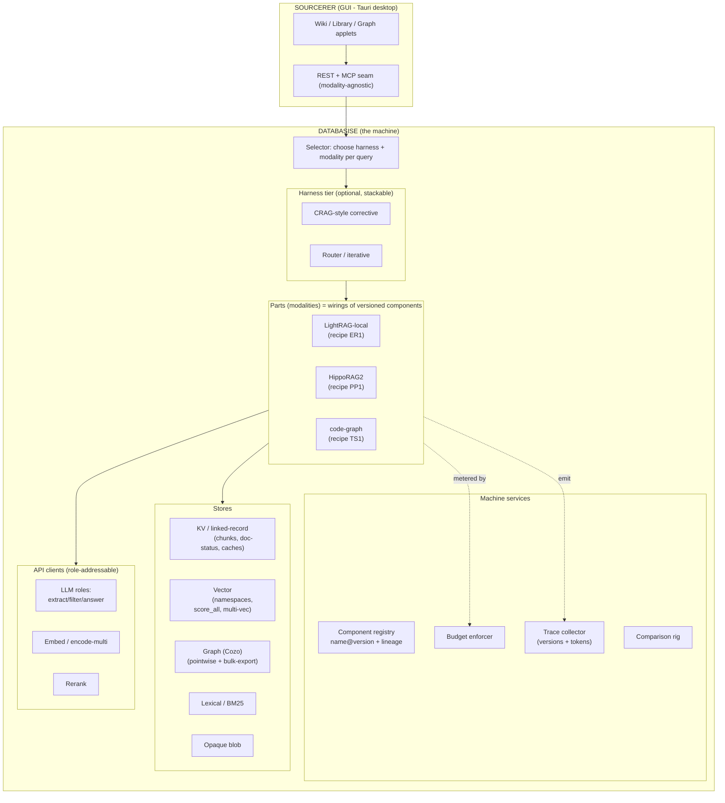
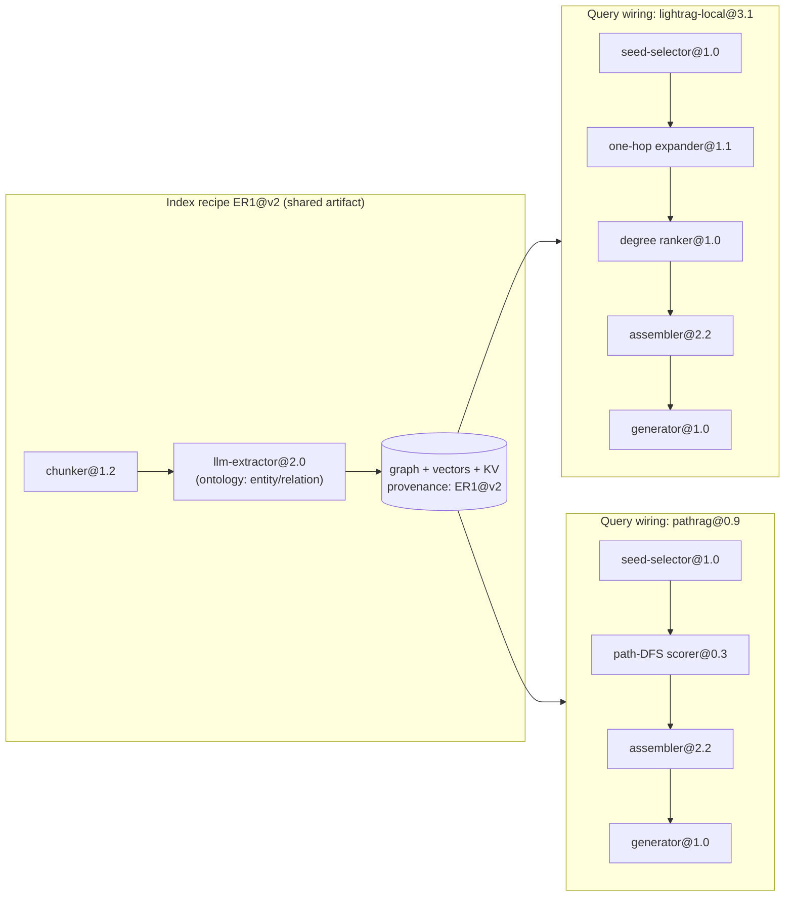
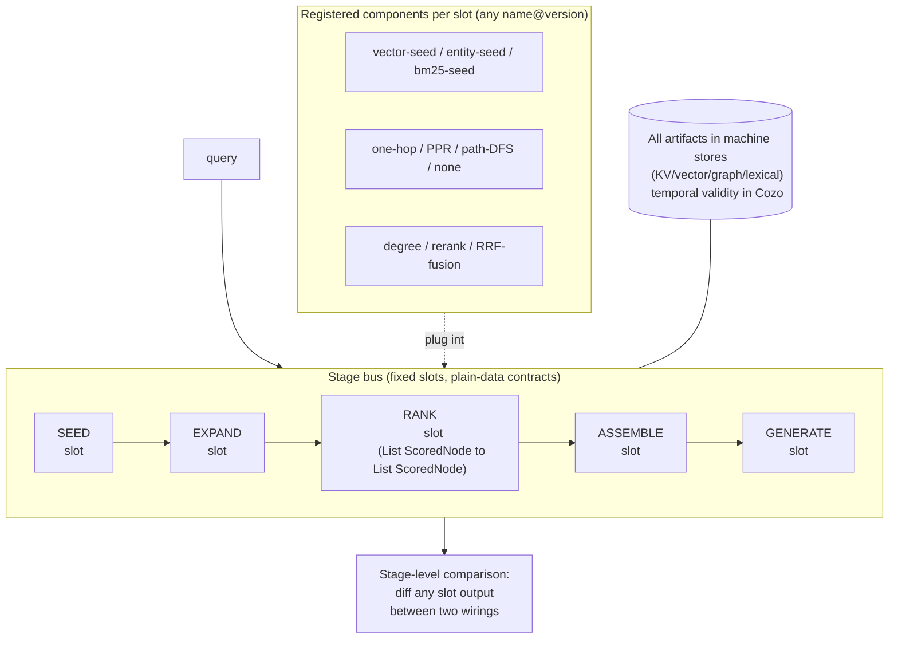
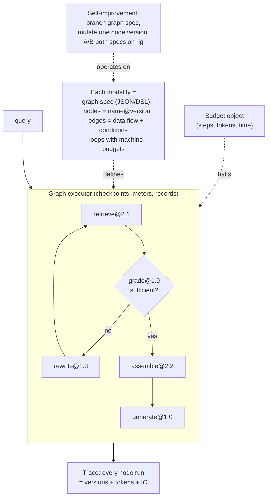
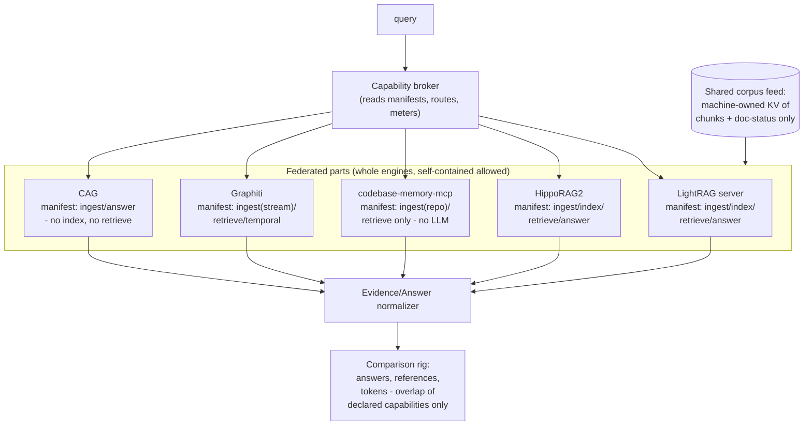
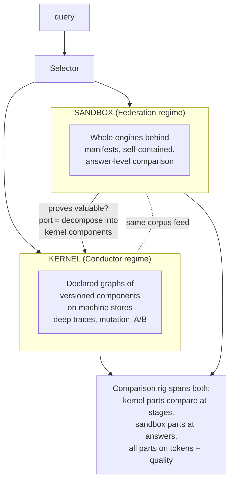

# Candidate Architectures — Diagrams

**Status:** superseded — candidates A, B, and C are superseded by `SELECTION.md` (the D4 One Machine selection, with its spike-005 amendment); tracked at `SYSTEM-MODEL.md ## §ST`.

Four candidate architectures over the same component inventory, each a different position on the five tension axes (SYNTHESIS.md §7), scored later against the ten-goal rubric (ARCHITECTURE-RUBRIC.md). Read the shared anatomy first; every candidate reuses its vocabulary.

---

## 0. Shared Anatomy — how everything nests

The machine (Databasise) sits inside Sourcerer. Parts sit inside the machine. Components sit inside parts. Harnesses wrap parts.

How a part decomposes, and where sharing happens:

One recipe, many wirings: PathRAG reuses LightRAG's index verbatim (code-verified). Both wirings share `seed-selector@1.0`, `assembler@2.2`, `generator@1.0` — a new modality here is two new components, not a system.

---

## Candidate A — "Stage Bus" (normalized pipeline machine)

**Position:** normalization total; extraction shared; parts are code with manifests filling fixed stage slots; temporal in Cozo (machine); comparison at every stage boundary.

- **Wins:** deepest observability and comparison (diff *stages*, not just answers); maximal artifact sharing; cheapest LightRAG port (its 4-stage refactor maps 1:1).
- **Loses:** cannot express loops/branches (four of six agentic shapes unrepresentable); black-box parts (codebase-memory-mcp) and CAG don't fit slots; the slot vocabulary risks freezing today's paradigms into the machine.
- **Fits when:** the corpus of modalities stays pipeline-shaped and comparison depth matters most.

---

## Candidate B — "Conductor" (declared-graph engine)

**Position:** normalization default with blob escape hatch; extraction shared where declared-compatible; modalities are *declared graphs* of versioned opaque components the machine executes; temporal in both layers; comparison at node boundaries where normalized, answer-level otherwise.

- **Wins:** expresses all control-flow shapes (loops, branches, agent walks); versioning-native — the graph spec *is* the pinned, mutable, A/B-able artifact; budgets built into the executor; the natural substrate for self-improvement.
- **Loses:** highest machine complexity (an execution engine to build and debug); contract design for node boundaries is the hard intellectual work; opaque nodes tempt teams to stuff whole modalities into one node, quietly becoming Candidate C.
- **Fits when:** harnesses, custom modalities, and machine-driven mutation are first-class goals — which they are.

---

## Candidate C — "Federation" (capability broker over whole engines)

**Position:** normalization minimal; no shared extraction; parts are whole engines behind manifests; temporal is a part (Graphiti); comparison at evidence/answer level only.

- **Wins:** cheapest hosting of *anything* — a new paper is runnable in days unmodified; black boxes are first-class; zero port cost; upstream updates keep flowing.
- **Loses:** shallow comparison (answers only, never stages); near-zero artifact sharing (every engine re-indexes: N× token cost); no component versioning inside parts — self-improvement limited to selection, never mutation.
- **Fits when:** the goal is rapid *evaluation* of externals rather than evolution of internals — the survey phase, permanently.

---

## Candidate D — "Kernel + Sandbox" (hybrid, promotion path)

**Position:** two regimes with a documented promotion path — a Conductor-style kernel for house modalities, a Federation-style sandbox for trials; extraction shared inside the kernel only; temporal in kernel Cozo *and* hostable as sandbox part; comparison deep in kernel, answer-level in sandbox.

- **Wins:** resolves the try-fast vs evolve-deep tension instead of picking a side; the promotion path ("prove in sandbox, port to kernel") is exactly how LightRAG→components would proceed anyway; sandbox failures cost nothing.
- **Loses:** two regimes to maintain; the promotion path can rot into "everything stays in the sandbox forever" without discipline; selector and rig must handle both regimes.
- **Fits when:** both rapid external trials *and* deep self-improvement are goals — which is the stated goal ladder. The red team's job is to test whether the two-regime cost is real or exaggerated.

---

## The axes at a glance

| Axis | A Stage Bus | B Conductor | C Federation | D Kernel+Sandbox |
|---|---|---|---|---|
| Normalization stops at | everything | default + blob hatch | corpus feed only | kernel: all / sandbox: feed |
| Extraction | one shared, ontology-config | shared where compatible | per-engine | shared in kernel |
| Part representation | code in fixed slots | declared graph of versions | whole engine + manifest | both, by regime |
| Temporal | machine (Cozo) | both | part (Graphiti) | both |
| Comparison depth | every stage | node boundaries | answers only | deep / shallow by regime |

**Honest prior before red team:** B and D are the only candidates consistent with the versioning-as-improvement mandate; A maximizes science but can't host the survey's edge cases; C is unbeatable for trials but a dead end for self-improvement. D's two-regime cost is the live question.

---
*Drafted 2026-08-10 from SYNTHESIS.md + ARCHITECTURE-RUBRIC.md. Next: red-team round.*
