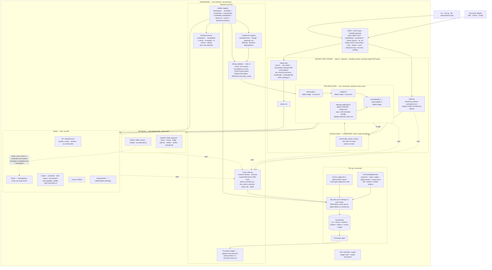
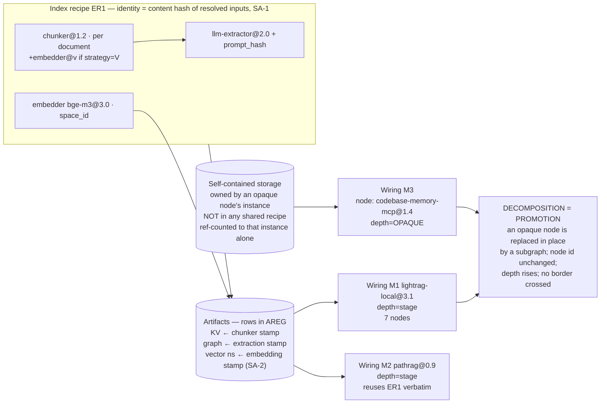

# D4 One Machine — the sandbox is a capability, not a regime

## Position

D exists because two populations of parts look irreconcilable: house modalities you decompose, version, mutate, and A/B; and foreign engines you want running by Friday. D reconciles them with two execution regimes and a promotion path between. D4's claim is that the second regime is a **coarse proxy for four declarations a component can make about itself** — `opaque-internals`, `self-contained-storage`, `external-resource`, `deny-by-default network` — and that once those declarations are machine-enforced per node, the regime boundary has no work left to do. There is one executor. A whole external engine is a node of an opaque kind carrying a large capability set, invoked exactly like a ranker is invoked, traced into the same trace schema, identified by the same `(name@version, config_hash, resolved_dependency_ids)` tuple, gated by the same promotion gate. Promotion is not a border crossing; it is an ordinary refactor — the node becomes a subgraph, in place, and every wiring that named the node keeps working because a subgraph *is* a node. The slogan that carries the variant: **the kernel is not a place, it is a depth.** D's regime label answers "how deeply can I see into this part?" with a location; D4 answers it with a value the wiring validator computes, stamps on every run record, and enforces. Unbundling is strictly more expressive than the regime: D cannot express a transparent-but-external part or an opaque-but-machine-stored part, and both exist in the survey.

## The five axes

| Axis | D4's position | Justification |
|---|---|---|
| **Kernel graph-execution style** | One executor only. Every part — decomposed component, harness, planner, or whole foreign engine — is a node in a JSON wiring the single executor runs. | Two executors mean two trace schemas, two budget implementations, two identity disciplines, and a rig whose cross-population metric is defined at the shallowest common denominator (RT-modularity Attack 4, D column). One executor makes the comparison *depth* a data field instead of a structural ceiling. [inference] |
| **Sandbox containment depth** | Per-node, and **derived, not granted**: the validator computes `execution_mode` from a node's declared `effects`. Pure non-iterative nodes may run in-process; anything touching net, FS, a store, an LLM, or its own storage is forced to a confined subprocess. The arm is always its own process. | Declaring capabilities must *cost* containment, never buy freedom. Inverting the usual manifest reading is what makes "capability, not regime" honest — a foreign engine's large capability set forces it into the heaviest containment automatically, with no human deciding it belongs "in the sandbox". [inference] |
| **Promotion mechanics** | Node → subgraph decomposition, in place. `lightrag-engine@1.5.4` (one opaque node) becomes `{chunk, extract, seed, expand, rank, assemble, generate}` (a subgraph). The wiring's node id is unchanged; the depth label rises from `opaque` toward `stage`; nothing crosses a boundary. | Promotion in D is a one-way port with no re-promotion ritual — RT-upgradability §1 names this as D's specific defect ("the sandbox copy and the kernel copy drift and nobody owns reconciliation"). Decomposition is idempotent: decomposing an already-decomposed part is a no-op, so absorbing upstream v2 has the same mechanism as the first port. [inference] |
| **Instrument placement** | Kernel — i.e. all six machine services are plain machine services applying uniformly to every node. No service has a per-regime variant. | There is no second regime to place them relative to. The load this removes is real: in D, services 1–4 each need a "does this apply to sandbox parts?" answer, and each answer is a place a divergence can hide. [inference] |
| **Comparison depth** | The wiring validator computes `depth ∈ {opaque, evidence, stage}` per node, takes the **minimum over the compared path** as the wiring's depth, stamps it on every run record, and the rig refuses to pool evidence across differing labels. | D's honest statement is "kernel deep, sandbox shallow" — a property of a location, therefore not checkable. D4's is a computed value with a static rule and a runtime audit (clause 3's `refs_in / refs_resolved`), therefore falsifiable per run. This is the mechanism the whole variant stands on; §"What would falsify" makes it the decisive falsifier. [inference] |

**One clarification, not a change of position.** The assigned axis says "in-process / subprocess". Machine service #2 mandates a per-arm process unconditionally. These do not conflict: *in-process* in D4 describes where a **node** is hosted relative to the arm's executor process; the **arm** is always its own confined process. A runaway in-process node therefore kills its own arm and nothing else, which is the correct blast radius and is recorded as a budget-halted partial run.

---

## Anatomy

The fixed anatomy (BRIEF §4), specialized to D4. The specialization is the absence of a SANDBOX subgraph and the presence of `depth` / `mode` on every node.

**The rule the `binds` edge carries: index-time clients bind artifacts; query-time clients do not.** Rerank, judge, and generator upgrades are free. Extractor and embedder upgrades cost a rebuild. Embedder identity is mandatory in the fitting contract — the machine refuses to write vectors it cannot attribute (closing the code-verified `_generate_collection_suffix()` hole where a missing `model_name` returns `None` and two models at the same dimension collide in one collection [code-verified, ANATOMY-REVIEW F1]).

The recipe/artifact zoom, with D4's decomposition axis drawn on it:

Two hazards placed explicitly, per BRIEF §4:

- **The chunker is selected per document and strategy `V` consumes the embedder** [code-verified, ANATOMY-REVIEW F2/F3], so chunk *boundaries* are a function of the embedding model. D4 does not claim a paradigm-neutral shared KV. The chunk artifact carries its chunker sub-recipe stamp (SA-2), and when the strategy is embedder-coupled that stamp **includes the embedder identity**, which makes the artifact recipe-bound rather than shared. The validator refuses a wiring that reads an embedder-stamped chunk artifact with a different embedder pinned. The shared-KV claim survives only for `F`/`R`/`P` strategies, and it survives as a checked property rather than an assertion.
- **LLM role→binding is hot-updatable at runtime** [code-verified, F5]. The trace therefore records the **resolved model per role per run**, never the role name. This is not optional bookkeeping in D4: the judge is a role, and a mid-A/B judge re-point turns a measured improvement into the judge's drift.

---

## Execution model

One executor, running JSON wirings. `deps` is a **partial order over named node ids**; node ids are positions, never instance identities. Component kind is a **tagged sum** — a single-key object whose key selects the kind and whose value is validated by that kind's schema.

Node kinds: the ~10 primitive part types (retriever, grader/filter, rewriter, ranker, assembler, generator, external-tool, planner, claim-extractor, chunk-pooler), plus four executor kinds — `fanout`, `join`, `fixpoint`, `subgraph` — plus one D4-specific kind, `opaque`.

**Fan-out / join (DQ-1a).** `fanout` is a first-class node kind with **runtime arity**: it emits a list, and the executor schedules one branch per element. `join` is a declared node whose socket is `List[List[X]] -> List[X]` (RAG-Fusion's multi-list ranker) or `List[Draft] -> Draft` (Speculative RAG's selector). Budget accounting under fan-out is **multiplicative, not accumulating** — N branches, and the enclosure debits N. This is the LangGraph `Send()`-shaped primitive that spike 002 recorded as expressible in *no* candidate as drawn; D4 gives it a node kind and a budget rule.

**Ephemeral subgraph (DQ-1b).** A `planner` node emits a sub-query DAG as a *value*. The executor executes that value under a budget derived from the enclosing enclosure, and records it **as trace data**. The planner is the versioned artifact; the emitted plan is never registered as a wiring, never gets a `name@version`, never appears in the alias table. The two lifecycles are separate by construction: registered wirings are content-addressed artifacts, emitted plans are trace payloads. The run stays reconstructable because the trace holds both the planner's instance hash and the plan it produced.

**Non-adjacent fan-in (DQ-1c).** Because `deps` names arbitrary upstream node ids rather than an immediate predecessor, non-adjacent fan-in is the **default case, not an extension**. An inline eval node declaring `deps: ["retrieve", "generate"]` reads pre-assembly evidence and the final answer in one node — the shape GAP-SWEEP §3.8.3 names. Cycles in the `deps` graph are legal (a CRAG retry loop is a legal modality) and are reported by the validator **as data** — `{cycle: [node ids]}` — never thrown.

**Iterative components are fixpoint nodes.** Auto-merging retrieval loops internally in surveyed code [code-verified, RT-modularity Attack 6 Stress 3], which violates goal 10 as written. D4 refuses the in-component loop: a component declaring `iterative: true` is hosted as a `fixpoint` node and the **executor** owns the iteration and the halt. This is what lets the in-process hosting rule be simple — no in-process node contains a loop, so the executor's step boundary is a real wall-clock checkpoint.

**How an opaque node runs.** The executor's foreign-node adapter does exactly five things: start or attach to a confined unit; hand it the corpus feed handle and the query object; enforce wall-clock and the injected LLM endpoint; normalize the returned evidence/answer into `ScoredItem` / `ContextPackage` at the node's outer boundary; write the trace record with `depth=opaque`. It is one call. D4 does not pretend this adapter is free — see Disadvantages — but it is bounded, and it is the *only* place the executor behaves differently for a foreign part.

---

## The sandbox boundary

There is no sandbox boundary. There is a **containment lattice**, computed per node.

**Step 1 — effects are declared and are preconditions.** Every component declares `effects ⊆ {reads_kv, reads_vector, reads_graph, reads_lexical, writes_artifact, calls_llm, calls_rerank, net, fs, self_storage}` plus `iterative`, `space_id`, `presumes_graph`, `accepts/emits kinds`, `accepts/emits score semantics`. Undeclared is denied, not warned.

**Step 2 — the validator derives `execution_mode`; it is never requested.**

| Declared effects | Derived mode | Enforcement |
|---|---|---|
| `∅` (pure), `iterative: false` | in-process, inside the arm's executor process | contained transitively by the arm's own confinement; a runaway kills its own arm |
| any store read, `calls_llm`, `calls_rerank` | subprocess, machine-mediated handles only | store handles are capability objects scoped to `(recipe@version, namespace)`; LLM calls go through the machine's client seam and are counted with the consuming model's tokenizer, stamped `counted_by` |
| `writes_artifact` | subprocess **and** `depth == stage` required | see the blast-radius rule below |
| `net`, `fs`, `self_storage`, `opaque` | confined unit: deny-by-default network namespace, FS confinement, store-write refused, wall-clock ceiling | substrate implementation is systemd `confinement.enable` + `mode = "full-apivfs"` + `RuntimeMaxSec`, with a `privateNetwork` container for the namespace unit confinement does not cover [docs-verified, spike 004] |

**Step 3 — the machine is the foreign engine's LLM provider.** An admitted opaque node is started with its network namespace denied and an injected OpenAI-compatible base URL pointing at the machine's client seam. Most surveyed engines take an endpoint, so this is usually free. The payoff is large: tokens are counted once, by the machine, with the consuming model's tokenizer, so `counted_by` is uniform across opaque and decomposed nodes and the rig's token axis stays a comparable quantity — the exact defect RT-modularity Attack 1a identifies as C's and D's measurement failure. Where an engine cannot be pointed at an injected endpoint, it is admitted only with `external-resource` + `unbudgetable`, and the rig **refuses** to publish a token comparison including it rather than publishing a wrong number.

**Step 4 — what actually crosses.** Into an opaque node: the query object, the corpus feed handle (chunk artifacts with their sub-recipe stamps), a budget, an LLM endpoint. Out of it: `List[ScoredItem]` or an `Answer` + trace stub, with machine-minted refs where it can resolve them and `derived_from` where it cannot. Never crossing: filesystem paths, the node's internal ids, the artifact plane as a control channel.

**Step 5 — the two policies D needs, re-expressed per node.** RT-upgradability shows D falls below C without D-1 and D-2. D4 keeps both, attached to the depth label rather than to a location: **nodes with `depth == opaque` are excluded from the default selector** (runnable by the rig and by explicit request, never routed to by production), and **admission of an opaque node carries a TTL (~90 days), renewable only with a recorded reason in the ledger**. One condition in the selector; one field in the registry.

---

## Promotion

**Promotion of a mutation** (the improvement loop) is unchanged from the settled set: alias repoint, `rename(2)`-atomic, ~1 ms, multi-artifact in one swap, never a build; ledger append is the decision, the active pointer is a projection; the verb ladder is `check | preview | run | promote-next | promote-now` with one gate implementation parameterized by verb; running an arm never appends to the ledger.

**Promotion of a part** — what D calls the sandbox→kernel port — is in D4 an ordinary refactor with four mechanical steps and no ceremony:

1. Author a subgraph wiring whose `provides` matches the opaque node's outer socket contract.
2. Replace the node's value in the wiring with `{"subgraph": <wiring ref>}`. The **node id does not change**, so every `deps` edge naming it, every harness wrapping it, and every trace query keyed on the position keep working.
3. The validator recomputes the wiring's depth. It rises only if the subgraph's own leaves are registry-resolved and non-opaque.
4. Run the two wirings as arms against each other on the same eval bundle. The old opaque node is the incumbent; the decomposition is the challenger.

**What gates it.** The same promotion gate as any mutation, plus one extra refusal: the gate **refuses to treat a decomposition as an improvement**. A decomposition's job is parity, not gain. Its acceptance test is RT-upgradability's migration test — run both arms and require the difference to fall inside the A/A null band. A decomposition that *improves* the score is as suspicious as one that degrades it, because it means the port changed behavior somewhere unrecorded. This one rule addresses the failure RT-modularity Attack 3 predicts for D: "expect the first several ports to look like kernel regressions when they are format-decoupling bugs, which will discredit the kernel and stall the promotion path." In D4 a port is not a regression *or* an improvement; it is a parity claim that either holds or names where it broke.

**Partial decomposition is legal and is the normal state.** `{ingest-adapter, opaque-query-core, assembler@2.2}` is a valid wiring. Its depth is `opaque` (minimum over the path), so it is excluded from the default selector and refused shared-artifact writes until the opaque core is gone. Decomposition is therefore a ratchet with a mechanical brake at each notch, rather than a week-long port you either finish or abandon.

**What is discarded.** Nothing structural. The opaque node's own storage is reference-counted to its instance and GC'd when the last wiring pinning it is unpinned. Losing decompositions leave a ~200-byte tombstone (mutation id, parent, effect size, decision, evidence pointer) so a stateless proposer stops re-proposing them. Historical traces citing the opaque node keep resolving because the registry retains identity + hash in the `tombstoned` tier even after the artifact is purged.

---

## Instruments

All six machine services are plain machine services. There is no regime to place them relative to, and none has a per-population variant.

| # | Service | Owner | D4 specialization |
|---|---|---|---|
| 0 | **Eval bundle@version** | machine artifact, not a component | questions + gold + judge + judge prompt + corpus snapshot hash; dev / holdout / sealed holdout. Scores are comparable only within one `(eval@v, judge@v, corpus@v)` triple, and every board row carries it. The eval bundle is the one instrument that must be built before the architecture, per settled sequencing. |
| 1 | **Promotion gate** | machine, one implementation | A/A null distribution, paired significance, minimum-effect floor, confirmation on disjoint subsets, epoch FDR, hard-gate regression suite as veto never averaged. D4 adds three refusals: differing depth labels, differing `counted_by`, and a `held_constant` set wider than the declared mutation. |
| 2 | **Isolation domain + manifest enforcement** | machine | Per-arm process unconditionally; per-node `execution_mode` derived from effects; deny-by-default net/FS/store-write; wall-clock ceiling. **This is the service D respecifies its sandbox as. D4's reading: isolation is a property of running an arm, not of a place.** In D, the sandbox isolates foreign engines but the most common mutations — config and wiring, ranks 1 and 2 of the mutation ladder — are kernel-vs-kernel and get no benefit from it. D4 isolates the arm, so the population that mutates most is the population that is isolated. |
| 3 | **Artifact ownership + CoW + ref-counted GC** | machine | Writes scoped to `(recipe@version, namespace)`; CoW for experimental arms; **cache keys include the component instance version** (cache poisoning is the insidious one); retention tiers runnable / readable / tombstoned with a scheduled reconstructability probe. |
| 4 | **Promotion ledger** | machine, append-only | mutation id, class, parent, arm instance hashes, effect size, gate decision, evidence pointer, proposer id, **depth label**. Distinct from the lineage tree: lineage says what exists, the ledger says what was decided. Also carries opaque-node TTL renewals and their recorded reasons. |
| 5 | **Static mutation validator** | machine, runs at load | Everything in WIRING-SPEC-DRAFT §4, plus the two D4 computations: **depth per node and for the wiring**, and **`execution_mode` per node**. Returns all violations at once with JSON-Pointer paths; cycles as data; subtractive operations fail closed. Implementation is a build-phase choice among bespoke JSON-Schema-plus-graph-validator, `lib.evalModules` with the hardening rules, or CUE — the contract is behavioral and names no tool. |

Two further versioned artifacts D4 insists on, both from the red team: **the executor is a versioned artifact named in every trace** (amendment B-3 — otherwise the one thing that ran everything is the one thing "reconstruct yesterday's system" cannot name, and in D4 the executor ran the foreign engines too), and **selector policy is a versioned artifact** routed through the same branch → A/B → promote loop, since routing is the cheapest thing a self-improving system can improve.

---

## Comparison depth

`depth` is **computed, never declared**:

- `stage` — the node is a subgraph whose leaves are all registry-resolved components with enumerated inputs, and none of them declares `opaque`. Stage-level diffing is meaningful: every internal boundary has a name, a type, and an owner.
- `evidence` — the node's declared emit type is `List[ScoredItem]` with machine-minted refs, but its internals are unenumerated. Comparable at the evidence set, not below it.
- `opaque` — anything else. Comparable at the answer only.

The wiring's depth is the **minimum over the compared path**, so one opaque node caps the whole comparison — which is the honest thing and is exactly what D's cross-regime metric does silently. In D4 it is a stamped field, so the rig can act on it:

1. The rig **refuses to pool** per-question evidence across arms with different depth labels. It may still compare them, at the common denominator, and stamps that decision on the board row.
2. The gate refuses to read a stage-level diff as evidence when the wiring's depth is `evidence` or `opaque` — the diff is not available, so a promotion argument that depends on it fails at the gate rather than being quietly fabricated.
3. The board publishes a **decomposition ratio** per part (registry-resolved leaves / declared stages) beside every result, so a "one-node graph" advertises its own degradation. This is amendment B-2, and in D4 it is the same number as the depth computation rather than a second metric.

**The self-declaration hole and how it is closed.** The only input the component controls is its *emit type*, so a node could claim `evidence` while returning unresolvable refs. Contract clause 3 converts that lie into a loud failure: `deref` raises on unknown, an assembler may not emit a package containing unresolved refs, and every run records `refs_in / refs_resolved` with the rig failing any run where `resolved < in`. Depth is therefore **statically computed and dynamically audited**, which is the strongest form available without reading the foreign engine's source.

---

## Scenario S1 — embedder swap

`bge-m3@3.0.0 → qwen3-embed@1.0.0`, both index-side and query-side. Wirings in play: M1 `lightrag-local@3.1` (depth `stage`), M2 `pathrag@0.9` (depth `stage`, reuses ER1 verbatim [code-verified]), M3 a `codebase-memory-mcp@1.4` opaque node with its own compiled `nomic-embed-code` 768-d int8 vectors [code-verified].

**What invalidates.** SA-1 mints a new recipe hash, because `(embed_model_id, dim, normalization, pooling)` is inside the hash. SA-2 confines the damage: the **vector namespaces** invalidate (each carries the embedding stamp and an immutable `space_id`); the **graph** does not (extraction stamp unchanged); the **KV chunks** do not — *unless* the wiring's chunker node is strategy `V`, whose sub-recipe stamp includes the embedder, in which case chunk boundaries change, `source_id` joins move, and the graph invalidates transitively.

**What the reindex planner classifies.** For M1/M2 with an `F`/`R`/`P` chunker: `re-embed` — re-embed N namespaces, keep the extraction output, keep the KV. That is the cheap half, and it is the half that costs no LLM extraction tokens (the expensive side is ~1,786 entangled lines and all the tokens [code-verified, spike 001]). For a `V`-chunked wiring: `rebuild`, with the full cost estimate attached. For M3: **`not-applicable (opaque)`** — its vectors are inside its own storage, stamped to its instance hash, in a space the machine cannot participate in.

**What is reused.** Everything the graph and KV hold, plus both wirings at once: M1 and M2 share ER1, so one re-embed fixes both. Artifact sharing and migration cost are the same axis.

**In-flight arms straddling the migration.** Nothing is mutated in place, so nothing is invalidated mid-flight. The new namespace is minted alongside the old (immutable in space; changing any `EmbeddingSpace` field mints, never mutates), and an in-flight arm keeps reading the old namespace by its pinned instance identity. The old namespace becomes GC-eligible when the last arm and the last scoreboard row citing it are retired — the honest tension between full reproducibility and bounded disk is resolved in favor of the ledger: a namespace cited by a *decision* is retained; one cited only by a *run* is evictable.

**How the rig avoids blaming the component under test.** Four mechanisms, in order of when they fire:

1. **At load.** The validator typechecks `reads_space == namespace.space_id`. A query encoder pointed at old vectors is refused before execution, so the classic same-dimension silent swap — cosine values in range, thresholds mis-calibrated, plausible ranked wrong results — cannot occur at all. This is the highest-value single check in the scenario, and it is the one upstream does not have: LightRAG's only vector guard is a dimension-equality `assert` inside vendored `nano_vectordb`, while it *does* partition LLM caches by model identity [code-verified, RT-upgradability §0]. The lesson was learned for caches and not applied to embeddings; D4 applies it.
2. **At run.** `refs_in / refs_resolved` per run; any run where they differ fails.
3. **At scoring.** The staleness view — `AREG × currently-pinned instances` — names invalidated namespaces; any result citing one is stamped `stale-artifact` and excluded from the gate.
4. **At the gate.** Each arm carries a `held_constant` set computed from the two wirings' recipe hashes. If the diff contains anything beyond the declared mutation, the gate returns *inconclusive* rather than a verdict. An embedder swap is an index-side mutation, so it is compared against its own baseline under a separate, far stricter rate limit — one recipe version is ~15 M extraction tokens, roughly seven days of query-side experimentation.

**M3's role, and D4's specific move.** The opaque node's baseline did not move, so it is not evidence about the embedder. The rig **partitions rather than pools**: the embedder comparison is published over the arms whose recipe hash changed, and M3 appears on the board as unaffected, with its depth label explaining why. In D this partition is implicit in the regime; in D4 it is a computed consequence of two stamped fields, which means it also works for the cases D cannot name — a decomposed part that happens to pin a different embedder, for instance.

**Who decides.** The planner classifies and prices; the gate refuses; a human authorizes the re-embed spend.

---

## Scenario S2 — LightRAG ships v2 upstream

**Which components have upstream deltas, and how you know.** Every registry entry carries `upstream_ref` = (repo, tag/commit, file/symbol). A scheduled job diffs the pinned commit against the new tag and emits an affected-component list. The answer is a **diff-able list, not a blind decision** — "these 4 of 23 components have upstream deltas" — which is the whole payoff of a field that costs one column. Concretely, from the code-verified inventory: the query side is ~794 lines over a named 4-stage pipeline with plain dict/list boundaries, decomposing to roughly 5–8 components; the index side is ~1,786 lines welded to the entity/relation ontology, decomposing to the extractor plus the merge/upsert family; and separately the Cozo plugin implements 20 `BaseGraphStorage` abstract methods, which is a **machine store adapter, not a component**, and is where a v2 storage-schema change lands hardest [all code-verified, spike 001 / RT-upgradability §1].

**What a re-port costs.** Per component, and each one is independently gate-able because the decomposed part is a wiring: you swap one ported component at a time and A/B it. That is a different cost shape from D's, where the ported copy is frozen in the kernel and the upstream copy lives in the sandbox with no ritual for absorbing an improvement across the border — the defect RT-upgradability names as D's ("the sandbox copy and the kernel copy drift and nobody owns reconciliation").

**What the "sandbox" absorbs vs what must be re-implemented.** In D4 the free absorption is total and requires no regime: `lightrag-engine@2.0` is Nix-packaged and admitted as an opaque node with a new `name@version`. Because instance identity closes over the **environment hash**, the new closure automatically mints a new instance identity — nobody has to remember to bump anything. That node runs against the decomposed subgraph on the same corpus feed and the same eval bundle, so **whether v2 is worth adopting is measured, not inferred from a changelog** — the asset RT-upgradability credits D with, retained in full.

What must be re-implemented is only the components you chose to decompose *and* that have upstream deltas. And absorbing an upstream improvement uses the same mechanism as the original port: branch the corresponding component in the subgraph, A/B, promote. **Promotion is idempotent because decomposition is idempotent** — decomposing an already-decomposed part is a no-op — which is the concrete answer to D's missing re-promotion path.

**The store-contract trap, and D4's position on it.** If the machine's store contract is a copy of `base.py`, the machine inherits LightRAG-shaped namespaces — `full_entities`, `full_relations`, `entity_chunks`, `relation_chunks` — that a phrase-graph part needs none of, plus upstream's version-free migration model, which sniffs *emptiness* to decide a backfill is needed and has no schema version field anywhere [code-verified, RT-upgradability §1]. That model cannot answer "what version is *this* artifact?", only "has *this one* backfill run?", and is unusable for a machine holding N artifact sets from M recipe versions. D4 takes the subtractive reading: `base.py` is a starting point to subtract from; the LightRAG-shaped namespaces become part-level concerns of the decomposed extractor, and the machine's store contract is the machine's. D4 has exactly **one** store contract to keep honest, not one per regime — a small, real saving that recurs on every upstream release.

---

## Scenario S3 — one full mutate → A/B → promote cycle

Mutation: `hybrid-retriever@1.0.0` config `topK: 8 → 16` in wiring `lightrag-local@3.1`. Config class — rank 1 on the permit ladder, fully statically verifiable, and the class with the best reward-per-risk, since published benchmarks disagreeing 6× for the same system implies configuration sensitivity dominates architectural difference.

Services touched, in order:

1. **Mutation proposer** (a versioned artifact; its hit-rate per mutation class is tracked in the ledger) emits an RFC 7386 merge-patch: `{"nodes":{"retrieve":{"config":{"topK":16}}}}`. JSON only, never code, never a format with evaluation semantics.
2. **#5 Static mutation validator.** Applies the patch; validates the resulting wiring **in full**; independently re-validates the base with no arm applied (an arm's override is filtered before type checking and silently masks base type errors). Checks: component resolution; socket types on every `deps` edge; capability declarations deny-by-default; `provides` satisfied; structural integrity; caps (max nodes, loop budget, fan-out cap, config domain range); `reads_space == namespace.space_id`; `requires_edge_weight_semantics` vs what the recipe wrote; `requires_block_kinds` vs what the assembler can emit; token-budget resolvability against the wired generator's tokenizer. **D4-specific:** recomputes `depth` per node and for the wiring, and derives `execution_mode` per node. All violations returned at once with JSON-Pointer paths; cycles as data.
3. **Identity minting.** `config_hash` = SHA-256 over the author-supplied JSON canonicalized by RFC 8785 (no ints outside int64; `1` ≡ `1.0`), including the environment hash. Instance identity `(name@version, config_hash, resolved_dependency_ids)`. The new wiring is content-addressed and registered.
4. **#0 Eval bundle@version** resolved: dev split selected, sealed holdout untouched, `(eval@v, judge@v, corpus@v)` recorded on every row.
5. **#2 Isolation domain.** Two arm processes — the champion is **re-run, not read from cache**, so generator and judge nondeterminism are paired. Each arm: confined unit, deny-by-default net, FS confinement, store-write refused except to CoW namespaces, `RuntimeMaxSec` ceiling. `retrieve` and `rank` declare no effects beyond store reads, so they are subprocess-hosted with capability-scoped store handles; a pure fusion node in the same wiring is in-process.
6. **#3 Artifact ownership + CoW.** The mutation is query-side, so the recipe hash is unchanged and both arms read the **same** index artifacts read-only — near-zero extra cost, which is the entire economic argument for query-side mutation. Cache keys include the component instance version.
7. **Execution.** One executor per arm. Traces record instance hashes per node, resolved model per role per run, tokens with `counted_by`, `refs_in / refs_resolved`, `space_id`s touched, executor version, depth label, budget state, and partial/degraded flags. Budget-halted and degraded runs are traced and scored, never discarded.
8. **Evidence collection.** Because this is a retrieval-side mutation, the primary measure is **gold-passage recall@k / nDCG**, not answer judging — it removes generator noise and judge noise entirely and costs no judge calls. End-to-end answer judging is reserved for generator and assembler mutations. The hard-gate regression suite runs regardless: citation validity, refuse-when-no-evidence, latency ceiling, token ceiling, output-schema conformance.
9. **#1 Promotion gate.** **What it sees:** paired per-question outcomes; the stored A/A null distribution for this triple; the minimum-effect floor; the confirmation run on a disjoint subset; the epoch FDR budget; the regression suite as a veto; the depth labels; the `held_constant` set; `refs_in / refs_resolved`; `counted_by`. **What it refuses:** any effect below the A/A 95th percentile (without which every reported delta is uninterpretable — judge-only measurement error at n=40 is ≈ ±4.7 pp at 1 SE, and a naive "adopt if higher" rule promotes on noise roughly 5 times for every real win); any regression-suite failure regardless of mean gain; any run where `refs_resolved < refs_in`; any run citing a stale artifact; any token comparison across differing `counted_by`; any arm pair whose `held_constant` diff exceeds the declared mutation; any pooling across differing depth labels. It returns promote / reject / **inconclusive**, and inconclusive is a first-class outcome.
10. **#4 Promotion ledger.** One append: mutation id, class `config`, parent, both arm instance hashes, effect size, gate decision, evidence pointer, proposer id, depth label. **Running the arms appended nothing** — evaluation is not a decision.
11. **Alias repoint.** `rename(2)`-atomic, ~1 ms, multi-artifact in one swap, never a build. The active-wiring pointer is regenerated as a projection of the ledger; if pointer and ledger disagree, the ledger wins.
12. **On rejection:** a ~200-byte loser tombstone, so a stateless proposer stops re-proposing it every epoch.

---

## Advantages

1. **One rig, one trace schema, one identity discipline — so cross-population comparison is not defined at the shallowest common denominator by construction.** RT-modularity's finding against D is that "the promotion decision — is porting this worth it? — is always made on the least informative evidence the system produces." In D4 the comparison depth is a computed, stamped field, so evidence is labelled rather than silently degraded, and the *decomposed* portion of a partially-decomposed part is compared at its real depth. [inference]
2. **Promotion is idempotent.** Decomposition of an already-decomposed part is a no-op, so absorbing upstream v2's improvements uses the same mechanism as the original port. D's one-way port has no re-promotion ritual — a named defect that D4 does not have to fix because it never creates it. [inference]
3. **Isolation is attached to the population that mutates.** D names the sandbox as the isolation domain, but the mutations that actually happen are config and wiring changes to house parts, which never enter the sandbox. D4 isolates the *arm*, so the isolation applies to every mutation class including the common ones. [inference]
4. **Capabilities cost containment rather than buying freedom.** Because `execution_mode` is derived from `effects`, a part cannot talk its way into a lighter regime; the heaviest containment is the automatic consequence of a large capability set. There is no "which regime does this belong in?" conversation to get wrong. [inference]
5. **A partially-decomposed part is a legal, useful, brake-equipped state.** Decomposition is a ratchet with a mechanical stop at each notch instead of a week-long port you either finish or abandon — which directly attacks the failure mode CANDIDATES names for D ("everything stays in the sandbox forever"), since there is no all-or-nothing step to defer. [inference]
6. **Token comparability survives foreign parts** when the machine is the engine's LLM provider — closing the measurement defect RT-modularity Attack 1a identifies as C's and D's, where N parts count tokens with N tokenizers and the rig's headline number is unit-inconsistent. [inference]
7. **Expressiveness the regime cannot reach.** Transparent-but-external (a decomposed wiring calling a live web search) and opaque-but-machine-stored (a foreign engine writing into machine stores under a declared recipe) are both nameable in D4 and neither is nameable in D. [inference]

---

## Disadvantages

1. **The confinement mechanism is a computed property, not a wall — and this is D4's central exposure.** D's regime boundary cannot be forgotten; D4's depends on the depth computation being right and on the rule "shared-artifact writes require `depth == stage`" holding under pressure. The pressure is real and predictable: the fastest way to make a half-decomposed part useful is to grant its opaque core a store-write scope. In D that would have required a full, gated port. In D4 the gate is the validator refusing the write — mechanical and unforgettable *if* implemented, and nothing at all if the rule is relaxed once "temporarily". **If the depth label cannot be computed statically, D4 has no brake and D's regime is doing real structural work.**
2. **One executor is one point of failure and one migration.** In D, an executor bug cannot affect sandbox parts and a broker bug cannot affect kernel parts. D4 gives that up. The mitigation is thin but real: an opaque node's execution is a single invoke, so the executor surface exercised on its behalf is small; and the executor is a versioned artifact named in every trace, so a regression is at least attributable.
3. **D4 deletes the duplication, not the capability.** The foreign-node adapter — process lifecycle, RPC, health, corpus-feed handoff, evidence normalization — is C's broker folded into the executor. It still has to be written. D4's saving is one registry instead of two, one rig path instead of two, one identity discipline instead of two; it is *not* "one component instead of two". Anyone scoring D4 as "half the surface of D" is scoring it wrong.
4. **Budget obedience has an honest hole at the boundary of an opaque node.** Wall-clock and per-arm process are enforceable; token spend inside an engine with its own network access is not. D4's answer is to deny the network and inject the endpoint, which works for most engines and not all. Where it fails, the part is `unbudgetable` and excluded from token comparison — an explicit refusal rather than a wrong number, but a real reduction in what the rig can say.
5. **Incremental decomposition means incremental debt admission.** D's port is one big expensive gate that concentrates scrutiny. D4's decomposition is many small steps, each easy to under-scrutinize. The per-write-scope gate is arguably better because it is finer and mechanical — but it is untested, and "many small deliberate acts" is a well-known way to arrive somewhere nobody chose.
6. **The registry holds two populations under one namespace.** Nothing separates the ~3,650 mutation-derived component versions per year from the ~20 opaque engine entries except a query on the depth label. Navigability is preserved by tombstoning and by the ledger, not by structure. D gets the separation for free.
7. **Goal 1 is violated on purpose, visibly.** An opaque node is an entire modality in one node. D4's position is that making the violation a computed, published number (decomposition ratio, depth label) is better than making it a location — but it is still a violation, and a reader who wants "every component does one stage-sized job" as an invariant will not get it here.

---

## Disqualifier check

| DQ | Status | Mechanism |
|---|---|---|
| **DQ-1 Executor primitives** | **PASS** | `fanout` is a first-class node kind with runtime arity and multiplicative budget accounting; `join` is a declared node with `List[List[X]] -> List[X]` / `List[Draft] -> Draft` sockets; `fixpoint` hosts loop-with-condition and takes the loop away from iterative components. **Ephemeral subgraph:** a `planner` node emits a plan as a value; the executor runs it under a derived budget and records it as trace data; the planner is the versioned artifact and the plan is never registered — separate lifecycles by construction. **Non-adjacent fan-in:** `deps` is a partial order over named node ids, so reading a non-immediate sibling is the default case, not an extension. |
| **DQ-2 Two-plane separation** | **PASS** | The executor owns loops, branches, fan-out arity, and planner-emitted plans; the artifact plane holds component versions, recipes, index artifacts, wiring specs, traces, lineage, and is **read-only to components at runtime**. Every completed run's trace is an unrolled DAG naming instance hashes. Wirings are DAG-plane data whose *content* may describe cycles; the validator reports cycles as data. The D4-specific risk is an opaque node's self-contained storage becoming a control channel: it is registered in AREG as a row (`namespace_handle → producing instance hash`) and the machine never reads it as control, only as provenance. |
| **DQ-3 Second identity vocabulary** | **PASS** | Identity is SA-1 everywhere. Store paths, filesystem locations, and import paths never serve as identity — an opaque node's internal paths live inside its confinement and appear in no wiring, registry entry, or trace. AREG stores machine-minted namespace handles, never paths. The environment hash may be *derived from* a Nix derivation hash, but it is a field value inside `config_hash`, not an addressing scheme. Positional/dense chunk indices are permitted only as part-local projections with an auditable bijection. |
| **DQ-4 Environment-unpinned identity** | **PASS** | `config_hash` includes a build/runtime environment digest; instance identity is `(name@version, config_hash, resolved_dependency_ids)`. D4 leans on this harder than the other variants: a foreign engine's whole closure is its environment hash, so `lightrag-engine@1.5.4` built against a different Python or CUDA is a different instance automatically, with no human bump. |
| **DQ-5 Wirings with evaluation semantics** | **PASS** | Wirings are JSON. The mutation operator emits JSON only. Component kind is a tagged sum validated per-kind. Arm deltas are RFC 7386 merge-patch with subtractive operations fail-closed. No format the validator must sandbox appears anywhere. |

---

## Rubric scoring

Honest; five clear, five partial. No variant scores all ten.

| # | Goal | Score | Rationale |
|---|---|---|---|
| 1 | Single responsibility | **partial** | True for decomposed nodes; an opaque node is a whole modality in one node by design. D4's defense is that the violation is a published number (depth, decomposition ratio) rather than a hidden location — but it is still a violation. |
| 2 | Explicit contract | **yes** | Typed sockets at every `deps` edge, `ScoredItem` + `Score{value, semantics, space_id}`, `ContextPackage` blocks, machine-minted refs — including at an opaque node's outer boundary, which is the only boundary it has. |
| 3 | Capability manifest | **yes — strongest** | The manifest is not documentation; it is the input to a derived `execution_mode` and a computed depth. Declaring more capabilities buys heavier containment. |
| 4 | Swappable | **partial** | Decomposed nodes swap at component granularity; an opaque node swaps only at whole-modality granularity. No candidate does better; D4 at least makes the granularity a stamped field. |
| 5 | Composable | **yes** | One executor, loops, branches, fan-out/join with runtime arity, planner-emitted subgraphs, non-adjacent fan-in, stacking harnesses, subgraph-as-node. |
| 6 | Artifact-shareable | **partial, honestly bounded** | Decomposed parts share via SA-1/SA-2 stamps. An opaque node **structurally cannot** produce a shareable artifact — its resolved inputs are not enumerable, so it has no SA-1 identity to check compatibility against. D4 states this as a rule the validator enforces rather than a limitation discovered later. Also honest about the `V`-chunker case, where "shared KV is paradigm-neutral" is simply false. |
| 7 | Version-controlled | **yes** | Uniform across the whole system, including foreign engines, because instance identity closes over the closure and the environment hash. The eval bundle, judge, selector policy, and executor are all versioned — the instruments were the unversioned layer in the original design. |
| 8 | Mutable | **partial** | Full mutation for decomposed nodes; opaque nodes are mutable only in config and position. D4 argues this is the correct *bound* rather than a loss — see registry growth below. |
| 9 | Observable | **yes, with a stamped caveat** | One trace schema for everything: instance hashes, resolved model per role per run, tokens with `counted_by`, `refs_in / refs_resolved`, `space_id`s, executor version, depth. The *limit* of observability is data, not folklore. |
| 10 | Budget-obedient | **partial** | Machine-mediated calls are fully metered; the executor owns every loop; budget encloses ingest and query and accounts multiplicatively under fan-out. The hole is an opaque node with `external-resource` that cannot be pointed at an injected endpoint: wall-clock-budgetable, not token-budgetable, and excluded from token comparison. |

---

## Machine services — where each lives and what it costs D4

- **#0 Eval bundle@version** — machine artifact. Cost is identical for every variant and is the dominant cost in the whole design: at n=40 questions with 15% discordance, a genuine +5 pp improvement has power ≈0.10, and detecting +5 pp at 80% power needs n ≈ 470. D4 changes nothing here and should not claim to.
- **#1 Promotion gate** — machine, one implementation, parameterized by verb. D4 adds three refusals (depth mismatch, `counted_by` mismatch, `held_constant` overrun) and one rule (a decomposition must fall inside the A/A null band — parity, not gain). Cost: small, and it is the rule that keeps ports from being read as regressions.
- **#2 Isolation domain** — machine. **This is where D4 spends most.** It must be genuinely per-node-derived rather than per-regime, and it must include the injected-LLM-endpoint mechanism to keep token counting uniform. Substrate implementation is systemd confinement plus a private-network container; the contract stays behavioral.
- **#3 Artifact ownership + CoW + GC** — machine. D4 leans on it harder than D does, because it is what *replaces* the regime as the blast-radius mechanism: an opaque node's storage is reference-counted to its instance alone and reclaimed on unpin, so its migration debt is never owed.
- **#4 Promotion ledger** — machine, cheapest item, highest leverage. D4 adds the depth label and opaque-node TTL renewals with recorded reasons.
- **#5 Static mutation validator** — machine, runs at load. **D4's largest single cost.** It carries two computations no other variant needs — depth per node and per wiring, and derived `execution_mode` — and both are load-bearing for the whole variant. If these are not implementable, D4 is not implementable.

---

## Contract clauses — how each is satisfied

1. **Declarations are machine-enforced preconditions.** The validator runs at load and fails closed, returning all violations at once with JSON-Pointer paths. In D4 it additionally derives containment and computes depth, so a declaration cannot be aspirational: it changes how the node is hosted.
2. **Identity closes over the closure.** `(name@version, config_hash incl. environment hash, resolved_dependency_ids)`; traces, lineage, and A/B rows record the instance hash, never the bare name. Config lives in the wiring and is inside `config_hash`, which closes the unversioned-config back door through immutability.
3. **Machine-minted refs with provenance.** `ChunkRef = (corpus_id, recipe@version, ordinal, content_hash)`; `deref` raises loudly; assemblers may not emit unresolved refs; derived evidence carries `derived_from`; every run records `refs_in / refs_resolved`. In D4 this clause does double duty: it is the runtime audit that keeps a node from lying about `evidence` depth.
4. **Interpretation travels with the value.** `ScoredItem{ref, kind, score, provenance, payload}`; `Score{value, semantics, space_id}`; vector namespaces stamped immutably with an `EmbeddingSpace` id; graph edges declare weight semantics; whole-graph algorithms declare required semantics; absolute thresholds are space-bound. This is what stops PPR running over LLM-confidence weights, degree-ranking a call graph, and range-normalizing fusion across incommensurable scores.
5. **Structured prompt boundary.** Assemblers emit `List[ContextPackage]` of typed blocks with a declared `order_policy`; rendering happens once in a machine-owned renderer pinned by the wiring; harnesses splice blocks, never text; generators declare `requires_block_kinds` and may pin client capabilities (`logprobs`, `prefix_continuation`, `prompt_cache`); token counting is a machine service using the consuming model's tokenizer, stamped `counted_by`.

---

## What would falsify this variant

Concrete and observable, in decreasing order of decisiveness:

1. **Depth cannot be computed statically.** If, over three real parts — a decomposed `lightrag-local` wiring, an opaque `codebase-memory-mcp` node, and a half-decomposed LightRAG — the validator cannot compute `depth` from the wiring plus registry entries alone and has to accept a self-declaration, then D4 has no brake, the "shared-artifact writes require `depth == stage`" rule is unenforceable, and **D's regime boundary is doing real structural work that D4 cannot replace.** This single experiment decides the variant.
2. **The foreign-node adapter is as large as a broker.** If invoking a foreign engine as a node requires a per-engine adapter comparable in size to C's capability broker, D4's saving evaporates and it is D with worse fault isolation. Measurable: implement the adapter for two engines with different shapes (`codebase-memory-mcp`, which needs no LLM and owns its storage, and a LightRAG server) and compare against the broker D would need.
3. **Decomposition never stops cleanly.** If real ports produce long-lived partially-decomposed nodes that need shared-store writes, the validator rule becomes an obstacle people route around, migration debt enters the shared plane continuously, and D's single expensive gate is the better design.
4. **Engines cannot be pointed at an injected LLM endpoint in the common case.** Then token comparability is lost for most opaque nodes, `counted_by` diverges, and D4's "one rig" claim degrades to exactly D's shallowest-denominator problem — with the two-regime clarity given up for nothing.
5. **A parity test cannot be made to pass.** If a decomposition of LightRAG's query side cannot be brought inside the A/A null band against the opaque original, then "promotion is an ordinary refactor" is false; promotion is a rewrite, and a rewrite deserves the ceremony D gives it.

---

## Is the second regime needed?

**No — as an *execution* regime. With one qualification and one decisive test.**

What D's regime actually names is a bundle of four declarations (`opaque-internals`, `self-contained-storage`, `external-resource`, `non-mutable`) plus two policies (excluded from the default selector, disposable artifacts). Unbundled per node, every one of them is expressible, enforceable, and *finer* — and the unbundling buys expressiveness the regime forbids. I searched for a subset of parts that genuinely requires a second regime and did not find one:

- A foreign engine needing a long-lived warm daemon is a node with `execution_mode: long-lived-service` — a scheduling declaration, not a regime.
- A live-web retriever is a node with `external-resource` + `unbudgetable` + `non-reproducible` labels, and the rig excludes it from reproducibility claims.
- Upstream tracking (S2) is two nodes in two wirings compared by one rig at the depth their labels permit.

The qualification: **everything the regime provided must be re-provided, and one of the replacements is novel.** Blast radius is confined by `depth == stage` gating shared-artifact writes, plus the SA-1 consequence that an opaque node's resolved inputs are not enumerable so it cannot mint a shareable artifact at all, plus reference-counted GC. Isolation is confined by deriving `execution_mode` from declared effects, with the arm always a process. Registry growth is bounded by the observation that **an opaque node has nothing to mutate but its config and its position**, so registry growth scales with the number of *decomposed* nodes — which is exactly D's bound ("scales with kernel size, not total modality count"), obtained without a regime, because "kernel" and "decomposed" were always the same set.

**The evidence that decides it** is falsifier 1, and it is cheap: take the three parts named above, write the depth computation, and check that all three labels fall out of the wiring and registry with no self-declaration. If they do, the second regime is unnecessary and D's lead over B collapses to "B plus a computed label" — which is the "B was right" outcome, reached with evidence. If they do not, D's regime is load-bearing and D4 is the argument for keeping it.

---

## Contract skeleton implied

The boundaries D4 would freeze into the fitting contract (feeds SPIKE-PLAN step 8):

- **`NodeKind`** — tagged sum over the ~10 primitive part types plus `fanout`, `join`, `fixpoint`, `subgraph`, `opaque`. Single-key object; per-kind socket schema; portable vocabulary (serde external tagging / pydantic discriminated unions).
- **`effects[]`** — `{reads_kv, reads_vector, reads_graph, reads_lexical, writes_artifact, calls_llm, calls_rerank, net, fs, self_storage}` plus `iterative: bool`, `space_id`, `presumes_graph`, `accepts/emits kinds`, `accepts/emits score semantics`, `order_stable`, `hierarchy_aware`, `checkpoint?`.
- **`depth ∈ {opaque, evidence, stage}`** — **computed by the validator**, never declared; wiring depth = minimum over the compared path; stamped on every run record and board row.
- **`execution_mode ∈ {in-process, subprocess, long-lived-service}`** — **derived from `effects`**, never requested; deny-by-default; the arm is always its own process.
- **The blast-radius rule** — *a node may write into a shared artifact namespace only if its computed depth is `stage`.* One rule, two jobs: comparison honesty and migration-debt confinement.
- **`counted_by`** on every token number; **`unbudgetable`** on nodes with un-injectable external network; the rig refuses mixed-`counted_by` comparisons.
- **`held_constant`** — computed per arm from the two wirings' recipe hashes; the gate returns *inconclusive* when the diff exceeds the declared mutation.
- **`upstream_ref`** = (repo, tag/commit, file/symbol) on every registry entry that is a port.
- **Admission conditions for an opaque node** — injected LLM endpoint (machine as provider), denied network namespace, TTL with recorded renewal reason, excluded from the default selector.
- **Sub-recipe stamps (SA-2)** — KV ← chunker (including embedder identity when the strategy is embedder-coupled), graph ← extraction, vector namespace ← embedding + `space_id`.
- **Degradation paths** — manifests declare what they can degrade to, not only what they require; partial and budget-halted runs are first-class, traced and scored.
- **`as_of`** on the query contract, threaded seam → selector → harness → node → store; graph-store `validity` as a declared sub-capability.
- **Versioned instruments** — eval bundle, judge + judge prompt, selector policy, mutation proposer, and the **executor**, each named in every trace it touched.

---
*D4 of four independent D-variants, spike 003. Drafted 2026-08-10 against BRIEF.md, CANDIDATES.md, ANATOMY-REVIEW.md, ARCHITECTURE-RUBRIC.md, RT-modularity / RT-upgradability / RT-selfimprove, GAP-SWEEP.md, SYNTHESIS.md, WIRING-SPEC-DRAFT.md, two-plane-separation.md, MANIFEST.md and the spike-findings skill. Uncommitted.*
